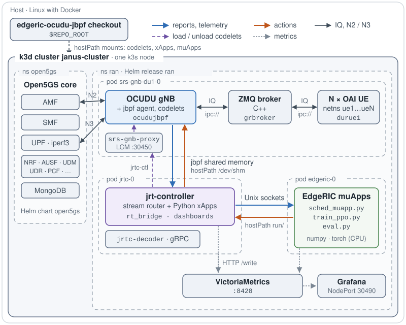
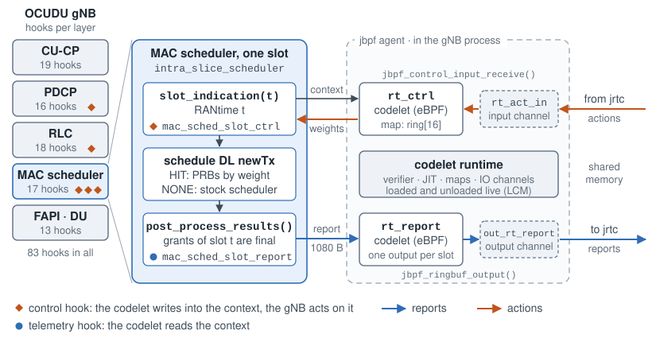
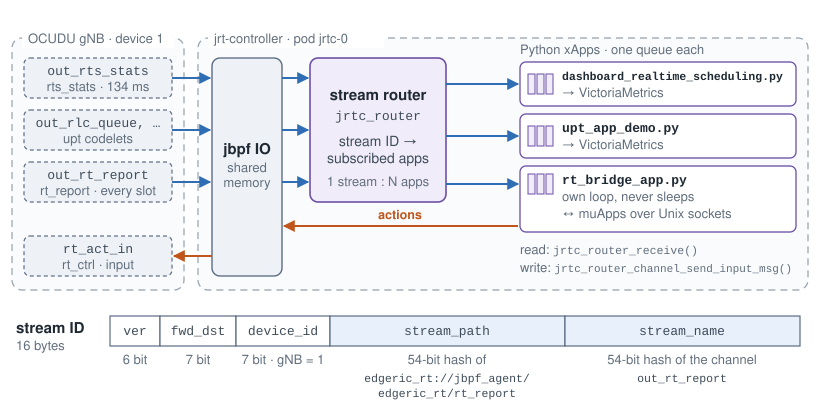
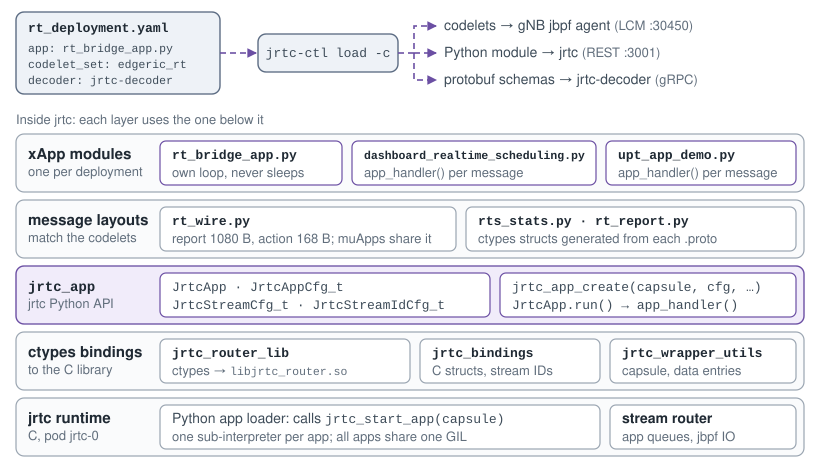
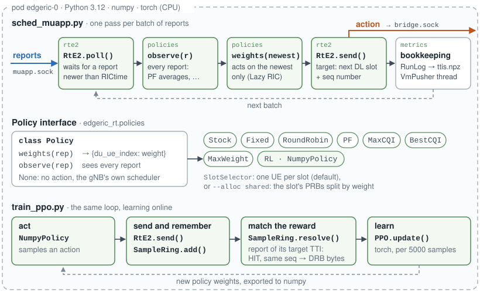
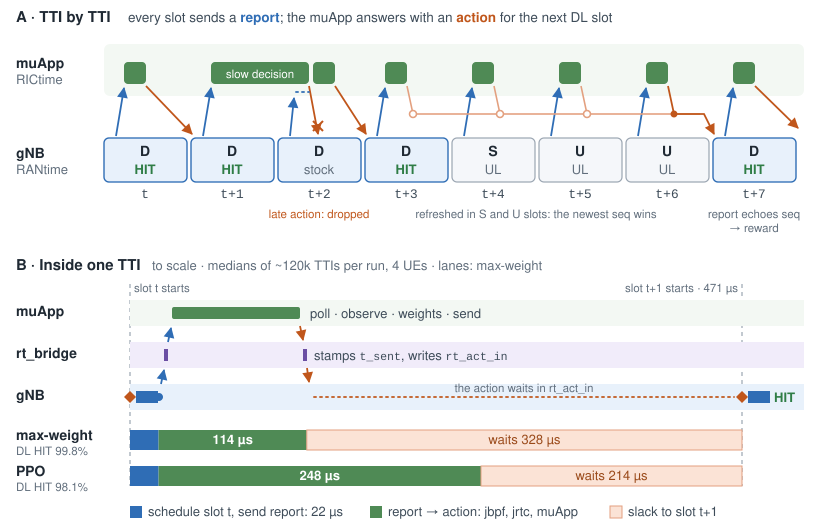
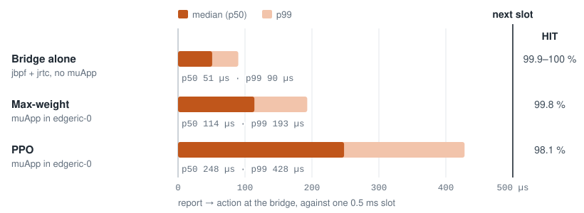

EdgeRIC with OCUDU-jbpf: System Design
======================================

EdgeRIC runs AI-in-the-loop control of the RAN at the TTI timescale. This release runs it on the OCUDU
gNB instrumented with jbpf. Every slot, two jbpf hooks in the MAC scheduler carry the state of every UE
out and the muApp's action back in. jrt-controller (jrtc) moves them between the gNB and the muApps.
The whole system runs on one server as a k3d (Kubernetes) cluster.

**Code:** `edgeric-ocudu-jbpf <https://github.com/ucsdwcsng/edgeric-ocudu-jbpf>`_ (branch ``open-ai-ran-tutorial``).
Guides: `README <https://github.com/ucsdwcsng/edgeric-ocudu-jbpf/blob/open-ai-ran-tutorial/README.md>`_ (build
and deploy) and
`edgeric-rt.md <https://github.com/ucsdwcsng/edgeric-ocudu-jbpf/blob/open-ai-ran-tutorial/docs/edgeric-rt.md>`_
(the loop and the muApps).

End-to-End Deployment on k3d
----------------------------

         srs-gnb-du1-0 with the OCUDU gNB, a C++ ZMQ broker and N OAI UEs; pod jrtc-0 with
         jrt-controller and its xApps; pod edgeric-0 with the EdgeRIC muApps; and VictoriaMetrics with
         Grafana. The gNB and jrtc share jbpf shared memory, and jrtc and edgeric-0 share Unix sockets.

   One cluster, two namespaces, three RAN pods. Blue carries reports and telemetry out of the gNB, orange
   carries actions back in, the dashed purple line loads codelets and the dotted lines carry metrics.

- **open5gs:** the 5G core, from the Open5GS Helm chart. iperf3 servers on the UPF generate traffic.
- **ran:** one Helm release (``jrtc-apps/containers/Helm``) creates three pods.

  - ``srs-gnb-du1-0``: the OCUDU gNB with its jbpf agent, a C++ ZMQ broker and N Duranta OAI UEs, each
    UE in its own network namespace. They run as ephemeral containers and pass IQ samples over ZMQ
    ``ipc://`` sockets in place of radios. ``srs-gnb-proxy`` takes codelet loads on port 30450.
  - ``jrtc-0``: jrt-controller with its stream router and Python xApps, plus ``jrtc-decoder``.
  - ``edgeric-0``: the EdgeRIC muApps, with Python 3.12, numpy and PyTorch (CPU).

  VictoriaMetrics and Grafana (NodePort 30490) serve the dashboards.

The pods talk through host directories they share. The gNB and jrtc mount the same host directory as
``/dev/shm``, so jbpf's shared memory spans both pods. jrtc and ``edgeric-0`` mount the same ``run/``
directory, which holds the Unix sockets between the bridge and the muApps. The xApps and muApps run
straight from the repo checkout, mounted into the pods, so changing one needs no image rebuild.

Software Architecture
---------------------

Four layers, from the gNB up: jbpf hooks in the gNB, the jrtc stream router, xApps on jrtc and the
EdgeRIC muApps.

jbpf Hooks in the OCUDU gNB
^^^^^^^^^^^^^^^^^^^^^^^^^^^

         DU 13, five of them control hooks. Right, one slot of the MAC scheduler: slot_indication calls
         mac_sched_slot_ctrl, where rt_ctrl reads rt_act_in and writes the weights back; after
         scheduling, post_process_results calls mac_sched_slot_report, where rt_report writes the
         report to out_rt_report.

   Left: the gNB's hooks per layer. Right: one slot of the MAC scheduler, with the two EdgeRIC-RT hooks
   and their codelets.

A hook is a call site compiled into the gNB. When a codelet is attached to it, the gNB thread runs the
codelet inline and passes it a pointer to a context struct. A codelet is eBPF: jbpf verifies it and
JIT-compiles it when it is loaded, and codelets load and unload while the gNB runs. A codelet talks to
jrtc through channels in shared memory. ``jbpf_ringbuf_output()`` writes to an output channel and
``jbpf_control_input_receive()`` reads an input channel. At a control hook the codelet also writes into
the context, and the gNB acts on what it wrote.

EdgeRIC-RT adds two hooks to the MAC scheduler (``intra_slice_scheduler``):

- ``mac_sched_slot_ctrl``, a control hook, runs at the start of every slot. Its codelet ``rt_ctrl``
  moves new actions from ``rt_act_in`` into a 16-entry ring indexed by target TTI. It hands the gNB an
  action only if one targets exactly this slot.
- ``mac_sched_slot_report`` runs once the slot is scheduled. Its codelet ``rt_report`` writes the
  1080-byte report to ``out_rt_report``. The report holds RANtime, each UE's CQI, backlog and grants,
  and the echo of the action applied in the slot.

The codeletset ``edgeric_rt.yaml`` binds each codelet to its hook and declares its channels.
``rt_wire.h`` and its Python mirror ``rt_wire.py`` fix the byte layout of the report and the action.
Building the codelets produces their eBPF objects and, for each output channel, a protobuf serializer
and a ctypes module for Python xApps.

jrtc Stream Router
^^^^^^^^^^^^^^^^^^

         which queues each message for every app subscribed to its stream: the dashboard, upt and
         rt_bridge xApps. rt_bridge writes actions back into rt_ctrl's input channel rt_act_in. Below,
         the 16-byte stream ID: version, forward destination, device ID, a hash of the stream path and
         a hash of the channel name.

   The router fans each output stream out to the apps that subscribed to it. The stream ID ties a
   channel to the codelet that owns it.

jrtc's router thread reads the codelets' output channels from jbpf's shared memory. It puts each
message on the queue of every app subscribed to that stream, without copying it, so one stream can
feed many apps. Each app drains its own queue with ``jrtc_router_receive()``. To reach a codelet, an
app writes into the codelet's input channel with ``jrtc_router_channel_send_input_msg()``.

A stream ID is 16 bytes. ``jrtc-ctl`` derives it when it loads a deployment, from the device, the
stream path ``<deployment>://jbpf_agent/<codeletset>/<codelet>`` and the channel name.

xApps on jrtc
^^^^^^^^^^^^^

         the Python module to jrtc and the schemas to jrtc-decoder. Inside jrtc, an xApp stands on
         five layers: the xApp modules, the message layouts, the jrtc_app Python API, the ctypes
         bindings to the jrtc router library, and the jrtc runtime with its Python app loader.

   Top: loading a deployment. Bottom: the Python packages an xApp stands on.

An xApp is a deployment YAML plus a Python module. ``jrtc-ctl load -c <yaml>`` loads the codelets
into the gNB, the module into jrtc and the protobuf schemas into the decoder. jrtc runs each Python
xApp in its own sub-interpreter and calls its ``jrtc_start_app(capsule)``. There the xApp declares its
streams with ``JrtcStreamCfg_t`` and its queue and timeouts with ``JrtcAppCfg_t``. It then runs one of
two ways:

- **Handler.** ``jrtc_app_create(...)``, then ``JrtcApp.run()`` calls
  ``app_handler(timeout, stream_idx, data_entry, state)`` for every message. The dashboard xApps work
  this way.
- **Own loop.** ``rt_bridge`` subclasses ``JrtcApp`` and loops without sleeping. It calls
  ``jrtc_router_receive()`` and ``jrtc_router_channel_send_input_msg()`` directly, so a report leaves
  within microseconds.

All Python xApps in jrtc share one GIL, so a heavy xApp delays the bridge. Keep the xApps that run
next to the bridge light.

EdgeRIC muApps
^^^^^^^^^^^^^^

         Policy.weights on the newest, RtE2.send to bridge.sock, then bookkeeping. Every scheduler
         implements Policy: Stock, Fixed, RoundRobin, PF, MaxCQI, BestCQI, MaxWeight and RL.
         train_ppo.py runs the same loop: the policy acts, SampleRing remembers each action by its
         sequence number, matches it to the report of its target TTI, and PPO.update learns from the
         samples.

   Top: one pass of the scheduler muApp. Middle: the interface every scheduler implements. Bottom: how
   the PPO trainer learns from the same loop.

A muApp is a plain Python process in ``edgeric-0``, so it can use numpy and PyTorch and never shares
jrtc's interpreter. Reports arrive on the Unix socket ``muapp.sock`` and actions go to ``bridge.sock``.
``edgeric_rt.rte2.RtE2`` wraps both sockets:

- ``poll()`` blocks until a report arrives, then drains the queue and returns every report newer than
  RICtime.
- ``send(rep, weights)`` tags the action with the next DL slot after the report, and with a sequence
  number.

A scheduler is a ``Policy`` with two methods. ``observe(rep)`` sees every report. ``weights(rep)``
returns a weight per UE for the newest one, or ``None`` to leave the slot to the gNB's own scheduler.
The muApp sends the action before it logs anything, since the action must reach the gNB within the
slot.

To train, ``SampleRing`` matches each action to the report of the slot it was applied in, which echoes
its sequence number. State, action and reward therefore always belong to one TTI. PyTorch runs only
for the PPO updates. Decisions run in numpy (``NumpyPolicy``), in about 70 µs.

Python Packages
^^^^^^^^^^^^^^^

.. list-table::
   :header-rows: 1
   :widths: 26 21 53

   * - Package or module
     - Runs in
     - Interface
   * - ``jrtc_app``
     - ``jrtc-0``
     - ``JrtcApp``, ``JrtcAppCfg_t``, ``JrtcStreamCfg_t``, ``JrtcStreamIdCfg_t``,
       ``jrtc_app_create()``; ``app_handler()`` is called per message
   * - ``jrtc_router_lib``, ``jrtc_bindings``, ``jrtc_wrapper_utils``
     - ``jrtc-0``
     - ctypes bindings to ``libjrtc_router``: ``jrtc_router_receive()``,
       ``jrtc_router_channel_send_input_msg()``
   * - ``rt_bridge_app.py``
     - ``jrtc-0``
     - The bridge xApp: reports to ``muapp.sock``, actions from ``bridge.sock`` into ``rt_act_in``
   * - ``rt_wire.py``
     - both
     - The 1080-byte report and the 168-byte action: ``decode_report()``, ``encode_action()``,
       ``next_dl_tti()``
   * - ``edgeric_rt.rte2``
     - ``edgeric-0``
     - ``RtE2.poll()``, ``RtE2.send()``, ``SampleRing``
   * - ``edgeric_rt.policies``
     - ``edgeric-0``
     - ``Policy.weights()``, ``Policy.observe()``, the schedulers, ``SlotSelector``
   * - ``edgeric_rt.rl.ppo``
     - ``edgeric-0``
     - ``Observer``, ``NumpyPolicy``, ``PPO.update()``
   * - ``edgeric_rt.metrics``
     - ``edgeric-0``
     - ``RunLog`` (every TTI to ``ttis.npz``), ``VmPusher`` (to VictoriaMetrics)
   * - ``edgeric_rt.ue_map``
     - ``edgeric-0``
     - ``UeMap``: UE name to C-RNTI to ``du_ue_index``
   * - ``muapps/``
     - ``edgeric-0``
     - ``sched_muapp.py``, ``train_ppo.py``, ``eval.py``

EdgeRIC Control, TTI by TTI
---------------------------

         action for the next DL slot, applied there as a HIT. A slow decision misses slot t+2, which
         runs the stock scheduler. The actions computed in S and U slots all target slot t+7, and the
         newest wins. Panel B, one TTI to scale: report at 22 microseconds, action 114 microseconds
         later with max-weight or 248 with PPO, then a wait of 328 or 214 microseconds for slot t+1.

   A: eight slots of the TDD pattern. B: one TTI to scale, with medians over about 120,000 TTIs per run
   (4 UEs, full buffer). Under ZMQ emulation the gNB starts a slot every 471 µs at the median; the TTI
   is 0.5 ms.

**RANtime** is the gNB's slot counter, carried in every report. **RICtime** is the RANtime of the
newest report the muApp has read.

- Every slot sends a report, UL slots included.
- The muApp tags each action with the first DL slot after its report. During S and U slots it
  refreshes the action for the next DL slot, and ``rt_ctrl`` keeps the newest.
- At the start of each slot, ``rt_ctrl`` applies an action only if one targets exactly this RANtime
  (a HIT). Otherwise the slot runs the gNB's own scheduler, and an action that arrives after its slot
  is dropped.
- The report of the slot an action was applied in echoes the action's sequence number. The reward,
  the DRB bytes scheduled in that slot, is therefore paired with the action that earned it.
- With no new report the muApp waits (Lazy RAN). If it falls behind, it acts on the newest report only
  (Lazy RIC).

Measured with 4 UEs, the gNB sends the report 22 µs into the slot. Report to action takes 114 µs with
max-weight (p99 193 µs) and 248 µs with PPO (p99 428 µs). With the bridge acting by itself, without a
muApp, it takes 51 µs: the cost of jbpf and jrtc. The action then waits 328 or 214 µs for its slot.
Max-weight's action lands in its exact TTI in 99.8% of DL slots, and PPO's in 98.1%. The rest run the
gNB's own scheduler.

Latency Budget
^^^^^^^^^^^^^^

         jrtc without a muApp: median 51 µs, p99 90 µs, and 99.9 to 100 % of DL slots get their
         action in the exact TTI. Through the max-weight muApp: median 114 µs, p99 193 µs, 99.8 %.
         Through the PPO muApp: median 248 µs, p99 428 µs, 98.1 %.

   Report to action at the bridge, with 4 UEs and full buffers, against one 0.5 ms slot. HIT is the
   share of DL slots whose action was applied in its exact TTI.
