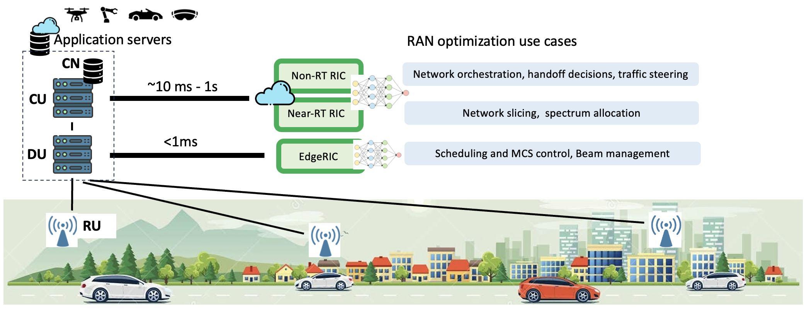

.. Edge_RIX documentation master file, created by
   sphinx-quickstart on Mon Nov 20 16:41:50 2023.
   You can adapt this file completely to your liking, but it should at least
   contain the root `toctree` directive.

EdgeRIC: Delivering Real-time Intelligence to Radio Access Networks
========================================================================

.. NextG cellular networks must support a wide variety of applications that require radio access with latency, 
.. throughput and reliability guarantees hitherto unavailable. Simultaneously, the environment is becoming in-
.. creasingly dynamic over diverse spectrum bands, user mobility patterns and variable traffic patterns. Com-
.. plex cross layer interactions imply that problems without crisp models are emerging where a data-driven 
.. machine learning approach to optimal resource utilization has value. We introduce EdgeRIC, a real-time RIC 
.. co-located with the Distributed Unit (DU). It is decoupled from the RAN stack, and operates at the RAN timescale.

- EdgeRIC is a platform for **real-time AI-in-the-loop** for decision and control in cellular networks. It is designed to access network and application-level information to execute AI-optimized and other policies in real-time (sub-millisecond) .

.. .. raw:: html

..    

..      

..        <video width="500" height="380" controls>
..          <source src="_static/beamarmor_demo.mp4" type="video/mp4" controls autoplay>
..          Your browser does not support the video tag.
..        </video>
..      

..       

..        <video width="500" height="380" controls>
..          <source src="_static/demo-2.mp4" type="video/mp4" controls autoplay>
..          Your browser does not support the video tag.
..        </video>
..      

..    

.. EdgeRIC Focus Areas
.. ------------------------

.. .. image:: pics/edgeric-focus.png
..   :width: 600
..   :alt: sample text

.. container:: news-sidebar-source

   .. include:: news.md

.. _our-projects:

Our Projects
------------------------

.. raw:: html

   

     <a href="projects/cloud-gaming.html" class="project-card" id="card-cloud-gaming">
       <h3>Cloud Gaming via 5G</h3>
     </a>
     <a href="projects/multimodal-sensing.html" class="project-card" id="card-multimodal">
       <h3>mmsRAN: Multi-Modal Sensing</h3>
     </a>
     <a href="projects/telemetry.html" class="project-card" id="card-telemetry">
       <h3>SCOUT: Packet Centric Telemetry</h3>
     </a>
     <a href="projects/qoe-networking.html" class="project-card" id="card-qoe">
       <h3>QoE-aware Networking</h3>
     </a>
     <a href="projects/tiny-twin.html" class="project-card" id="card-tiny-twin">
       <h3>Tiny-twin</h3>
     </a>
     <a href="projects/other-muapps.html" class="project-card" id="card-muapps">
       <h3>Meet Our μApps Family</h3>
     </a>
   

.. toctree::
   :maxdepth: 1
   :caption: Our Projects

   projects/cloud-gaming
   projects/multimodal-sensing
   projects/telemetry
   projects/qoe-networking
   projects/tiny-twin
   projects/other-muapps
  

.. _our-team:

Team
------------------------
.. toctree::
   :maxdepth: 1
   :caption: Team

   team

.. raw:: html

   

     

       <a href="https://www.linkedin.com/in/dinesh-bharadia-5a42a912/" class="team-link">
         

         <h4>Dinesh Bharadia</h4>
       </a>
       
Professor, UCSD

       <a href="mailto:dineshb@ucsd.edu" class="team-email">dineshb@ucsd.edu</a>
     

     

       <a href="https://engineering.tamu.edu/electrical/profiles/sshakkottai.html" class="team-link">
         

         <h4>Srinivas Shakkottai</h4>
       </a>
       
Professor, TAMU

       <a href="mailto:sshakkot@tamu.edu" class="team-email">sshakkot@tamu.edu</a>
     

     

       <a href="https://ishjain.github.io/" class="team-link">
         

         <h4>Ish Jain</h4>
       </a>
       
Professor, RPI

       <a href="mailto:jaini2@rpi.edu" class="team-email">jaini2@rpi.edu</a>
     

     

       <a href="https://www.ist.osaka-u.ac.jp/english/researcher/detail.php?id=105" class="team-link">
         

         <h4>Shunsuke Saruwatari</h4>
       </a>
       
Professor, University of Osaka

       <a href="mailto:ssaruwatari@ucsd.edu" class="team-email">ssaruwatari@ucsd.edu</a>
     

     

       <a href="https://directory.tamu.edu/people/d7155b54fc8dda18102870ba67d388c6/?branch=people&cn=yun" class="team-link">
         

         <h4>Woo Hyun Ko</h4>
       </a>
       
Senior Research Engineer, TAMU

       <a href="mailto:whko@tamu.edu" class="team-email">whko@tamu.edu</a>
     

     

       <a href="https://ushasigh.github.io/" class="team-link">
         

         <h4>Ushasi Ghosh</h4>
       </a>
       
PhD Student, UCSD

       <a href="mailto:ughosh@ucsd.edu" class="team-email">ughosh@ucsd.edu</a>
     

     

       <a href="https://www.linkedin.com/in/sushilaseshasayee/" class="team-link">
         

         <h4>Sushila Seshasayee</h4>
       </a>
       
PhD Student, UCSD

       <a href="mailto:sseshasa@ucsd.edu" class="team-email">sseshasa@ucsd.edu</a>
     

     

       <a href="https://scholar.google.com/citations?user=aAP3asAAAAAJ&hl=en" class="team-link">
         

         <h4>Ali Mamaghani</h4>
       </a>
       
PhD Student, UCSD

       <a href="mailto:amamaghani@ucsd.edu" class="team-email">amamaghani@ucsd.edu</a>
     

     

       <a href="https://www.linkedin.com/in/qiz066/" class="team-link">
         

         <h4>Qingyuan Zheng</h4>
       </a>
       
MS Student, UCSD

       <a href="mailto:qiz066@ucsd.edu" class="team-email">qiz066@ucsd.edu</a>
     

     

       <a href="https://wcsng.ucsd.edu/" class="team-link">
         

         <h4>WCSNG</h4>
       </a>
       
Lab @ UCSD

       <a href="https://github.com/ucsdwcsng" class="team-email" target="_blank" rel="noopener noreferrer">github.com/ucsdwcsng</a>
     

   

.. _our-demos:

Demos 
------------------------

.. toctree::
   :maxdepth: 1
   :caption: Demos

   demo
   
.. raw:: html

   

     

       

         <h3>BeamArmor</h3>
         
Anti-jamming: Controlling MIMO weights in realtime to steer the beam null toward the jammer

       

       

         

           <button type="button" class="video-play-btn" aria-label="Play video"></button>
         

         <video preload="metadata" data-src="_static/beamarmor_demo.mp4">
           Your browser does not support the video tag.
         </video>
       

     

     

       

         <h3>AI Scheduling</h3>
         
RL-based scheduling policy trained to maximize overall system throughput

       

       

         

           <button type="button" class="video-play-btn" aria-label="Play video"></button>
         

         <video preload="metadata" data-src="_static/demo-2.mp4">
           Your browser does not support the video tag.
         </video>
       

     

     

       

         <h3>Multi-site Management</h3>
         
Interference-aware resource distribution across sites with Near-RT RIC

       

       

         

           <button type="button" class="video-play-btn" aria-label="Play video"></button>
         

         <video preload="metadata" data-src="_static/sparc-video-demo.mov">
           Your browser does not support the video tag.
         </video>
       

     

   

.. _edgeric-events:

Events
------------------------

.. toctree::
   :maxdepth: 2
   :caption: EdgeRIC Events
   :hidden:

   oaic-workshop-2024.rst
   srsran-2024-workshop.rst

.. raw:: html

   

     <a class="event-card" href="oaic-workshop-2024.html">
       
2024

       

         
OAIC Workshop 2024

         
Tutorials, demos, and hands-on sessions for OAI + EdgeRIC.

       

       
View

     </a>
     <a class="event-card" href="srsran-2024-workshop.html">
       
2024

       

         
srsRAN Workshop 2024

         
EdgeRIC integration, experiments, and live testbed walkthroughs.

       

       
View

     </a>
   

   

Open Source Repositories
------------------------

.. raw:: html

   

     

       <h3>srsRAN-4G + EdgeRIC</h3>
       
<strong>Release Date:</strong> TBD

       
<strong>Description:</strong> EdgeRIC integrated with srsRAN 4G

       <a href="#" class="repo-link" target="_blank" rel="noopener noreferrer">View on GitHub</a>
     

     

       <h3>srsRAN-5G (2024) + EdgeRIC</h3>
       
<strong>Release Date:</strong> 2024

       
<strong>Description:</strong> EdgeRIC on srsRAN 5G 2024 release

       <a href="https://github.com/ucsdwcsng/EdgeRIC-on-5G/tree/srsran" class="repo-link" target="_blank" rel="noopener noreferrer">View on GitHub</a>
     

     

       <h3>srsRAN-5G (25.10) + EdgeRIC</h3>
       
<strong>Release Date:</strong> 25.10

       
<strong>Description:</strong> EdgeRIC on srsRAN 5G 25.10 release

       <a href="#" class="repo-link" target="_blank" rel="noopener noreferrer">View on GitHub</a>
     

     

       <h3>OAI + EdgeRIC</h3>
       
<strong>Release Date:</strong> Oct 01, 2025

       
<strong>Description:</strong> EdgeRIC integrated with OpenAirInterface

       <a href="https://github.com/ucsdwcsng/EdgeRIC-5G-OAI" class="repo-link" target="_blank" rel="noopener noreferrer">View on GitHub</a>
     

   

.. _5g-testbed:

5G Testbed
------------------------

.. raw:: html

   

.. toctree::
   :maxdepth: 1
   :caption: 5G Testbed

   5g-testbed

.. Current Status
.. ------------------------

.. We are currently supported on the **srsRAN and OAI Projects**. 

.. .. image:: pics/edgeric-architecture-overview.png
..   :width: 600
..   :alt: sample text

.. **Our Currently Supported Real time Metrics:**

.. .. image:: pics/current-metrics.png
..   :width: 600
..   :alt: sample text

.. **Our Currently Supported Control Capabilities:**

.. .. image:: pics/current-capabilities.png
..   :width: 600
..   :alt: sample text

.. **Refer to our 5G srsRAN version:** `Github (srsRAN) <https://github.com/ucsdwcsng/EdgeRIC-on-5G.git>`_  - Multi container solution available

.. **Refer to our 5G OAI version:** `Github (OAI) <https://github.com/ucsdwcsng/EdgeRIC-5G-OAI.git>`_  

.. _edgeric-architecture:

EdgeRIC Core Architecture
------------------------

.. toctree::
   :maxdepth: 2
   :caption: EdgeRIC Architecture

   edgeric-architecture

.. raw:: html

   

     <a class="arch-section" href="edgeric-architecture.html">
       
RT-E2 interface (Real time E2 interface)

       
Messaging framework between the RAN stack and EdgeRIC, built on ZMQ and protobuf, with TTI-level synchronization.

     </a>
     <a class="arch-section" href="edgeric-architecture.html">
       
RT-E2 Report Message

       
Per-UE KPI report structure (cqi, buffers, TBS, rates) sent every TTI from the RAN to EdgeRIC.

     </a>
     <a class="arch-section" href="edgeric-architecture.html">
       
RT-E2 Policy Message

       
Control-action messages from μApps back to the RAN, including scheduling weights and blanking decisions.

     </a>
     <a class="arch-section" href="edgeric-architecture.html">
       
REDIS database

       
How Redis is used for model storage, μApp lifecycle management, and dynamic configuration.

     </a>
     <a class="arch-section" href="edgeric-architecture.html">
       
μApps – EdgeRIC microservices

       
How μApps subscribe to metrics, compute policies, and send control via the EdgeRIC messenger.

     </a>
   

.. _edgeric-tutorials:

Publications & Tutorials
------------------------

.. toctree::
   :maxdepth: 2
   :caption: Tutorials
   :hidden:

   tutorials

.. raw:: html

   

     

       <h3>EdgeRIC</h3>
       
Empowering Real-time Intelligent Optimization and Control in NextG Cellular Networks

       

         <a href="https://www.usenix.org/conference/nsdi24/presentation/ko" class="pub-btn pub-btn-paper" target="_blank" rel="noopener">Paper@NSDI'24</a>
         <a href="https://dl.acm.org/doi/abs/10.1145/3603269.3610867" class="pub-btn pub-btn-paper" target="_blank" rel="noopener">Demo@SIGCOMM'23</a>
         <a href="https://wcsng.ucsd.edu/edgeric/" class="pub-btn pub-btn-web" target="_blank" rel="noopener">Project Website</a>
         <a href="https://github.com/ushasigh/EdgeRIC-A-real-time-RIC.git" class="pub-btn pub-btn-code" target="_blank" rel="noopener">Code on GitHub</a>
         <a href="edgeric.html" class="pub-btn pub-btn-tutorial">Main Paper Tutorial</a>
       

     

     

       <h3>BeamArmor</h3>
       
Seamless Anti-Jamming in 5G Cellular Networks with MIMO Null-steering

       

         <a href="https://dl.acm.org/doi/10.1145/3638550.3641138" class="pub-btn pub-btn-paper" target="_blank" rel="noopener">Paper@HotMobile'24</a>
         <a href="https://wcsng.ucsd.edu/beamarmor/" class="pub-btn pub-btn-web" target="_blank" rel="noopener">Project Website</a>
         <a href="https://github.com/ucsdwcsng/beamarmor.git" class="pub-btn pub-btn-code" target="_blank" rel="noopener">Code on GitHub</a>
         <a href="beamarmor.html" class="pub-btn pub-btn-tutorial">BeamArmor Tutorial</a>
       

     

     

       <h3>Tiny-twin</h3>
       
A Lightweight and Verifiable Digital Twin for NextG Cellular Networks

       

         <a href="https://arxiv.org/abs/2601.08217" class="pub-btn pub-btn-paper" target="_blank" rel="noopener">Paper@DySPAN'26</a>
         <a href="https://dl.acm.org/doi/abs/10.1145/3638550.3643625" class="pub-btn pub-btn-paper" target="_blank" rel="noopener">Poster@HotMobile'24</a>
         <a href="tiny-twin.html" class="pub-btn pub-btn-tutorial">Tiny-twin Tutorial</a>
       

     

     

       <h3>Windex</h3>
       
Realtime Neural Whittle Indexing for Scalable Service Guarantees in NextG Cellular Networks

       

         <a href="https://arxiv.org/abs/2406.01888" class="pub-btn pub-btn-paper" target="_blank" rel="noopener">Main Paper</a>
         <a href="https://dl.acm.org/doi/10.1145/3636534.3700034" class="pub-btn pub-btn-paper" target="_blank" rel="noopener">Demo@MobiCom'24</a>
         <a href="https://wcsng.ucsd.edu/windex/" class="pub-btn pub-btn-web" target="_blank" rel="noopener">Project Website</a>
         <a href="https://github.com/ucsdwcsng/EdgeRIC_whittleIndex.git" class="pub-btn pub-btn-code" target="_blank" rel="noopener">Code on GitHub</a>
         <a href="windex.html" class="pub-btn pub-btn-tutorial">Windex Tutorial</a>
       

     

     

       <h3>SPARC</h3>
       
Spatio-Temporal Adaptive Resource Control for Multi-site Spectrum Management in NextG Cellular Networks

       

         <a href="https://dl.acm.org/doi/abs/10.1145/3696405" class="pub-btn pub-btn-paper" target="_blank" rel="noopener">Paper@CoNEXT'25</a>
         <a href="https://wcsng.ucsd.edu/sparc/" class="pub-btn pub-btn-web" target="_blank" rel="noopener">Project Website</a>
         <a href="https://github.com/ushasigh/SPARC-multi-siteManagent.git" class="pub-btn pub-btn-code" target="_blank" rel="noopener">Code on GitHub</a>
         <a href="sparc.html" class="pub-btn pub-btn-tutorial">SPARC Tutorial</a>
       

     

   

.. _datasets:

Datasets
------------------------

.. toctree::
   :maxdepth: 2
   :caption: Datasets

   dataset_page/edgeric-datasets
   dataset_page/scout-dataset

.. raw:: html

   

     <a href="dataset_page/edgeric-datasets.html" class="dataset-card">
       

       

         <h4>EdgeRIC Dataset</h4>
         
Channel traces (CQI) from over-the-air mobility experiments, used for Tiny-twin emulation and RL training.

       

     </a>
     <a href="dataset_page/scout-dataset.html" class="dataset-card">
       

       

         <h4>Scout Dataset</h4>
         
Log dataset for SCOUT: packet-centric telemetry logs, per-packet latency, queue dynamics, and scheduling impact analysis.

       

     </a>
   

.. Research Papers
.. ------------------------
.. - EdgeRIC main paper: https://www.usenix.org/conference/nsdi24/presentation/ko
.. - BeamArmor: https://dl.acm.org/doi/10.1145/3638550.3641138
.. - Windex: https://arxiv.org/abs/2406.01888
.. - Tiny-twin: https://dl.acm.org/doi/abs/10.1145/3638550.3643625

.. Indices and tables
.. ==================

.. .. * :ref:`genindex`
.. .. * :ref:`modindex`
.. .. * :ref:`search`

Funding 
------------------------ 
This work was funded primarily by NSF Grants CNS 2312978, CNS 2312979 and in part by CNS 1955696, ECCS 2030245, ARO grant W911NF- 19-1-0367.

.. .. toctree::
..    :maxdepth: 2
..    :caption: Getting Started

..    gettingstarted
