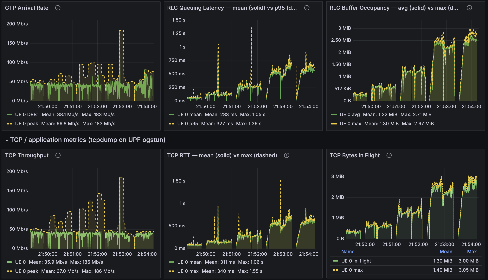
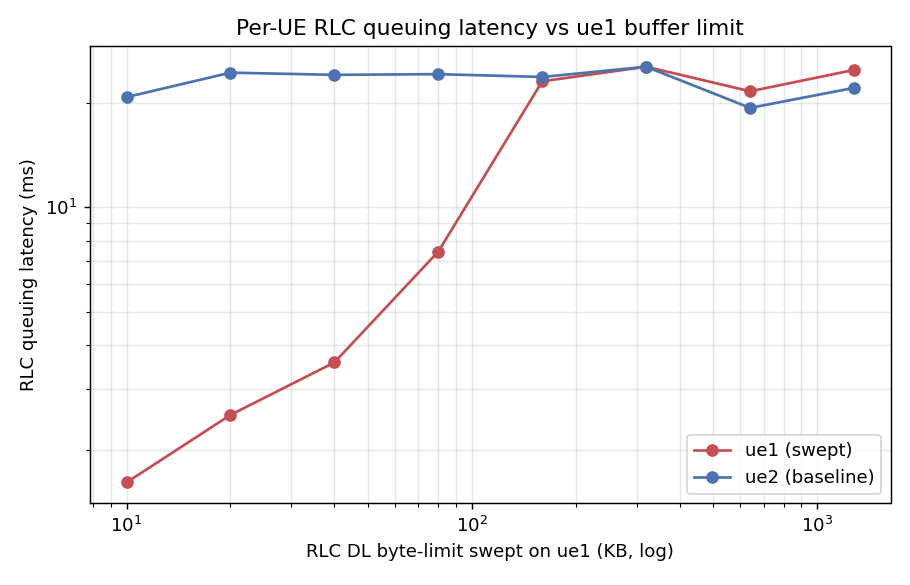
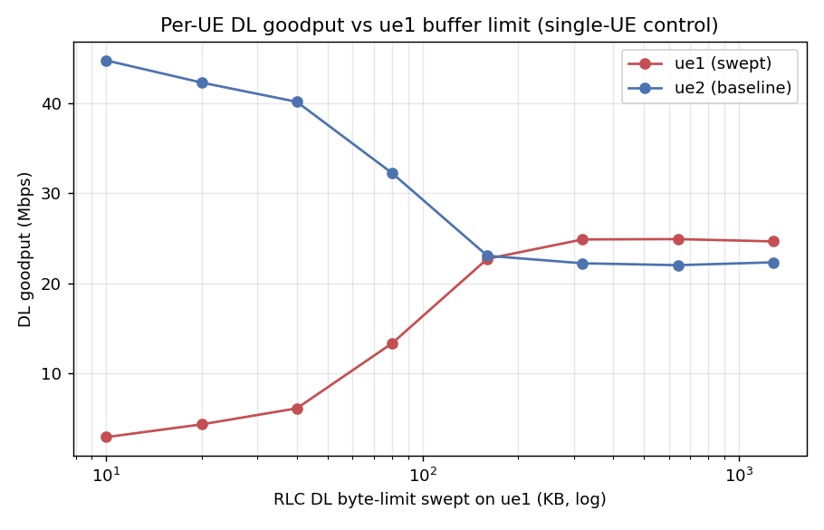
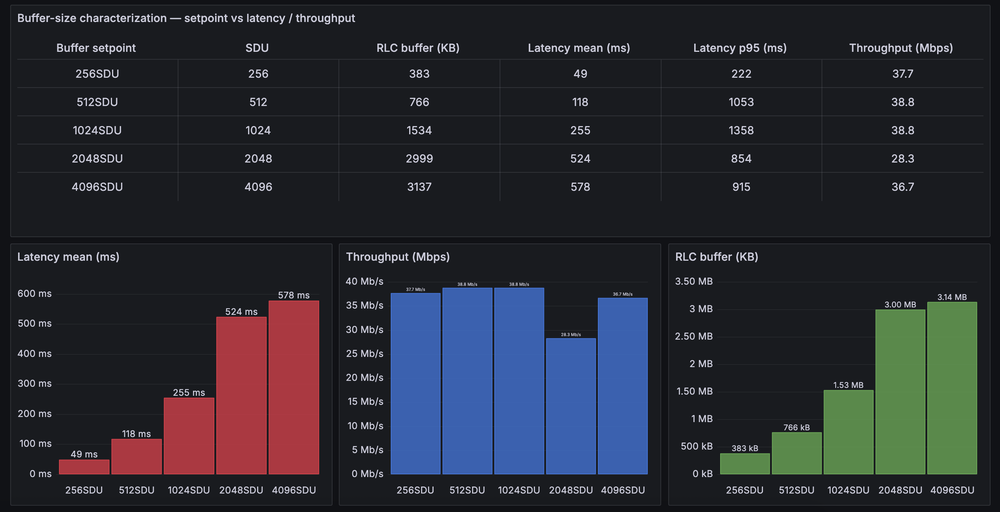
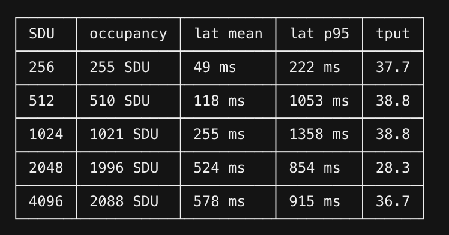

## Open AI-RAN Tutorial: In-RAN Telemetry and Control with jbpf Codelets

In this tutorial we bring up a **complete 5G testbed inside a single k3d Kubernetes cluster** — the
**jbpf-instrumented OCUDU gNB**, the **jrt-controller (jrtc)**, an **Open5GS** core and four
**Duranta OAI `nr-UE`s** over ZMQ — and then use it as a platform for programmable, in-RAN
observability and control.

The programmable unit is a **codelet**: a small eBPF program that is loaded at runtime into the
running gNB, attached to a *hook* on the RAN datapath, and unloaded again — **without recompiling or
restarting the gNB**. Codelets that only read the datapath are *telemetry* codelets; codelets that
write back into the RAN's own structures are *control* codelets. Both are the same mechanism.

The tutorial is in three parts:

| Part | What you do | Key artifacts |
|---|---|---|
| **[Part 1](#part-1-loading-and-unloading-codelets)** | Load and unload example codelets (MAC stats), then start the dashboard and visualize live per-UE telemetry | `mac_stats.yaml`, `dashboard/deployment_ocudu.yaml`, Grafana |
| **[Part 2](#part-2-writing-new-codelets)** | **Write new codelets**: RLC telemetry, and per-packet telemetry — **RLC queuing latency** and **RLC buffer occupancy** | `rlc_queueing.cpp`, `rlc_buffer_enq/deq.cpp`, `upt.yaml`, `upt_app.py` |
| **[Part 3](#part-3-a-control-codelet-for-rlc-buffer-management)** | **Write a control codelet**: dynamic **RLC buffer management** that actuates the gNB from userspace | `rlc_fixed.cpp`, `rlc_ctrl.cpp`, `bufsize*.yaml` |

**Code:** `https://github.com/ucsdwcsng/scout-jbpf` (branch `open-ai-ran-tutorial`)

</br>

### Architecture

```text
 ┌───────────────────────── k3d cluster: janus-cluster ─────────────────────────┐
 │                                                                              │
 │  ns: open5gs                    ns: ran                                      │
 │  ┌───────────────┐   N2/N3   ┌────────────── pod: srs-gnb-du1-0 ───────────┐  │
 │  │ AMF SMF UPF   │◄─────────►│  ocudujbpf : OCUDU gNB  (+ jbpf agent)      │  │
 │  │ NRF UDM PCF   │           │  grbroker  : GNU Radio ZMQ broker           │  │
 │  │ MongoDB       │           │  durue1    : 4x Duranta OAI nr-UE (netns)   │  │
 │  └───────────────┘           └───────────────┬─────────────────────────────┘  │
 │                                              │ jbpf IPC (/dev/shm, /tmp/jbpf) │
 │                              ┌───────────────▼──────────────┐                 │
 │                              │  pod: jrtc-0                 │                 │
 │                              │   jrtc      : jrt-controller │                 │
 │                              │              + python xApps  │                 │
 │                              │   jrtc-decoder : protobuf    │                 │
 │                              └───────────────┬──────────────┘                 │
 │                                              │ InfluxDB line protocol         │
 │                              ┌───────────────▼──────────────┐                 │
 │                              │ VictoriaMetrics :30491       │                 │
 │                              │ Grafana         :30490       │                 │
 │                              └──────────────────────────────┘                 │
 └──────────────────────────────────────────────────────────────────────────────┘
```

</br>

---

## Part 0: Bring up the testbed

Everything below runs on one Linux host with `docker`, `k3d` (v5+), `kubectl`, `helm` (v3+), and
`git`; the user must be in the `docker` group. **~8 CPU cores are recommended** — the ZMQ software
radio is real-time sensitive.

### Clone and set up the environment

**Terminal 0**

```bash
git clone -b open-ai-ran-tutorial git@github.com:ucsdwcsng/scout-jbpf.git
cd scout-jbpf
git submodule update --init --recursive     # ocudu-jbpf (the RAN) + jbpf_protobuf (the SDK)

export REPO_ROOT="$(pwd)"
export CLUSTER=janus-cluster
```

Run these three exports **in every new terminal** you open for this tutorial:

```bash
export REPO_ROOT=/path/to/scout-jbpf
export CLUSTER=janus-cluster
export KUBECONFIG="$(k3d kubeconfig write "$CLUSTER")"
```

### Create the cluster

```bash
k3d cluster create "$CLUSTER" \
  --volume "$REPO_ROOT:$REPO_ROOT" \
  --port "30400-30500:30400-30500@loadbalancer"

export KUBECONFIG="$(k3d kubeconfig write "$CLUSTER")"

# Multus CNI (the RAN pods use it)
kubectl apply -f https://raw.githubusercontent.com/k8snetworkplumbingwg/multus-cni/master/deployments/multus-daemonset-thick.yml
kubectl wait --for=condition=ready pod -l app=multus -n kube-system --timeout=120s
```

The `--volume` bind-mount makes built binaries persist on the host across pod restarts. The
`30400-30500` port range is published to the host, which is how you will reach Grafana later.

### Deploy the 5G core and the subscribers

```bash
kubectl create namespace open5gs
helm install open5gs "$REPO_ROOT/open5gs" -n open5gs -f "$REPO_ROOT/open5gs/values-5g.yaml"
kubectl wait --for=condition=ready pod -l app.kubernetes.io/name=mongodb -n open5gs --timeout=180s

# pcf/udr start before mongodb is ready - restart them once
kubectl get pods -n open5gs --no-headers | awk '/pcf|udr/{print $1}' | xargs -r kubectl -n open5gs delete pod
kubectl get pods -n open5gs -w        # Ctrl-C when all pods are 1/1
```

Add the four subscribers (PLMN `99970`, IMSIs `...001`–`...004`):

```bash
POP=$(kubectl get pods -n open5gs --no-headers | awk '/populate/{print $1}' | head -1)
K=00112233445566778899aabbccddeeff
OPC=63bfa50ee6523365ff14c1f45f88737d
for IMSI in 999700000000001 999700000000002 999700000000003 999700000000004; do
  kubectl exec -n open5gs "$POP" -- open5gs-dbctl add "$IMSI" "$K" "$OPC"
done
kubectl exec -n open5gs "$POP" -- open5gs-dbctl showall | grep -c imsi   # expect 4
```

### Deploy the RAN pod and the jrt-controller

```bash
sed "s#__REPO_ROOT__#$REPO_ROOT#g" \
  "$REPO_ROOT/jrtc-apps/containers/Helm/k3d-values.yaml" > /tmp/k3d-values.local.yaml

kubectl create namespace ran
USE_JRTC=1 helm install ran "$REPO_ROOT/jrtc-apps/containers/Helm" -n ran \
  -f "$REPO_ROOT/jrtc-apps/containers/Helm/jrtc.yaml" \
  -f /tmp/k3d-values.local.yaml

kubectl -n ran rollout status statefulset/srs-gnb-du1 --timeout=300s
kubectl get pods -n ran            # srs-gnb-du1-0 and jrtc-0 both Running
```

This deploys the *scaffolding*: the gNB pod (with the jbpf IPC volumes and the `srs-gnb-du1-proxy`
service) and `jrtc-0`. The gNB binary itself runs as an **ephemeral container** in that pod, added
below.

### Build the images (one time, ~20 min)

```bash
# 0a. GNU Radio broker
docker build -t gnuradio-broker:local "$REPO_ROOT/broker"
k3d image import gnuradio-broker:local -c "$CLUSTER"

# 0b. OCUDU + jbpf gNB  (~15 min, clang-18)
( cd "$REPO_ROOT/ocudu-jbpf" && ./build.sh )
k3d image import ocudu-gnb-jbpf:local -c "$CLUSTER"

# 0c. Duranta OAI nr-UE (ZMQ)
docker build -t duranta-nr-ue:local "$REPO_ROOT/duranta-oai-ue"
k3d image import duranta-nr-ue:local -c "$CLUSTER"

# 0d. The codelets themselves  (.o files are gitignored, so this is required)
cd "$REPO_ROOT/jrtc-apps/codelets"
for d in rlc mac pdcp ngap rrc ue_contexts perf edgeric bufsize l4span upt; do ./make.sh -d "$d"; done
cd "$REPO_ROOT"
```

Each codelet should print `Program terminates within N instructions` — that line is the **jbpf
verifier accepting the program**. If you instead see `Failed verification`, the codelet will not
load; see [Writing a codelet](#20-anatomy-of-a-codelet) for the usual causes.

### Start the radio

The gNB, broker and UEs run as **ephemeral containers** inside `srs-gnb-du1-0`. They share the pod
network namespace (so ZMQ talks over localhost) and the gNB shares `/dev/shm` + `/tmp/jbpf` with
`jrtc-0` for the jbpf IPC.

```bash
# --- add the ephemeral containers (one time per pod) ---
kubectl debug -n ran srs-gnb-du1-0 --image=gnuradio-broker:local --image-pull-policy=IfNotPresent \
  -c grbroker --target=gnb -- sleep infinity

kubectl debug -n ran srs-gnb-du1-0 --image=duranta-nr-ue:local --image-pull-policy=IfNotPresent \
  -c durue1 --target=gnb --profile=sysadmin -- sleep infinity

# the gNB needs the jbpf IPC volume mounts, which `kubectl debug` cannot set:
kubectl patch pod -n ran srs-gnb-du1-0 --subresource ephemeralcontainers --type strategic \
  -p "$(cat "$REPO_ROOT/ocudu-jbpf/deploy/ephem_jbpf.json")"

kubectl get pod -n ran srs-gnb-du1-0 -o jsonpath='{.status.ephemeralContainerStatuses[*].name}'; echo
```

**Start `fwd.py` in `jrtc-0`.** `jrtc-ctl` hard-codes `127.0.0.1:30450`; `fwd.py` bridges that to
the gNB proxy service. **Nothing in Parts 1–3 will load without it.**

```bash
kubectl cp "$REPO_ROOT/ocudu-jbpf/deploy/fwd.py" ran/jrtc-0:/tmp/fwd.py -c jrtc
kubectl exec -n ran jrtc-0 -c jrtc -- bash -c \
  'pkill -x python3 2>/dev/null; nohup setsid python3 -u /tmp/fwd.py >/tmp/fwd.log 2>&1 </dev/null & disown; sleep 1; cat /tmp/fwd.log'
```

Stage the configs and the codelet directories into the gNB container (the gNB's jbpf agent loads
each codelet's serde `.so` from `/codelets/...`, so **the directory must exist inside the
`ocudujbpf` container**, not just on the host):

```bash
GDIR="$REPO_ROOT/ocudu-jbpf/deploy"; UDIR="$REPO_ROOT/duranta-oai-ue"
kubectl cp "$GDIR/gnb_ocudu_jbpf.yml" ran/srs-gnb-du1-0:/tmp/gnb_ocudu_jbpf.yml -c ocudujbpf
kubectl cp "$UDIR/broker4_netns.py"   ran/srs-gnb-du1-0:/tmp/broker4_netns.py   -c grbroker
for n in 1 2 3 4; do kubectl cp "$UDIR/oaiue${n}_netns.conf" ran/srs-gnb-du1-0:/tmp/oaiue${n}_netns.conf -c durue1; done

kubectl exec -n ran srs-gnb-du1-0 -c ocudujbpf -- mkdir -p /codelets
for d in ue_contexts mac rlc pdcp rrc ngap upt edgeric bufsize; do
  kubectl cp "$REPO_ROOT/jrtc-apps/codelets/$d" ran/srs-gnb-du1-0:/codelets/ -c ocudujbpf
done
```

**Bring it up — the order matters: broker → gNB → UEs.**

```bash
# 1) broker
kubectl exec -n ran srs-gnb-du1-0 -c grbroker -- bash -c \
  'cd /tmp && nohup setsid python3 -u broker4_netns.py >/tmp/broker.log 2>&1 </dev/null & disown; sleep 3; echo broker:$(pgrep -x python3)'

# 2) OCUDU jbpf gNB - jbpf inits, registers to jrt-controller, then connects to the AMF
kubectl exec -n ran srs-gnb-du1-0 -c ocudujbpf -- bash -c \
  'cd /tmp && nohup setsid /usr/local/bin/gnb -c gnb_ocudu_jbpf.yml >/tmp/gnb.stdout 2>&1 </dev/null & disown; sleep 12; \
   grep -aoE "Registration succeeded|Connected to AMF" /tmp/gnb.stdout /tmp/gnb.log | tail -2'

# 3) per-UE netns + 4 UEs
kubectl cp "$UDIR/netns_setup.sh" ran/srs-gnb-du1-0:/tmp/netns_setup.sh -c durue1
kubectl exec -n ran srs-gnb-du1-0 -c durue1 -- bash -c 'mkdir -p /var/run/netns && bash /tmp/netns_setup.sh'
kubectl exec -n ran srs-gnb-du1-0 -c durue1 -- bash -c '
  cd /opt/oai-nr-ue/bin
  for n in 1 2 3 4; do
    nohup setsid ip netns exec ue$n ./nr-uesoftmodem -O /tmp/oaiue${n}_netns.conf \
        --band 78 --numerology 1 -r 51 -C 3489420000 --ue-scan-carrier -E >/tmp/ue$n.log 2>&1 </dev/null & disown
    sleep 4
  done'
```

**What a successful attach looks like** — four distinct TUN IPs:

```bash
kubectl exec -n ran srs-gnb-du1-0 -c durue1 -- bash -c \
  'for n in 1 2 3 4; do echo -n "ue$n:$(ip netns exec ue$n ip -o -4 addr show oaitun_ue1 2>/dev/null|awk "{print \$4}") "; done; echo'
# ue1:10.45.0.2/24 ue2:10.45.0.3/24 ue3:10.45.0.4/24 ue4:10.45.0.5/24
```

> **ZMQ cannot reconnect mid-run.** If you restart any one of broker / gNB / UEs, restart **all
> three**, in that order. SIGKILL-ing the gNB also leaves a stale jbpf IPC peer in the
> jrt-controller — wait a few seconds for jrtc to reap it, then start the gNB again.

### Traffic

iperf3 servers run on the UPF; clients run per-UE inside each netns.

```bash
UPF=$(kubectl get pods -n open5gs -o name | grep -i upf | head -1); UPF=${UPF#pod/}
kubectl exec -n open5gs "$UPF" -- bash -c 'for p in 5201 5202 5203 5204; do nohup iperf3 -s -B 10.45.0.1 -p $p >/dev/null 2>&1 & done; echo servers up'

# concurrent DL (-R) on all 4 UEs
kubectl exec -n ran srs-gnb-du1-0 -c durue1 -- bash -c \
  'for n in 1 2 3 4; do p=$((5200+n)); ip netns exec ue$n iperf3 -c 10.45.0.1 -p $p -t 30 -R >/tmp/dl$n.txt 2>&1 & done; wait; \
   for n in 1 2 3 4; do echo "ue$n: $(grep receiver /tmp/dl$n.txt | tail -1 | grep -oE "[0-9.]+ [KMG]bits/sec")"; done'
```

Drop the `-R` for uplink. About **20 Mbit/s aggregate DL** is the ZMQ software-radio ceiling with
4 UEs; a single UE can reach ~45 Mbit/s.

</br>

---

## Part 1: Loading and unloading codelets

### 1.1 The two YAML files you need to understand

Everything in this tutorial is driven by two levels of YAML.

**(a) The codeletset** — a group of codelets that share state, live in `codelets/<layer>/`. It says
*which `.o` binds to which hook*, *which maps are shared between them*, and *how the output is
serialized*. Here is the shape, using the MAC statistics codeletset
(`codelets/mac/mac_stats.yaml`):

```yaml
codeletset_id: mac_stats

codelet_descriptor:

  # (1) the REPORTER - owns the output channels, runs on a periodic hook
  - codelet_name: mac_stats_collect
    codelet_path: ${JBPF_CODELETS}/mac/mac_stats_collect.o
    hook_name: report_stats                 # <- periodic timer hook
    priority: 1
    out_io_channel:
      - name: output_map_crc
        forward_destination: DestinationNone
        serde:
          file_path: ${JBPF_CODELETS}/mac/mac_sched_crc_stats:crc_stats_serializer.so
          protobuf:
            package_path: ${JBPF_CODELETS}/mac/mac_sched_crc_stats.pb
            msg_name: crc_stats
      # ... output_map_bsr / output_map_phr / output_map_uci

  # (2) the COLLECTORS - one per datapath hook, no output of their own;
  #     they accumulate into the reporter's maps via linked_maps
  - codelet_name: mac_sched_crc_stats
    codelet_path: ${JBPF_CODELETS}/mac/mac_sched_crc_stats.o
    hook_name: mac_sched_crc_indication     # <- fires on every CRC indication
    priority: 1
    linked_maps:
      - map_name: stats_map_crc
        linked_codelet_name: mac_stats_collect
        linked_map_name: stats_map_crc
      - map_name: crc_hash
        linked_codelet_name: mac_stats_collect
        linked_map_name: crc_hash
```

This **collector / reporter split** is the standard jbpf telemetry pattern: the hot-path codelets do
nothing but bump counters in a shared map, and one codelet on a periodic hook does the (relatively
expensive) serialize-and-emit. `mac_stats.yaml` has one reporter pair plus collectors on
`mac_sched_crc_indication`, `mac_sched_ul_bsr_indication`, `mac_sched_ul_phr_indication`,
`mac_sched_uci_indication`, `mac_sched_harq_dl`, `mac_sched_harq_ul`, and `mac_sched_ue_deletion`.

**(b) The deployment** — what you actually hand to `jrtc-ctl`, lives in `jrtc_apps/<app>/`. It names
the decoder, an optional python xApp, the jbpf device, and the codeletsets to load. The minimal
codelet-only form (no xApp — decoded JSON lands in the `jrtc-decoder` log):

Create `jrtc-apps/jrtc_apps/mac/deployment_mac.yaml`:

```yaml
name: mac_stats

decoder:
  - type: decodergrpc
    host: jrtc-decoder.ran.svc.cluster.local
    port: 20789

jbpf:
  device:
    - id: 1
      host: srs-gnb-du1-proxy.ran.svc.cluster.local
      port: 30450

  codelet_set:
    - device: 1
      config: ${JBPF_CODELETS}/mac/mac_stats.yaml
```

`jrtc_apps/*` and `codelets/*` are bind-mounted into `jrtc-0` as `/apps` and `/codelets`, so this
file is visible inside the pod immediately — no rebuild, no copy.

### 1.2 Load the MAC stats codeletset

Define this helper once per terminal:

```bash
JRTC() { kubectl exec -n ran jrtc-0 -c jrtc -- bash -c \
  "export JRTC_APPS=/apps JBPF_CODELETS=/codelets; /jrtc/out/bin/jrtc-ctl $*"; }
```

**Terminal 1** — load:

```bash
JRTC 'load -c /apps/mac/deployment_mac.yaml'
```

**What to observe.** A successful load prints, in order:

```text
INFO[0000] loaded app                        id=1 startTime="..."
INFO[0000] successfully upserted proto package
INFO[0000] successfully associated stream ID
```

and the gNB registers the codelets on their hooks:

```bash
kubectl exec -n ran srs-gnb-du1-0 -c ocudujbpf -- \
  grep -aoE "Registered codelet [a-z_0-9]+ to hook [a-z_0-9]+" /tmp/gnb.stdout | tail
```

```text
Registered codelet mac_stats_collect to hook report_stats
Registered codelet mac_sched_crc_stats to hook mac_sched_crc_indication
Registered codelet mac_sched_bsr_stats to hook mac_sched_ul_bsr_indication
Registered codelet mac_sched_phr_stats to hook mac_sched_ul_phr_indication
Registered codelet mac_sched_uci_pdu_stats to hook mac_sched_uci_indication
Registered codelet mac_sched_dl_harq_stats to hook mac_sched_harq_dl
Registered codelet mac_sched_ul_harq_stats to hook mac_sched_harq_ul
```

and:

```bash
kubectl exec -n ran srs-gnb-du1-0 -c ocudujbpf -- grep -a "Codeletset is loaded OK" /tmp/gnb.log
```

**Terminal 2** — run DL traffic ([Part 0](#traffic)) and watch the decoded telemetry:

```bash
kubectl logs -n ran jrtc-0 -c jrtc-decoder --tail=40 -f
```

Each message is one periodic report carrying per-UE CRC / BSR / PHR / UCI / HARQ statistics — the
MAC scheduler's view of every UE, decoded from protobuf, live, from a gNB you did not restart.

### 1.3 Unload

```bash
JRTC 'unload -c /apps/mac/deployment_mac.yaml'
```

The hooks go back to being no-ops. The gNB never noticed.

> **Try it:** load, unload, and re-load a few times while traffic runs — the point of the exercise
> is that instrumentation is now a *runtime* decision, not a build-time one. But do **not** churn
> rapidly: a tight load/unload loop can wedge the app-loader and stress the jbpf LCM.

### 1.4 Load/unload troubleshooting

| Symptom | Cause | Fix |
|---|---|---|
| `dial tcp 127.0.0.1:30450: connect: connection refused` | `fwd.py` is not running in `jrtc-0` | restart it ([Part 0](#start-the-radio)) |
| `400 Bad Request` on load | the app is already loaded | unload first, then load |
| gNB reports no `Registered codelet` lines | the codelet dir is missing **inside** the `ocudujbpf` container | `kubectl cp` the `codelets/<dir>` again |
| `Error connecting to /tmp/jbpf/jbpf_lcm_ipc: Connection refused` | the gNB's jbpf agent died (usually an oversized codeletset descriptor) | restart the gNB (and therefore broker → gNB → UEs) |
| app loaded but codelets did not deploy | partial unload left state behind | delete the app by its **numeric** id: `kubectl exec -n ran jrtc-0 -c jrtc -- curl -s -X DELETE http://127.0.0.1:3001/app/<n>` |

If `jrtc-ctl` fails specifically at the codelet-deployment step, you can drive the reverse proxy
directly:

```bash
# deploy
kubectl exec -it jrtc-0 -n ran -c jrtc -- curl -X POST -H "Content-Type: application/json" \
  http://srs-gnb-du1-proxy.ran.svc.cluster.local:30450 --data @/tmp/codelet_payload.json   # -> 201 Created

# remove (by codeletset_id)
kubectl exec -it jrtc-0 -n ran -c jrtc -- curl -X DELETE \
  http://srs-gnb-du1-proxy.ran.svc.cluster.local:30450/mac_stats                            # -> 200 OK
```

### 1.5 Start the dashboard

The **dashboard xApp** is a python app running inside `jrtc-0` that subscribes to *all* the layer
telemetry streams at once — UE contexts, MAC, RLC, PDCP, RRC, NGAP — correlates them per UE, and
emits per-UE JSON.

Use the OCUDU-tuned deployment, `jrtc_apps/dashboard/deployment_ocudu.yaml`. It differs from the
upstream `deployment.yaml` in two ways: the hosts/ports are the in-cluster service names, and the
FAPI codeletsets are omitted (OCUDU's FAPI structs differ from the SDK-built codelets).

```yaml
name: dashboard

decoder:
  - type: decodergrpc
    host: jrtc-decoder.ran.svc.cluster.local
    port: 20789

app:
  - name: dashboard
    path: ${JRTC_APPS}/dashboard/dashboard.py
    type: python
    host: jrtc-service.ran.svc.cluster.local
    port: 3001
    modules:
      - ${JRTC_APPS}/libs/ue_contexts_map.py
      - ${JBPF_CODELETS}/mac/mac_sched_crc_stats.py
      - ${JBPF_CODELETS}/rlc/rlc_dl_stats.py
      # ... one generated python binding per proto

jbpf:
  device:
    - id: 1
      host: srs-gnb-du1-proxy.ran.svc.cluster.local
      port: 30450

  codelet_set:
    - device: 1
      config: ${JBPF_CODELETS}/ue_contexts/ue_contexts.yaml
    - device: 1
      config: ${JBPF_CODELETS}/mac/mac_stats.yaml
    - device: 1
      config: ${JBPF_CODELETS}/rlc/rlc_stats.yaml
    - device: 1
      config: ${JBPF_CODELETS}/pdcp/pdcp_stats.yaml
    - device: 1
      config: ${JBPF_CODELETS}/rrc/rrc.yaml
    - device: 1
      config: ${JBPF_CODELETS}/ngap/ngap.yaml
```

Make sure the codelet directories it needs are inside the gNB container, then load:

```bash
for d in ue_contexts mac pdcp rrc ngap rlc; do
  kubectl cp "$REPO_ROOT/jrtc-apps/codelets/$d" ran/srs-gnb-du1-0:/codelets/ -c ocudujbpf
done

JRTC 'unload -c /apps/mac/deployment_mac.yaml'    # mac_stats is part of the dashboard set
JRTC 'load   -c /apps/dashboard/deployment_ocudu.yaml'
```

Generate traffic, then watch:

```bash
kubectl logs -n ran jrtc-0 -c jrtc --tail=40 -f | grep -E "MAC_SCHED|RLC_|PDCP_|CRC"
```

> **Load the dashboard *before* attaching the UEs** if you want the `imsi` / UE-context fields
> populated: the `ue_contexts` codelets catch the RRC/NGAP attach events, which have already
> happened by the time a late-loaded codelet arrives.

Unload with the same YAML:

```bash
JRTC 'unload -c /apps/dashboard/deployment_ocudu.yaml'
```

### 1.6 Visualize: Grafana + VictoriaMetrics

JSON in a log is fine for a demo but not for looking at dynamics. The repo ships a metrics backend:
an xApp converts each decoded message into **InfluxDB line protocol**, pushes it to
**VictoriaMetrics**, and **Grafana** queries VM with PromQL.

```text
codelet  →  jrtc  →  xApp (line protocol)  →  VictoriaMetrics :30491  →  Grafana :30490
```

VictoriaMetrics is used instead of Prometheus because the data is **pushed** at sub-second
granularity, and Prometheus's pull model has a ≥1 s scrape floor that would destroy the resolution.

```bash
# dashboard JSON first - the Grafana pod mounts this ConfigMap
kubectl create configmap grafana-upt-dashboard -n ran \
  --from-file=upt-dashboard.json="$REPO_ROOT/telemetry/upt-dashboard.json" \
  --dry-run=client -o yaml | kubectl apply -f -

kubectl apply -f "$REPO_ROOT/telemetry/telemetry-stack.yaml"
kubectl rollout status deployment/grafana -n ran --timeout=120s
```

Open **`http://<host>:30490`** → dashboard *RAN User-Plane Telemetry (per-packet)*
(uid `upt-userplane`). Both NodePorts sit inside `30400–30500`, which k3d already publishes.

The panels are empty until Part 2 — they are fed by the codelets you are about to write. Once they
are, one UE under DL iperf3 looks like this:



The top row is pure in-RAN telemetry from the codelets: GTP arrival rate, RLC queuing latency (mean
solid, p95 dashed) and RLC buffer occupancy (avg solid, max dashed). The bottom row is the same run
seen from *outside* the RAN — `tcpdump` on the UPF's `ogstun`.

Keeping both rows on one dashboard is what makes the measurement checkable. In the run above, TCP
RTT (mean 311 ms, max 1.55 s) tracks RLC queuing latency (mean 283 ms, max 1.36 s), and TCP
bytes-in-flight (mean 1.30 MiB, max 3.05 MiB) tracks RLC buffer occupancy (mean 1.22 MiB, max
2.97 MiB) — two independent measurement paths, same curve. That agreement is the evidence that the
RLC queue is where the latency lives, and it is the whole justification for Part 3.

> Grafana silently refuses any refresh faster than `min_refresh_interval` (default 5 s). The
> Deployment therefore sets `GF_DASHBOARDS_MIN_REFRESH_INTERVAL=500ms`; without it the dashboard's
> `"refresh": "500ms"` is ignored.

</br>

---

## Part 2: Writing new codelets

Part 1 loaded codelets somebody else wrote. Now we write our own, and we pick a measurement that the
standard per-layer counters cannot give: **where does a downlink packet actually spend its time, and
how deep is the queue it waits in?**

Three codelets, all downlink, all per UE per radio bearer:

| Codelet | Hook | Measures |
|---|---|---|
| `gtp_arrival` | `pdcp_dl_new_sdu` | DL arrival rate into the RAN |
| **`rlc_queueing`** | `rlc_dl_sdu_send_started` | **RLC queuing latency** (SDU arrival → start of transmission) |
| **`rlc_buffer_enq` / `_deq`** | `rlc_dl_new_sdu` / `rlc_dl_sdu_send_completed` | **RLC buffer occupancy** (bytes and packets in the SDU queue) |

They live in `jrtc-apps/codelets/upt/` (upt = user-plane telemetry) and are deployed by
`jrtc_apps/upt/deployment_fixed.yaml`.

### 2.0 Anatomy of a codelet

Every codelet is one `.cpp` with a single `jbpf_main`, compiled to BPF and verified:

```cpp
#include <linux/bpf.h>
#include "jbpf_srsran_contexts.h"          // the RAN context structs
#include "../utils/misc_utils.h"
#include "../utils/hashmap_utils.h"
#define SEC(NAME) __attribute__((section(NAME), used))
#include "jbpf_defs.h"
#include "jbpf_helper.h"

// output channel: a ring buffer typed by the protobuf message
jbpf_ringbuf_map(out_channel, my_stats, 16);

extern "C" SEC("jbpf_srsran_generic")
uint64_t jbpf_main(void* state)
{
    struct jbpf_ran_generic_ctx* ctx = (jbpf_ran_generic_ctx*)state;

    // 1. cast ctx->data to the layer's context struct
    const jbpf_rlc_ctx_info& rlc_ctx = *reinterpret_cast<const jbpf_rlc_ctx_info*>(ctx->data);

    // 2. MANDATORY bounds check - the verifier rejects the program without it
    if (reinterpret_cast<const uint8_t*>(&rlc_ctx) + sizeof(jbpf_rlc_ctx_info) >
        reinterpret_cast<const uint8_t*>(ctx->data_end)) {
        return JBPF_CODELET_FAILURE;
    }

    // 3. do the work: accumulate into maps, or emit
    return JBPF_CODELET_SUCCESS;
}
```

Rules the verifier enforces, and the ones that will actually bite you:

- **Bounds-check `ctx->data` against `ctx->data_end`** before touching it. Always.
- **Loops must be bounded** and provably terminating (`#pragma unroll` with a constant bound).
- **No 64-bit division.** Use shifts. This is why the bucketing below uses a power of two.
- **No `.rodata`.** A file-scope `static const uint32_t TABLE[8]` makes the loader emit a `.rodata`
  section it does not relocate, and the verifier then reports *0 instructions*. Use a `switch`
  that returns the value instead. (You will hit this in Part 3.)
- Every array access is masked (`arr[i % N]`) so the verifier can prove it is in range.

### 2.1 The design decision: bucket inside the codelet

The naive design streams one IO message per packet. At 50 Mbps a single UE produces ~4167 pkt/s,
which is ~130 MB/s of IO per UE; the jbpf IO mempool is exhausted and `jbpf_mbuf_alloc` starts
failing with *"error dequeuing memory from the mempool"*.

So these codelets **aggregate per-packet events into fixed time buckets inside the codelet** and emit
one protobuf message per bucket per stream. Per-packet *accuracy* is retained — every packet still
updates the accumulators — but the *output rate becomes independent of the traffic rate*
(~7.45 msg/s per stream at any load).

`codelets/upt/upt_helpers.h`:

```c
// Bucket width as a power-of-two shift on the ns timestamp.
// A shift, not a division: 64-bit division is awkward for the eBPF verifier.
// 1 << 27 ns = 134.217728 ms
#define UPT_BUCKET_SHIFT (27)
#define UPT_BUCKET_NS    (1ULL << UPT_BUCKET_SHIFT)

// Max (UE, radio-bearer) pairs tracked per bucket.
// MUST equal max_count in the .options files.
#define UPT_MAX_UE_RB (16)

// SRBs and DRBs share the small rb_id space; fold is_srb into the key so
// SRB1 and DRB1 land in distinct slots.
#define RBID_2_EXPLICIT(__is_srb, __rb_id) ((__is_srb) ? (__rb_id) : ((__rb_id) + 8))
```

The rollover logic is identical in all three codelets:

```c
uint64_t now    = jbpf_time_get_ns();
uint64_t bucket = now >> UPT_BUCKET_SHIFT;

if (*last_bucket != bucket) {                     // the bucket just closed
    if (*last_bucket != 0 && out->stats_count > 0) {
        out->timestamp = now;
        out->bucket_id = *last_bucket;
        jbpf_ringbuf_output(&out_channel, out, sizeof(*out));   // emit it
    }
    JBPF_HASHMAP_CLEAR(&hash);
    jbpf_map_clear(&stats_map);
    *last_bucket = bucket;
}
// ... then accumulate this event into out->stats[ind]
```

Per-(UE, bearer) slotting uses the shared protohash helper:

```c
int new_val = 0;
uint32_t ind = JBPF_PROTOHASH_LOOKUP_ELEM_64(out, stats, hash, ue_index, rb_id, new_val);
// every access is out->stats[ind % UPT_MAX_UE_RB]
```

### 2.2 Codelet 1 — RLC queuing latency

**The measurement.** srsRAN stamps `time_of_arrival` on every SDU when it enters RLC
(`rlc_tx_am_entity::handle_sdu`), and just before it starts building the PDU it computes the elapsed
time and passes it to the hook:

```cpp
// srsRAN: lib/rlc/rlc_tx_am_entity.cpp
auto latency = std::chrono::duration_cast<std::chrono::nanoseconds>(
    std::chrono::high_resolution_clock::now() - sdu_info.time_of_arrival);
CALL_JBPF_HOOK(hook_rlc_dl_sdu_send_started,
               sdu_info.pdcp_sn.value(), sdu_info.is_retx, (uint64_t)latency.count());
```

So `latency_ns = (start of PDU build) − (SDU arrival at RLC)` — a **queuing** delay, not an
over-the-air delay. The codelet does not compute it; it only *reduces* it.

> This is why there is no PDCP-SN → enqueue-timestamp shared map here. The classic design (an
> enqueue codelet writes a map keyed by PDCP SN, a dequeue codelet looks it up and subtracts) exists
> only because some forks do not expose `latency_ns`. Reading it directly removes a per-packet map
> insert + lookup + delete from the datapath, and removes the map-pressure failure mode entirely.

**Step 1 — the wire format.** `codelets/upt/rlc_queue_stats.proto`:

```protobuf
syntax = "proto2";

message t_rlc_queue_item {
   required uint32 du_ue_index    = 1;
   required uint32 is_srb         = 2;
   required uint32 rb_id          = 3;
   required uint32 count          = 4;   // SDUs measured in this bucket
   required uint64 latency_sum_ns = 5;
   required uint64 latency_min_ns = 6;
   required uint64 latency_max_ns = 7;
   required uint32 retx_count     = 8;
}

message rlc_queue_stats {
   required uint64 timestamp = 1;
   required uint64 bucket_id = 2;
   repeated t_rlc_queue_item stats = 3;
}
```

and `rlc_queue_stats.options` — **this number must equal `UPT_MAX_UE_RB`**:

```text
rlc_queue_stats.stats max_count:16
```

**Step 2 — the accumulator.** `stats_utils.h`'s `STATS_UPDATE` is 32-bit and these latencies exceed
4.29 s under bufferbloat, so `upt_helpers.h` adds a 64-bit one:

```c
#define UPT_LAT_UPDATE(__d, __v)            \
    do {                                    \
        __d.count++;                        \
        __d.latency_sum_ns += (__v);        \
        if ((__v) < __d.latency_min_ns) { __d.latency_min_ns = (__v); } \
        if ((__v) > __d.latency_max_ns) { __d.latency_max_ns = (__v); } \
    } while (0)
```

**Step 3 — the codelet.** `codelets/upt/rlc_queueing.cpp`, the part after the boilerplate:

```cpp
jbpf_ringbuf_map(out_rlc_queue, rlc_queue_stats, 16);
UPT_DEFINE_STATS_MAP(rlcq_stats_map, rlc_queue_stats)
UPT_DEFINE_BUCKET_MAP(rlcq_bucket_map)
DEFINE_PROTOHASH_64(rlcq_hash, UPT_MAX_UE_RB)

extern "C" SEC("jbpf_srsran_generic")
uint64_t jbpf_main(void* state)
{
    /* ... ctx cast + bounds check + map lookups + bucket rollover ... */

    // srs_meta_data1 = pdcp_sn << 32 | is_retx ;  srs_meta_data2 = latency_ns
    uint32_t is_retx    = (uint32_t)(ctx->srs_meta_data1 & 0xFFFFFFFF);
    uint64_t latency_ns = ctx->srs_meta_data2;            // <- the measurement

    int rb_id = RBID_2_EXPLICIT(rlc_ctx.is_srb, rlc_ctx.rb_id);

    int new_val = 0;
    uint32_t ind = JBPF_PROTOHASH_LOOKUP_ELEM_64(out, stats, rlcq_hash,
                                                 rlc_ctx.du_ue_index, rb_id, new_val);
    if (new_val) {
        out->stats[ind % UPT_MAX_UE_RB].du_ue_index = rlc_ctx.du_ue_index;
        out->stats[ind % UPT_MAX_UE_RB].is_srb      = rlc_ctx.is_srb;
        out->stats[ind % UPT_MAX_UE_RB].rb_id       = rlc_ctx.rb_id;
        UPT_LAT_INIT(out->stats[ind % UPT_MAX_UE_RB]);
    }

    UPT_LAT_UPDATE(out->stats[ind % UPT_MAX_UE_RB], latency_ns);
    if (is_retx) { out->stats[ind % UPT_MAX_UE_RB].retx_count += 1; }

    return JBPF_CODELET_SUCCESS;
}
```

That is the whole thing: ~40 lines of logic, verified at **411 instructions**.

### 2.3 Codelet 2 — RLC buffer occupancy

Occupancy needs two hooks, because the queue both grows and drains:

- `rlc_dl_new_sdu` → **`rlc_buffer_enq`** (grows; **owns the output channel** and flushes)
- `rlc_dl_sdu_send_completed` → **`rlc_buffer_deq`** (drains; accumulates only)

**Where the number comes from.** srsRAN's own `CALL_JBPF_HOOK` macro attaches the live queue depth
to *every* RLC hook invocation:

```cpp
jbpf_ctx.u.am_tx.sdu_queue_info = { true,
                                    sdu_queue.get_state().n_sdus,     /* num_pkts  */
                                    sdu_queue.get_state().n_bytes };  /* num_bytes */
```

so the codelet **samples occupancy directly** rather than integrating (enqueued − dequeued):

```c
// rlc_buffer_common.h - pick the mode-specific union arm
#define UPT_RLCB_GET_QUEUE(__rlc_ctx, __qi)                          \
    do {                                                             \
        __qi = NULL;                                                 \
        if ((__rlc_ctx.rlc_mode == JBPF_RLC_MODE_AM) &&              \
            (__rlc_ctx.u.am_tx.sdu_queue_info.used)) {               \
            __qi = &__rlc_ctx.u.am_tx.sdu_queue_info;                \
        } else if (/* UM */) { ... } else if (/* TM */) { ... }      \
    } while (0)

#define UPT_RLCB_SAMPLE(__d, __qi)                                   \
    do {                                                             \
        __d.samples++;                                               \
        __d.queue_bytes_last = __qi->num_bytes;                      \
        __d.queue_pkts_last  = __qi->num_pkts;                       \
        __d.queue_bytes_sum += __qi->num_bytes;                      \
        if (__qi->num_bytes > __d.queue_bytes_max) { __d.queue_bytes_max = __qi->num_bytes; } \
        if (__qi->num_pkts  > __d.queue_pkts_max)  { __d.queue_pkts_max  = __qi->num_pkts;  } \
    } while (0)
```

> **Why sample rather than integrate.** An integrated `enq − deq` counter drifts **permanently** if a
> single event is missed, a bearer is re-established, or the codelet is loaded mid-flow. A direct
> sample is self-correcting. `enq_pkts` / `deq_pkts` are still reported per bucket, so the integrated
> view remains reconstructable if you want it.

**Sharing state between two codelets.** The two halves must accumulate into the *same* message. That
is what `linked_maps` is for — in `codelets/upt/upt.yaml`:

```yaml
  - codelet_name: rlc_buffer_enq
    codelet_path: ${JBPF_CODELETS}/upt/rlc_buffer_enq.o
    hook_name: rlc_dl_new_sdu
    priority: 1
    out_io_channel:                      # <- only enq owns the output
      - name: out_rlc_buffer
        forward_destination: DestinationNone
        serde:
          file_path: ${JBPF_CODELETS}/upt/rlc_buffer_stats:rlc_buffer_stats_serializer.so
          protobuf:
            package_path: ${JBPF_CODELETS}/upt/rlc_buffer_stats.pb
            msg_name: rlc_buffer_stats

  - codelet_name: rlc_buffer_deq
    codelet_path: ${JBPF_CODELETS}/upt/rlc_buffer_deq.o
    hook_name: rlc_dl_sdu_send_completed
    priority: 2
    linked_maps:                         # <- deq borrows enq's state
      - map_name: rlcb_stats_map
        linked_codelet_name: rlc_buffer_enq
        linked_map_name: rlcb_stats_map
      - map_name: rlcb_bucket_map
        linked_codelet_name: rlc_buffer_enq
        linked_map_name: rlcb_bucket_map
      - map_name: rlcb_hash
        linked_codelet_name: rlc_buffer_enq
        linked_map_name: rlcb_hash
```

`rlc_buffer_deq.cpp` declares the same three maps and the same protohash, and its rollover branch
**resets but never emits** — only the enqueue side flushes.

### 2.4 Advanced — lossless per-packet records

The bucketed codelets measure per packet but export ~134 ms summaries, discarding the PDCP SN and the
latency *distribution*. `rlc_pkt_record.cpp` keeps **one record per packet** and batches them:

```c
#define UPT_PKT_BATCH (64)     // MUST equal max_count in rlc_pkt_records.options

bool bucket_rolled = (*last_bucket != 0) && (*last_bucket != bucket);
if (out->pkts_count >= UPT_PKT_BATCH || bucket_rolled) {
    if (out->pkts_count > 0) {
        out->timestamp = now;
        jbpf_ringbuf_output(&out_rlc_pkts, out, sizeof(*out));
        out->pkts_count = 0;
    }
}
```

Flush on **full OR bucket boundary** — the boundary bounds staleness to one bucket under light load,
which matters when this stream is the sensor for a control loop (Part 3). Each record is
`{du_ue_index, is_srb, rb_id, pdcp_sn, latency_ns, is_retx, queue_bytes}`.

Measured: **18011 packets in 474 batches** (~38 records/message, ~38× fewer IO operations) over a
25 s 2-UE DL run, lossless. The percentiles it enables are the point — p50 ≈ 5.6/6.2 s but
**p99 ≈ 6.7/7.4 s**, a ~1 s tail the aggregate mean hid completely.

### 2.5 Build, deploy, observe

**Register the protos in the Makefile** — `codelets/upt/Makefile`:

```make
PROTO_AND_SCHEMA := \
	gtp_arrival_stats^gtp_arrival_stats \
	rlc_queue_stats^rlc_queue_stats \
	rlc_buffer_stats^rlc_buffer_stats \
	rlc_pkt_records^rlc_pkt_records

include ../Makefile.defs
include ../Makefile.common
```

Each entry generates the nanopb `.pb`/`.pb.h`, the `*_serializer.so` used by the jbpf agent, and —
when `USE_JRTC=1` — the ctypes `.py` binding the xApp imports.

**Build:**

```bash
cd "$REPO_ROOT/jrtc-apps/codelets"
rm -f upt/*.o          # make does NOT track header dependencies - see the traps below
./make.sh -d upt
```

Look for the verifier line on each codelet:

```text
--------- rlc_queueing.cpp ----------------------------------------------
clang++ -O2 -target bpf ... -c rlc_queueing.cpp -o rlc_queueing.o
Program terminates within 411 instructions
```

Reference counts: `gtp_arrival` 348, `rlc_queueing` 411, `rlc_buffer_enq` 450, `rlc_buffer_deq` 419.

**Deploy.** `jrtc_apps/upt/deployment_fixed.yaml` pairs the codeletset with the consumer xApp:

```yaml
name: upt

decoder:
  - type: decodergrpc
    host: jrtc-decoder.ran.svc.cluster.local
    port: 20789

app:
  - name: upt_app
    path: ${JRTC_APPS}/upt/upt_app.py
    type: python
    host: jrtc-service.ran.svc.cluster.local
    port: 3001
    modules:
      - ${JBPF_CODELETS}/upt/gtp_arrival_stats.py
      - ${JBPF_CODELETS}/upt/rlc_queue_stats.py
      - ${JBPF_CODELETS}/upt/rlc_buffer_stats.py
      - ${JBPF_CODELETS}/upt/rlc_pkt_records.py

jbpf:
  device:
    - id: 1
      host: srs-gnb-du1-proxy.ran.svc.cluster.local
      port: 30450

  codelet_set:
    - device: 1
      config: ${JBPF_CODELETS}/upt/upt.yaml
```

```bash
kubectl cp "$REPO_ROOT/jrtc-apps/codelets/upt" ran/srs-gnb-du1-0:/codelets/ -c ocudujbpf
JRTC 'load -c /apps/upt/deployment_fixed.yaml'
```

**The xApp side.** An xApp subscribes to streams by name and gets the decoded struct. Subscription
(`upt_app.py`):

```python
streams = [
    JrtcStreamCfg_t(
        JrtcStreamIdCfg_t(JRTC_ROUTER_REQ_DEST_ANY, JRTC_ROUTER_REQ_DEVICE_ID_ANY,
                          b"upt://jbpf_agent/upt/rlc_queueing", b"out_rlc_queue"), True, None),
    JrtcStreamCfg_t(
        JrtcStreamIdCfg_t(JRTC_ROUTER_REQ_DEST_ANY, JRTC_ROUTER_REQ_DEVICE_ID_ANY,
                          b"upt://jbpf_agent/upt/rlc_buffer_enq", b"out_rlc_buffer"), True, None),
]
```

and the handler turns a bucket into a sample:

```python
def handle_rlc_queue(state, data):
    ts_ns = int((data.bucket_id + 1) * UPT_BUCKET_NS)     # stamp at bucket CLOSE
    for i in range(data.stats_count):
        s = data.stats[i]
        if s.count == 0:
            continue
        avg_ms = (s.latency_sum_ns / s.count) / 1e6
        _emit(state, "upt_rlc_queue",
              {"ue": s.du_ue_index, "bearer": _bearer(s.is_srb, s.rb_id)},
              {"latency_ms":     round(avg_ms, 4),
               "latency_min_ms": round(s.latency_min_ns / 1e6, 4),
               "latency_max_ms": round(s.latency_max_ns / 1e6, 4),
               "sdus": s.count, "retx": s.retx_count},
              ts_ns)

def handle_rlc_buffer(state, data):
    ts_ns = int((data.bucket_id + 1) * UPT_BUCKET_NS)
    for i in range(data.stats_count):
        s = data.stats[i]
        avg_bytes = (s.queue_bytes_sum / s.samples) if s.samples else 0
        _emit(state, "upt_rlc_buffer",
              {"ue": s.du_ue_index, "bearer": _bearer(s.is_srb, s.rb_id)},
              {"bytes": s.queue_bytes_last, "bytes_max": s.queue_bytes_max,
               "bytes_avg": round(avg_bytes, 1),
               "enq_pkts": s.enq_pkts, "deq_pkts": s.deq_pkts},
              ts_ns)
```

`bucket_id` is `jbpf_time_get_ns() >> 27`, i.e. absolute epoch-ns, so these series line up
sample-for-sample with anything else timestamped on the same host (e.g. a tcpdump-derived TCP RTT
series) with no clock translation.

**Observe.** Run DL traffic and open Grafana (`:30490`, dashboard `upt-userplane`). VictoriaMetrics
maps line protocol `measurement,tags field=value` to `{measurement}_{field}`:

| Panel | PromQL | Unit |
|---|---|---|
| GTP Arrival Rate | `upt_gtp_arrival_mbps{bearer=~"$bearer"}` | Mbit/s |
| RLC Queuing Latency | `upt_rlc_queue_latency_ms` (avg) + `upt_rlc_queue_latency_max_ms` (max, dashed) | ms |
| RLC Buffer Occupancy | `upt_rlc_buffer_bytes_avg` (avg) + `upt_rlc_buffer_bytes_max` (max, dashed) | bytes |

Or, without Grafana:

```bash
curl -s 'http://localhost:30491/api/v1/query?query=upt_rlc_queue_latency_ms'
curl -s 'http://localhost:30491/api/v1/query?query=upt_rlc_buffer_bytes_max'
```

### 2.6 Sanity-check the measurement

The buffer and latency codelets are independent — different hooks, different maps — so their
agreement is real evidence. With DL-only iperf3 on 2 UEs we measured:

| Quantity | UE0 | UE1 |
|---|---|---|
| GTP arrival, peak | 54.2 Mbps | 31.5 Mbps |
| Sustained DL goodput (iperf3) | 3.61 Mbps | 2.89 Mbps |
| RLC buffer, peak | 2.74 MB | 2.87 MB |
| RLC queuing latency, peak | 5.64 s | 5.99 s |

Little's law cross-check: `2.74 MB × 8 / 3.61 Mbps ≈ 6.1 s` against **5.64 s** measured — agreement
to ~10% from two independent code paths.

And these numbers are **not** anomalies. The gNB's configured limit is
`rlc_queue_bytes_limit = 6172672` (~6 MB), so a ~2.7 MB standing queue drained at ~3.6 Mbps *is*
multi-second bufferbloat. **That is the problem Part 3 goes and fixes.**

### 2.7 Traps (all of these were hit during development)

- **`max_count` in the `.options` file must equal `UPT_MAX_UE_RB`** (and `UPT_PKT_BATCH` for the
  per-packet records). An oversized proto plus a deep ringbuf makes the codeletset descriptor large
  enough that the LCM IPC load times out and **kills the gNB's jbpf agent**; every subsequent load
  then fails with `Error connecting to /tmp/jbpf/jbpf_lcm_ipc: Connection refused` until the **gNB is
  restarted**.
- **`make` does not track header dependencies.** After editing `upt_helpers.h`, `rm -f upt/*.o` —
  otherwise codelets link shared maps of mismatched size.
- **Never start a thread in a jrtc python xApp.** jrtc runs apps in python sub-interpreters and calls
  `Py_EndInterpreter` on unload, which aborts the process
  (`Fatal Python error: Py_EndInterpreter: not the last thread`) if any other thread is alive.
  `upt_app.py` is single-threaded by necessity and flushes on the timeout callback.
- **`UPT_BUCKET_SHIFT` is duplicated** in `codelets/upt/upt_helpers.h` and `jrtc_apps/upt/upt_app.py`.
  Change one without the other and every rate and timestamp is silently wrong by a power of two.
- **UE index spaces differ across layers.** RLC codelets report `du_ue_index`; PDCP codelets report
  `cu_ue_index`. These are *different* index spaces (DU-side vs CU-side). They happen to line up with
  2 UEs, but that is not guaranteed — for a rigorous mapping, load the `ue_contexts` codeletset and
  resolve with `jrtc_apps/libs/ue_contexts_map.py`.

</br>

---

## Part 3: A control codelet for RLC buffer management

Parts 1 and 2 only *read*. Part 3 *writes*: a codelet that changes a DRB's RLC downlink byte limit
at runtime, so the RAN's queue depth becomes a knob a userspace policy can turn.

### 3.1 Monitor hooks vs. control hooks

A **monitor** hook (`DEFINE_JBPF_HOOK`) hands the codelet a read-only snapshot. A **control** hook
(`DEFINE_JBPF_CTRL_HOOK`) hands it a pointer to an **srsRAN-owned struct**, and srsRAN *reads the
struct back* after the hook returns. Writing through `ctx->data` therefore writes the gNB's memory
and takes effect immediately:

```text
 codelet writes ci->new_byte_limit  through ctx->data
      │
      ▼
 hook_rlc_dl_ctrl(&ci)   in rlc_tx_am_entity::handle_sdu   (BEFORE the drop test)
      │  srsRAN reads ci.new_byte_limit back
      ▼
 sdu_queue.set_byte_limit(new)  →  the queue-full test in rlc_sdu_queue_lockfree.h
```

This is the same in-place mechanism the L4S ECN-marking codelet uses to rewrite packet headers. No
shared-map-in-host access, no RPC, no thread.

**The gNB side already ships in `ocudu-jbpf`** — four small, localized edits:

| # | File | Change |
|---|---|---|
| 1 | `include/srsran/jbpf/jbpf_srsran_contexts.h` | add `struct jbpf_rlc_ctrl_info` |
| 2 | `srsran_jbpf/verifier/specs/jbpf_srsran_hooks.h` | `DECLARE_JBPF_HOOK(rlc_dl_ctrl, …)` |
| 3 | `lib/rlc/rlc_sdu_queue_lockfree.h` | `const uint32_t byte_limit` → `std::atomic<uint32_t>` + `set_byte_limit()` / `get_byte_limit()` |
| 4 | `lib/rlc/rlc_tx_am_entity.cpp` | `DEFINE_JBPF_CTRL_HOOK(rlc_dl_ctrl)`; build the ctx in `handle_sdu`, call the hook, apply `new_byte_limit` if nonzero |

`byte_limit` was `const`; making it `std::atomic` keeps the lock-free queue lock-free and it is
written only from the hook thread. Only **AM** is wired (the DRB is AM); UM/TM would be the same edit
in their respective `rlc_tx_*_entity.cpp`. Everything is under `#ifdef JBPF_ENABLED`.

Four writable hooks exist in this build:

| Hook | What it actuates | Codelet |
|---|---|---|
| **`rlc_dl_ctrl`** | **RLC DL byte limit (buffer management)** | **`bufsize/rlc_fixed`, `upt/rlc_ctrl`** |
| `mac_sched_dl_ctrl` | DL scheduling, PRB share per UE | `edgeric/dl_sched` |
| `mac_sched_dl_mcs_ctrl` | DL MCS override per UE | `edgeric/dl_mcs` |
| `pdcp_dl_sdu_segment` | in-place L4S ECN marking | `l4span/l4span_mark` |

### 3.2 The simplest control codelet: a fixed cap

`codelets/bufsize/rlc_fixed.cpp` — the entire control codelet is ~20 lines of logic:

```cpp
#ifndef FIXED_LIMIT
#define FIXED_LIMIT (65536)
#endif

// MUST match struct jbpf_rlc_ctrl_info in the gNB's jbpf_srsran_contexts.h.
// Defined locally because codelets build against the SDK image's headers, not
// the modified gNB source tree. The two definitions are the wire contract for
// the ctx.data pointer.
struct jbpf_rlc_ctrl_info {
    uint16_t du_ue_index;
    uint8_t  is_srb;
    uint8_t  rb_id;
    uint32_t cur_byte_limit;   // srsRAN -> codelet
    uint32_t new_byte_limit;   // codelet -> srsRAN  (0 = leave unchanged)
};

extern "C" SEC("jbpf_srsran_generic")
uint64_t jbpf_main(void* state)
{
    struct jbpf_ran_generic_ctx* ctx = (jbpf_ran_generic_ctx*)state;

    struct jbpf_rlc_ctrl_info* ci = (struct jbpf_rlc_ctrl_info*)ctx->data;
    if (reinterpret_cast<uint8_t*>(ci) + sizeof(struct jbpf_rlc_ctrl_info) >
        reinterpret_cast<uint8_t*>(ctx->data_end)) {
        return JBPF_CODELET_FAILURE;
    }
    if (ci->is_srb) {
        ci->new_byte_limit = 0;          // leave signaling bearers alone
        return JBPF_CODELET_SUCCESS;
    }
    ci->new_byte_limit = FIXED_LIMIT;    // fixed tail-drop threshold on all DRBs
    return JBPF_CODELET_SUCCESS;
}
```

> **Note the redefined struct.** Codelets compile against the SDK image's headers, *not* the modified
> gNB tree, so `jbpf_rlc_ctrl_info` is declared locally. The two definitions are a wire contract:
> if they drift, you will be writing into the wrong offset of the gNB's memory. Keep them in sync.

**Build three variants.** `FIXED_LIMIT` is a compile-time constant, so one source yields several
binaries. Add `codelets/bufsize/Makefile`:

```make
include ../Makefile.defs

VARIANTS := 16 64 256
OBJS := $(foreach v,$(VARIANTS),rlc_fixed$(v).o)

all: $(OBJS)

rlc_fixed%.o: rlc_fixed.cpp
	$(CXX) $(CXXFLAGS) $(INC) -DFIXED_LIMIT=$$(( $* * 1024 )) -c $< -o $@
	- $(VERIFIER_BIN) $@ || echo "$<: Failed verification"

clean:
	rm -f *.o
```

```bash
cd "$REPO_ROOT/jrtc-apps/codelets" && ./make.sh -d bufsize
# -> rlc_fixed16.o, rlc_fixed64.o, rlc_fixed256.o, each verified
```

**Codeletset** — `codelets/bufsize/bufsize16.yaml`. Note there is **no `out_io_channel`**: a pure
actuator has no output stream.

```yaml
codeletset_id: bufsize
codelet_descriptor:
  - codelet_name: rlc_fixed
    codelet_path: ${JBPF_CODELETS}/bufsize/rlc_fixed16.o
    hook_name: rlc_dl_ctrl
    priority: 1
```

**Deployment** — `jrtc_apps/bufsize/deployment16.yaml`. No decoder, no xApp; just a codeletset:

```yaml
name: bufsize
jbpf:
  device:
    - id: 1
      host: srs-gnb-du1-proxy.ran.svc.cluster.local
      port: 30450
  codelet_set:
    - device: 1
      config: ${JBPF_CODELETS}/bufsize/bufsize16.yaml
```

### 3.3 Run it

Keep the Part 2 telemetry loaded so you can *see* the effect, then load the actuator:

```bash
kubectl cp "$REPO_ROOT/jrtc-apps/codelets/bufsize" ran/srs-gnb-du1-0:/codelets/ -c ocudujbpf

JRTC 'load -c /apps/upt/deployment_fixed.yaml'      # sensors (Part 2)
JRTC 'load -c /apps/bufsize/deployment16.yaml'      # actuator: 16 KB cap
```

Run DL TCP traffic, then check that the RAN is dropping **at exactly your setpoint**:

```bash
kubectl exec -n ran srs-gnb-du1-0 -c ocudujbpf -- \
  bash -c 'grep "Dropped SDU" /tmp/gnb.log | grep -o "queued_bytes=[0-9]*" | sort | uniq -c | sort -rn | head'
```

The `queued_bytes` values cluster right at the cap. In our 150 KB-setpoint run the gNB logged
**13,924** `Dropped SDU … queued_bytes=148797` — and **zero** drops at the 6 MB step.

Swap the setpoint live — unload one, load another:

```bash
JRTC 'unload -c /apps/bufsize/deployment16.yaml'
JRTC 'load   -c /apps/bufsize/deployment256.yaml'
```

Buffer occupancy follows the setpoint, measured by the Part 2 codelets
(`upt_rlc_buffer_bytes_max`, binned by setpoint):

| setpoint | measured occupancy |
|---|---|
| 6.2 MB (srsRAN default) | 1.93 MB |
| 2.0 MB | 296 KB |
| 150 KB | 108 KB |

### 3.4 What the control actually buys you

Sweeping the RLC byte limit on **one** UE while a second UE runs unmodified separates cause from
effect cleanly. Queuing latency on the swept UE collapses as the cap tightens, while the baseline UE
is untouched:



...and the cost is throughput on that UE — which the other UE picks up:



Read together, these two plots are the whole lesson. There is a **knee**. Below it you have bought
latency with throughput you did not want to spend; above it you are paying latency for buffer you do
not need. Measured end to end against TCP (2 UEs, DL iperf3, RAN metrics from jbpf vs. TCP metrics
from tcpdump on the UPF):

| RLC byte-limit setpoint | RLC buf_max | RLC latency | TCP RTT | TCP throughput |
|---|---|---|---|---|
| 6.2 MB (srsRAN default) | 1.93 MB | 2831 ms | **3019 ms** | 4.17 Mbps |
| 2.0 MB | 296 KB | 527 ms | **519 ms** | **7.51 Mbps** |
| 500 KB | 303 KB | 750 ms | ~0 | ~0 |
| 150 KB | 108 KB | 590 ms | ~0 | ~0 |

Three things to take from this table:

1. **TCP RTT ≈ RLC queuing latency** (3019 ≈ 2831; 519 ≈ 527), from two completely independent
   measurement paths. The RLC buffer *is* the dominant end-to-end RTT term.
2. **6.2 MB → 2 MB cut TCP RTT ~5.8× and *raised* throughput** (4.17 → 7.51 Mbps). Textbook
   bufferbloat: the oversized default buffer was hurting both latency and goodput.
3. **Too tight (≤500 KB) collapses CUBIC.** ~14k drops exceed what CUBIC tolerates and goodput
   craters.

#### The setpoint ladder

Sweeping the cap as a clean ladder — one setpoint per run, single UE, DL iperf3, cap expressed in
SDUs rather than bytes — puts the knee on one screen:



| setpoint | measured occupancy | RLC buffer (KB) | latency mean (ms) | latency p95 (ms) | throughput (Mbps) |
|---|---|---|---|---|---|
| 256 SDU  | 255 SDU  | 383  | **49**  | **222** | 37.7 |
| 512 SDU  | 510 SDU  | 766  | 118 | 1053 | **38.8** |
| 1024 SDU | 1021 SDU | 1534 | 255 | 1358 | **38.8** |
| 2048 SDU | 1996 SDU | 2999 | 524 | 854  | 28.3 |
| 4096 SDU | 2088 SDU | 3137 | 578 | 915  | 36.7 |

Mean latency is almost exactly linear in the setpoint — 49 → 118 → 255 → 524 ms, doubling with the
cap — while throughput is flat at ~37–39 Mbps from 256 SDU all the way up. **The top four-fifths of
the buffer buys nothing but delay.** 256 SDU is the knee: an 11× latency reduction against the
4096 SDU setpoint for ~3% of throughput.

The occupancy column is the sanity check that the actuator did what it was told:



Occupancy sits within a few SDUs of the cap at every step up to 2048 — the queue is saturated, the
cap is binding, and the codelet is the thing setting the queue depth. At 4096 it flattens at
2088 SDU: the offered load can no longer fill the buffer, so the setpoint stops being the control
variable and the extra headroom does nothing except widen the tail. That is where a fixed cap stops
being a controller at all — which is the next section.

### 3.5 Closing the loop

`codelets/upt/rlc_ctrl.cpp` is the adaptive version of `rlc_fixed`. It adds two things.

**(a) A control-input channel** — the canonical jbpf xApp→codelet path:

```c
struct rlc_ctrl_msg {
    uint32_t du_ue_index;
    uint32_t is_srb;
    uint32_t rb_id;
    uint32_t byte_limit;      // 0 clears the override
};

jbpf_control_input_map(ctrl_in, rlc_ctrl_msg, 32);
```

declared in the codeletset as an input rather than an output:

```yaml
  - codelet_name: rlc_ctrl
    codelet_path: ${JBPF_CODELETS}/upt/rlc_ctrl.o
    hook_name: rlc_dl_ctrl
    priority: 1
    in_io_channel:
      - name: ctrl_in
```

and drained on every invocation with a **bounded** loop, into a persistent `(ue,rb) → limit` map:

```c
struct rlc_ctrl_msg msg;
#pragma unroll
for (int n = 0; n < 8; n++) {                       // bounded: the verifier requires it
    int got = jbpf_control_input_receive(&ctrl_in, &msg, sizeof(msg));
    if (got <= 0) { break; }
    uint32_t key = slot_of(msg.du_ue_index, RBID_2_EXPLICIT(msg.is_srb, msg.rb_id));
    uint32_t val = msg.byte_limit;
    jbpf_map_update_elem(&limit_map, &key, &val, 0);
}

// an xApp override for THIS bearer wins
uint32_t* lim = (uint32_t*)jbpf_map_lookup_elem(&limit_map, &key);
if (lim && *lim != 0) {
    ci->new_byte_limit = *lim;                      // -> srsRAN applies it
    return JBPF_CODELET_SUCCESS;
}
```

**(b) A self-contained open-loop schedule** used when no override is present, so the sweep experiment
above needs no xApp at all — loading the codelet *is* the experiment:

```c
#define SWEEP_STEP_SHIFT  (37)     // 2^37 ns = 137.4 s per step
#define SWEEP_NSTEPS_MASK (7)      // 8 steps

// A switch, NOT a const array: a file-scope `static const uint32_t SCHED[8]`
// emits a .rodata section that the loader does not relocate, and the verifier
// then reports 0 instructions.
static inline uint32_t sweep_limit(uint32_t step)
{
    switch (step & SWEEP_NSTEPS_MASK) {
        case 0:  return 10000;      // ~10 KB
        case 1:  return 20000;
        case 2:  return 40000;
        case 3:  return 80000;
        case 4:  return 160000;
        case 5:  return 320000;
        case 6:  return 640000;
        default: return 1280000;    // ~1.28 MB
    }
}

// Only the target UE is swept; every other UE gets new_byte_limit = 0
// (unchanged), giving one swept UE and one uncontrolled baseline simultaneously.
if (ci->du_ue_index != SWEEP_TARGET_UE) { ci->new_byte_limit = 0; return JBPF_CODELET_SUCCESS; }
uint32_t step = (uint32_t)((jbpf_time_get_ns() >> SWEEP_STEP_SHIFT) & SWEEP_NSTEPS_MASK);
ci->new_byte_limit = sweep_limit(step);
```

`rlc_ctrl` is part of the `upt` codeletset, so it loads with the Part 2 telemetry:

```bash
JRTC 'load -c /apps/upt/deployment_fixed.yaml'      # sensors + rlc_ctrl actuator
# verify the control hook took:
kubectl exec -n ran srs-gnb-du1-0 -c ocudujbpf -- \
  grep -c "Registered codelet rlc_ctrl to hook rlc_dl_ctrl" /tmp/gnb.log     # >= 1
```

Verified at **506 instructions**. Loading it enables the sweep; unloading it reverts every bearer to
the configured limit.

> **Known gap — the closed-loop transport.** For the open-loop sweep, `upt_app.py` is an *observer*:
> it recomputes the same schedule from wall-clock and publishes `upt_ctrl_byte_limit` so the
> dashboard can line cause (setpoint) up against effect (RLC latency, TCP RTT). It sends nothing.
> The runtime does expose `jrtc_app_router_channel_send_input_msg` and the codelet's control-input
> channel *is* created, but the app's init gate (`jrtc_router_input_channel_exists`) never returns
> true for a **gNB-side (IPC)** control channel, so declaring it as an app stream makes init time out
> and the app exit. Open-loop sidesteps this by baking the schedule into the codelet. Finishing the
> loop — xApp reads the p99 latency from `rlc_pkt_record`, computes a setpoint, pushes it — needs
> this gate resolved or a different transport. **This is the open problem, and a good place to start
> contributing.**

</br>

---

## Appendix

### Stop and status

```bash
# stop the radio (order does not matter on the way down)
kubectl exec -n ran srs-gnb-du1-0 -c durue1    -- pkill -9 -x nr-uesoftmodem
kubectl exec -n ran srs-gnb-du1-0 -c ocudujbpf -- pkill -9 -x gnb
kubectl exec -n ran srs-gnb-du1-0 -c grbroker  -- pkill -9 -x python3

# status / logs
kubectl get pods -A | grep -E "ran|open5gs"
kubectl exec -n ran srs-gnb-du1-0 -c ocudujbpf -- tail -5 /tmp/gnb.log   # the real gNB log
kubectl logs -n ran jrtc-0 -c jrtc --tail=30                             # jrt-controller / xApps
kubectl logs -n ran jrtc-0 -c jrtc-decoder --tail=30                     # decoded protobuf

# tear down
k3d cluster delete "$CLUSTER"
```

### Verification cheat sheet

```bash
# codelets compile and pass the verifier
cd "$REPO_ROOT/jrtc-apps/codelets" && rm -f upt/*.o && ./make.sh -d upt

# codelets registered on their hooks in the gNB
kubectl exec -n ran srs-gnb-du1-0 -c ocudujbpf -- \
  grep -aoE "Registered codelet [a-z_0-9]+ to hook [a-z_0-9]+" /tmp/gnb.stdout | tail

# codeletset accepted
kubectl exec -n ran srs-gnb-du1-0 -c ocudujbpf -- grep -a "Codeletset is loaded OK" /tmp/gnb.log

# apps currently loaded in jrtc (ids are numeric)
kubectl exec -n ran jrtc-0 -c jrtc -- curl -s http://127.0.0.1:3001/app

# metrics reaching VictoriaMetrics
curl -s localhost:30491/api/v1/label/__name__/values
```

### Hooks used in this tutorial

| Hook | Layer | Type | Used by |
|---|---|---|---|
| `report_stats` | periodic | monitor | `mac_stats_collect`, `rlc_collect` |
| `mac_sched_crc_indication` / `_ul_bsr_` / `_ul_phr_` / `_uci_` / `_harq_dl` / `_harq_ul` | MAC | monitor | `mac_stats` collectors |
| `pdcp_dl_new_sdu` | PDCP | monitor | `gtp_arrival` |
| `rlc_dl_new_sdu` | RLC | monitor | `rlc_buffer_enq` |
| `rlc_dl_sdu_send_started` | RLC | monitor | `rlc_queueing`, `rlc_pkt_record` |
| `rlc_dl_sdu_send_completed` | RLC | monitor | `rlc_buffer_deq` |
| `rlc_dl_sdu_delivered`, `rlc_dl_tx_pdu`, `rlc_ul_rx_pdu`, … | RLC | monitor | `rlc_stats` codeletset |
| **`rlc_dl_ctrl`** | RLC | **control** | `rlc_fixed`, `rlc_ctrl` |
| `mac_sched_dl_ctrl` | MAC | control | `dl_sched` |
| `mac_sched_dl_mcs_ctrl` | MAC | control | `dl_mcs` |
| `pdcp_dl_sdu_segment` | PDCP | control | `l4span_mark` |

### Repository layout

| Path | What |
|---|---|
| `ocudu-jbpf/` (submodule) | jbpf-enabled OCUDU gNB source, `build.sh`, `deploy/` (gNB config, ephemeral-container patch, `fwd.py`) |
| `duranta-oai-ue/` | Duranta OAI `nr-UE` image, 4-UE ZMQ configs, netns setup |
| `broker/` | GNU Radio ZMQ broker image |
| `open5gs/` | Open5GS 5G core Helm chart |
| `jrtc-apps/codelets/` | all codelets, one directory per layer/feature |
| `jrtc-apps/jrtc_apps/` | python xApps + deployment YAMLs |
| `telemetry/` | VictoriaMetrics + Grafana stack, dashboard JSON, TCP probes |
| `codelet-deployment.md` | `jrtc-ctl` load/unload notes and the 400-error fix |
| `scout-telemetry-doc.md` | the Part 2 codelets in full detail, with srsRAN provenance |
| `scout-control-doc.md` | the Part 3 control path in full detail |

### Further reading

- **jbpf** — `https://github.com/microsoft/jbpf`
- **jrt-controller** — `https://github.com/microsoft/jrtc`
- **jrtc-apps** (upstream codelets and xApps) — `https://github.com/microsoft/jrtc-apps`
- **EdgeRIC** (NSDI'24) — `https://www.usenix.org/conference/nsdi24/presentation/ko`
