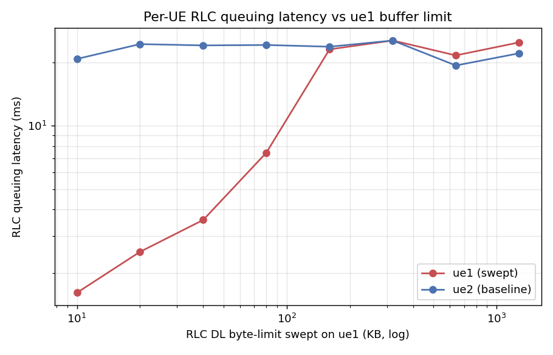
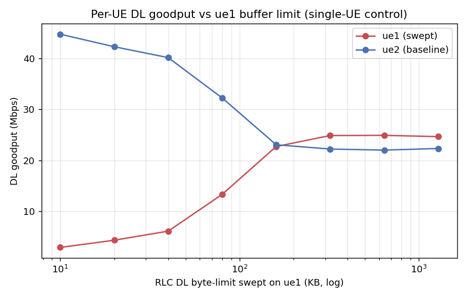
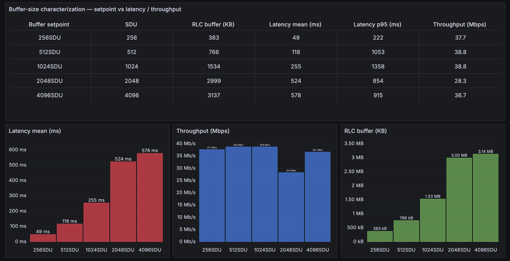
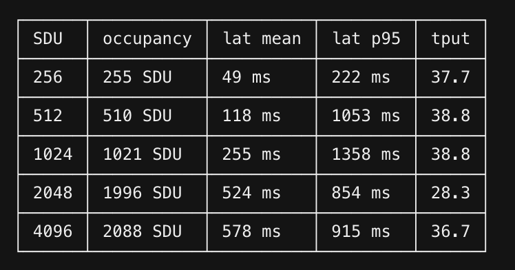

# Demo 3: TCP Flow Optimization with Real-Time Buffer Management

A bulk download fills the gNB's downlink RLC queue, and every packet behind it waits: a video call's RTT
climbs to hundreds of milliseconds while the download gains nothing. A control codelet on the
`rlc_dl_ctrl` hook sets that queue's limit at run time, for every UE (Section 2) or per UE (Section 3).

```{container} info-box
- **Before you start:** Parts 1 and 2 of the [tutorial](../open-ai-ran-tutorial.md). Part 1
  [builds the codelets](../open-ai-ran-tutorial.md#build-the-codelets) this demo loads: `upt`, `bufctl`
  and `bufcap`.
- **Design:** {doc}`../edgeric-ocudu-jbpf` (the hooks and jrtc), and the
  [telemetry](#telemetry-codelets-for-the-rlc-queue) and [control](#control-codelets-for-the-rlc-queue)
  codelets in the [Reference](#reference-to-be-updated).
- **Runtime:** about 25 minutes.
```

```{figure} demo3/queue.svg
:width: 100%
:alt: The UPF sends a video call and a download to one UE; both wait in the gNB's downlink RLC queue for the UE's bearer. The upt telemetry codelets report the queue's latency and occupancy to Grafana, and a control codelet on the rlc_dl_ctrl hook, bufcap or bufctl, sets the queue's limit
```

## 1. Run the System

Two UEs share the cell, both on a clean channel. In Section 2, UE 1 carries a video call and a download
while UE 2 stays idle; in Section 3, each UE runs one download. Open four terminals on the testbed host.

### Terminal 1: RAN

```bash
cd <your clone of edgeric-ocudu-jbpf>
export KUBECONFIG="$(k3d kubeconfig write janus-cluster)"
bash scripts/setup_zmq_chan_demo.sh 2 --ran --telemetry
```

The script stops everything still running, provisions two subscribers in the core, restarts `jrtc-0`,
starts the broker and the gNB for two UEs, and loads the `upt` telemetry codelets and the dashboard xApp.
It also copies the `bufctl` codelet into the gNB container for Section 3. Then it shows the gNB console.
It takes about 2 minutes; start Terminal 2 when the console appears.

```text
== [1/7] stop everything ==
    UPF iperf3 stopped
    UE iperf3 stopped
    UE stopped (live now: 0)
    gNB stopped; log truncated (was 0)
    broker stopped
  ues stopped
  broker stopped
== [2/7] core: IMSIs 999700000000001..999700000000002 ==
  provisioned (0 added)
== [3/7] fresh jrtc-0 (clean app registry + jbpf IPC peer) ==
  jrtc-0 ready
== [4/7] stage broker, UE and gNB configs; netns for 2 UE(s) ==
  ue1: pod 10.201.1.1 <-> netns 10.201.1.2
  ue2: pod 10.201.2.1 <-> netns 10.201.2.2
== [5/7] broker (2 UE) ==
  [broker] C++ single-thread, gNB tx ipc:///tmp/zmq/gnb_tx -> 2 UE(s) -> gNB rx ipc:///tmp/zmq/gnb_rx
  [broker] gNB receiver noise -65.0 dBFS
  [broker]   UE1: rx ipc:///tmp/zmq/ue1_rx  tx ipc:///tmp/zmq/ue1_tx  (DL +0.0 dB, UL +0.0 dB)
  [broker]   UE2: rx ipc:///tmp/zmq/ue2_rx  tx ipc:///tmp/zmq/ue2_tx  (DL +0.0 dB, UL +0.0 dB)
  [broker] running (chunk 11520, queue 23040, pacing DL at srate)
== [6/7] gNB (broker mode, dynamic pod-IP NG-U bind) ==
  gnb tx_port=ipc:///proc/61581/root/tmp/zmq/gnb_tx
  gnb started (bind=10.42.0.92)
  gnb procs=1 ngsetup=1
  fwd: fwd 127.0.0.1:30450 -> ('srs-gnb-du1-proxy.ran.svc.cluster.local', 30450)
  upt codeletset loaded
  dashboard xApp loaded

RAN UP. Broker for 2 UE(s); gNB connected to the AMF.
  UEs     : bash scripts/setup_zmq_chan_demo.sh 2 --ues [--channel FILE | --traces FILE]   (another terminal)
  console : bash scripts/gnb_console.sh

--== OCUDU gNB (commit ) ==--

Lower PHY in executor sequential baseband mode.
Available radio types: zmq and realtime_loopback.
Cell pci=1, bw=20 MHz, 1T1R, dl_arfcn=632628 (n78), dl_freq=3489.42 MHz, dl_ssb_arfcn=632256, ul_freq=3489.42 MHz

N2: Connection to AMF on open5gs-amf-ngap.open5gs.svc.cluster.local:38412 completed
Remote control server listening on 127.0.0.1:55555
==== gNB started ===
Type <h> to view help
```

Once the UEs attach (Terminal 2) and the traffic runs (Terminal 3), the console prints one row per UE
every second. UE 1 (C-RNTI 4601) carries the download at about 63 Mbit/s at CQI 15, with 2 to 3 MB
queued for it (`dl_bs`); UE 2 (4602) stays idle until Section 3:

```text
          |--------------------DL---------------------|-------------------------------UL-----------------------------
 pci rnti | cqi  ri  mcs  brate   ok  nok  (%)  dl_bs | pusch  rsrp  ri  mcs  brate   ok  nok  (%)    bsr     ta  phr
   1 4601 |  15 1.0   27    63M 1400    0   0%  2.41M |  33.6 -26.7   1   27   932k  100    0   0%  1.45k   260n   38
   1 4602 |  15 1.0    0      0    0    0   0%      0 |  33.5 -26.7   1   27  4.86k    1    0   0%      0   260n   38
   1 4601 |  15 1.0   27    63M 1400    0   0%  2.55M |  33.6 -26.7   1   27   944k  100    0   0%  1.45k   260n   38
   1 4602 |  15 1.0    0      0    0    0   0%      0 |  33.1 -26.7   1   27  4.86k    1    0   0%      0   260n   38
   1 4601 |  15 1.0   27    63M 1400    0   0%  2.69M |  33.7 -26.7   1   27   916k  100    0   0%  1.04k   260n   38
   1 4602 |  15 1.0    0      0    0    0   0%      0 |  32.7 -26.7   1   27  4.86k    1    0   0%      0   260n   38
   1 4601 |  15 1.0   27    63M 1400    0   0%  2.88M |  33.6 -26.7   1   27   926k  100    0   0%  1.04k   260n   38
   1 4602 |  15 1.0    0      0    0    0   0%      0 |   n/a   n/a   1    0      0    0    0   0%      0   260n   38
```

Ctrl-C leaves the console and the RAN keeps running; `bash scripts/gnb_console.sh` reopens it.

### Terminal 2: UEs

```bash
cd <your clone of edgeric-ocudu-jbpf>
export KUBECONFIG="$(k3d kubeconfig write janus-cluster)"
bash scripts/setup_zmq_chan_demo.sh 2 --ues
```

`--ues` starts the two UEs against Terminal 1's broker and gNB and waits until both attach, about 15 s.
Their channels are clean (CQI 15), so the queue, not the radio, decides the latency.

```text
== [1-6/7] the RAN of the last --ran ==
  broker pid 61581 for 2 UE(s), UL noise -65; gNB up; telemetry on
== [7/7] 2 UE(s) ==
  ue1: IMSI 999700000000001  chan: distance=50,speed=0,min_distance=40,max_distance=60,dl_snr_ref=30,ul_snr_ref=30,seed=1,jitter_db=0,ul_noise_dbfs=-65
  ue2: IMSI 999700000000002  chan: distance=50,speed=0,min_distance=40,max_distance=60,dl_snr_ref=30,ul_snr_ref=30,seed=2,jitter_db=0,ul_noise_dbfs=-65
  tune: gnb + broker threads SCHED_FIFO; gnb, broker, UEs on CPUs 16-31,48-63

################ verify ################
  ue1 ip=10.45.0.85  t 6.0 s, d 50.0 m, DL SNR 30.0 dB (ref -27.4 dBFS), UL SNR 30.0 dB, UL gain 8.4 dB
  ue2 ip=10.45.0.86  t 6.0 s, d 50.0 m, DL SNR 30.0 dB (ref -27.4 dBFS), UL SNR 30.0 dB, UL gain 8.4 dB
  UE 1  IMSI 999700000000001  IP 10.45.0.85   RAN_UE_NGAP_ID 0  AMF_UE_NGAP_ID 84
  UE 2  IMSI 999700000000002  IP 10.45.0.86   RAN_UE_NGAP_ID 1  AMF_UE_NGAP_ID 85
  -> 2 core events to the dashboard xApps (jrtc-0, udp 127.0.0.1:30502 dashboard, :30503 dashboard-realtime-scheduling)

SETUP DONE. 2 UE(s) attached.
  traffic : bash scripts/traffic_nue.sh start     (DL iperf3, UPF -> every UE)
  rates   : bash scripts/traffic_nue.sh status    (per-UE + total, measured at the UE)
  channel : kubectl exec -n ran srs-gnb-du1-0 -c durue1 -- grep 'ZMQ chan' /tmp/ues/ue1.log | tail
  stop    : bash scripts/traffic_nue.sh stop && bash scripts/stop_demo.sh
```

### Terminal 3: Traffic

```bash
cd <your clone of edgeric-ocudu-jbpf>
export KUBECONFIG="$(k3d kubeconfig write janus-cluster)"
bash buffer-control-experiments/traffic_A.sh start
```

```text
video: cubic paced 2M -> 10.45.0.85:5202
bulk:  cubic unlimited  -> 10.45.0.85:5201
flowmon: [flowmon] {'5201': 'bulk', '5202': 'video'} -> http://localhost:30491/write
```

Both flows run downlink from the UPF to UE 1, on the same bearer: a call paced at 2 Mbit/s and an
unlimited CUBIC download. `flowmon` reads each flow's RTT and throughput from the sender's TCP stack on
the UPF and writes them for Grafana. Within about 20 s the download fills the queue and the call's RTT
passes 200 ms. Other mixes:

```bash
bash buffer-control-experiments/traffic_A.sh start --cc bbr          # a BBR download instead
bash buffer-control-experiments/traffic_A.sh start --video-rate 4M
bash buffer-control-experiments/traffic_A.sh video-only              # or bulk-only
```

### Terminal 4: Grafana

```bash
cd <your clone of edgeric-ocudu-jbpf>
export KUBECONFIG="$(k3d kubeconfig write janus-cluster)"
python3 buffer-control-experiments/make_dashboard.py     # once per Grafana install
bash scripts/tcp_probe.sh
```

```text
{'folderUid': '', 'id': 3, 'slug': 'exp-a-b3a-buffer-knob-and-bad-channel', 'status': 'success', 'uid': 'expA-bufcap', 'url': '/d/expA-bufcap/exp-a-b3a-buffer-knob-and-bad-channel', 'version': 3}
-> http://localhost:30490/d/expA-bufcap
Dashboard: http://localhost:30490/d/upt-userplane   (Ctrl-C stops the TCP row)
[tcp_probe] UE map: {'10.45.0.85': 1, '10.45.0.86': 2}
[tcp_probe] writing to http://localhost:30491/write
[tcp_probe] capturing on open5gs-upf-59bcf7bbb8-v7djt:ogstun
[tcp_probe] pcap linktype=101 l2_offset=0
```

`make_dashboard.py` creates the experiment dashboard for Section 2. `tcp_probe.sh` captures on the UPF
and feeds the TCP row of the user-plane dashboard for Section 3; it runs in the foreground until Ctrl-C.
Open <http://localhost:30490/d/expA-bufcap>. From a laptop, forward the port first:
`ssh -N -L 30490:localhost:30490 <user>@<testbed-host>`.

```{figure} demo3/grafana-baseline.png
:width: 100%
:target: ../_images/grafana-baseline.png
:alt: The experiment dashboard before any cap. The video call's and the download's RTT rise and fall in a sawtooth between about 150 and 500 ms, averaging about 300 ms, with the gNB's queuing delay just below them; the download takes about 57 Mbit/s and the call 2 Mbit/s; the RLC queue holds about 2 MiB against the 6 MiB configured limit

The experiment dashboard before any cap.
```

- **Top row:** the call's RTT now, the download's throughput, the cap in force (none yet: the gNB's
  configured queue, 6 MiB) and the channel (MCS 28, a clean channel).
- **Latency:** the call's RTT (blue) and the download's (orange) average about 300 ms, in a CUBIC sawtooth
  that peaks near 500 ms. The gNB's queuing delay (dotted) tracks them: the queue is the RTT.
- **Throughput and RLC buffer:** the download takes about 57 Mbit/s and keeps about 2 MB queued; the
  call holds its 2 Mbit/s. The black line is the cap in force: with no cap, the gNB's configured queue,
  about 6 MB.

## 2. Cell-Wide Buffer Cap

### Terminal 5: Buffer Cap

Open a fifth terminal. The `bufcap` codelet holds one limit on every UE's queue. Step it down, about a
minute per size, then remove it:

```bash
cd <your clone of edgeric-ocudu-jbpf>
export KUBECONFIG="$(k3d kubeconfig write janus-cluster)"
bash buffer-control-experiments/bufcap.sh load 256k
bash buffer-control-experiments/bufcap.sh load 128k
bash buffer-control-experiments/bufcap.sh load 64k
bash buffer-control-experiments/bufcap.sh load 16k
bash buffer-control-experiments/bufcap.sh status
bash buffer-control-experiments/bufcap.sh off
```

`load` swaps out the cap in force, so you can move between sizes freely, and builds a size on its first
use. `off` loads `bufcap_off` until the next downlink packet has restored the configured limit, then
unloads it:

```text
  loaded bufcap_256k
  unloaded bufcap_256k
  loaded bufcap_128k
  unloaded bufcap_128k
  loaded bufcap_64k
  unloaded bufcap_64k
  loaded bufcap_16k
  bufcap: loads=4 removes=3 -> ATTACHED (16k)
  bufctl: loads=0 removes=0
  unloaded bufcap_16k
  loaded bufcap_off
  configured buffer restored; bufcap unloaded
```

Every cap change draws a dashed line on the dashboard. Then print the run, one row per setting (the
first 10 s after each change are skipped):

```bash
python3 buffer-control-experiments/snapshot.py --minutes 8.2
```

```text
  time (s)    cap           video RTT p50/p95  video Mb/s      bulk RTT p50/p95   bulk Mb/s
     0-108    no cap              303.8/424.3        2.01           304.3/422.1       56.54
   108-184    256k                  47.6/78.4        1.97             39.1/55.2       52.43
   184-261    128k                 31.0/181.7        1.96             24.9/91.2        39.5
   261-337    64k                  30.6/163.7        1.99             26.7/76.7       14.46
   337-416    16k                  51.5/125.5        0.93            48.3/127.5        0.96
   416-492    no cap              295.4/426.2        2.03           288.1/430.4       56.28
  plot: <your clone of edgeric-ocudu-jbpf>/buffer-control-experiments/results/session_20261008_004540/timeline.png
```

```{figure} demo3/grafana-cap.png
:width: 100%
:target: ../_images/grafana-cap.png
:alt: The experiment dashboard over Section 2. With no cap the call's and the download's RTT average about 300 ms and the RLC queue holds about 2 MiB. From the 256k cap on, the RTTs fall to tens of milliseconds and the queue to almost nothing; the download keeps 52 Mbit/s at 256k, falls to 14 at 64k and collapses at 16k. With the cap removed the bloat returns

Section 2: no cap, then 256k, 128k, 64k and 16k, then no cap again.
```

- **Latency:** each dashed line is a cap change. At 256k the call's median RTT drops from 304 ms to
  48 ms, and at 128k and 64k to about 31.
- **Throughput:** the download keeps 52 Mbit/s at 256k, then loses rate as the cap drops below the
  bandwidth-delay product: 40 at 128k and 14 at 64k. At 16k both flows collapse to under 1 Mbit/s. The
  call holds its 2 Mbit/s until 16k.
- **RLC buffer:** about 2 MB queued with no cap, almost nothing under any cap. The black line steps down
  with each cap and returns to the configured 6 MB after `off`.

Latency collapses long before throughput does: at 256k the call's median RTT is about a sixth of what it
was, and the download keeps 93 % of its rate. Smaller caps buy little more latency and cost the download
most of its rate.

## 3. Per-UE Limits, BBR vs CUBIC

One cap for the whole cell treats every flow the same. Now each UE runs one download, BBR on UE 1 and
CUBIC on UE 2, and you set each UE's limit live from the `bufctl` CLI.

### Terminal 3: Traffic

Switch the traffic. UE 1's flow needs BBR in the host kernel, which the k3d nodes share:

```bash
bash buffer-control-experiments/traffic_A.sh stop
sysctl net.ipv4.tcp_available_congestion_control     # bbr should be listed; if not: sudo modprobe tcp_bbr
bash scripts/traffic_2ue.sh start                    # UE 1 = BBR, UE 2 = CUBIC
bash scripts/traffic_2ue.sh status
```

```text
traffic stopped
flowmon stopped
net.ipv4.tcp_available_congestion_control = reno cubic bbr
ue1: DL started  UPF -> 10.45.0.85:5201  (cc=bbr rate=unlimited 3600s)
ue2: DL started  UPF -> 10.45.0.86:5202  (cc=cubic rate=unlimited 3600s)

Per-UE buffer control:  python3 jrtc-apps/jrtc_apps/bufctl/bufctl_cli.py

  ue1 ip=10.45.0.85   last=29.1 Mbits/sec
  ue2 ip=10.45.0.86   last=29.4 Mbits/sec
  live iperf3 -- ue: 2 upf: 2
```

Both UEs get the same rate, 32 Mbit/s at the MAC, but Terminal 1's console shows the difference
between the two transports: the CUBIC UE (C-RNTI 4602) keeps about 2 MB queued, while the BBR UE (4601)
keeps about 0.1 MB:

```text
          |--------------------DL---------------------|-------------------------------UL-----------------------------
 pci rnti | cqi  ri  mcs  brate   ok  nok  (%)  dl_bs | pusch  rsrp  ri  mcs  brate   ok  nok  (%)    bsr     ta  phr
   1 4601 |  15 1.0   27    32M  700    0   0%  66.3k |  33.4 -26.7   1   27   488k   69    0   0%     74   260n   38
   1 4602 |  15 1.0   27    32M  700    0   0%  1.78M |  33.4 -26.7   1   27   462k   67    0   0%    535   260n   38
   1 4601 |  15 1.0   27    32M  700    0   0%   111k |  33.4 -26.7   1   27   493k   70    0   0%      0   260n   38
   1 4602 |  15 1.0   27    32M  700    0   0%  1.91M |  33.4 -26.7   1   27   465k   67    0   0%      0   260n   38
   1 4601 |  15 1.0   27    32M  700    0   0%   104k |  33.5 -26.7   1   27   514k   72    0   0%      0   260n   38
   1 4602 |  15 1.0   27    32M  700    0   0%   1.9M |  33.3 -26.7   1   27   457k   66    0   0%  1.04k   260n   38
```

Other mixes:

```bash
bash scripts/traffic_2ue.sh start --cc cubic             # both CUBIC, as a baseline
bash scripts/traffic_2ue.sh start --cc1 cubic --cc2 bbr  # swap them
bash scripts/traffic_2ue.sh start --ue 1 --rate 2M       # UE 1 paced at 2 Mbit/s, like a call
```

Open the user-plane dashboard, <http://localhost:30490/d/upt-userplane>, and set `bearer` to `DRB1`.

### Terminal 6: bufctl CLI

Open a sixth terminal:

```bash
cd <your clone of edgeric-ocudu-jbpf>
export KUBECONFIG="$(k3d kubeconfig write janus-cluster)"
python3 jrtc-apps/jrtc_apps/bufctl/bufctl_cli.py
```

The CLI loads the `bufctl` codelet and its xApp when it starts and unloads them on `quit`. `bufctl` and
`bufcap` share the `rlc_dl_ctrl` hook, so the `bufcap.sh off` that ended Section 2 must have run. Its
commands:

```text
scan                    discover the live bearers
list                    UE, DRB, current and configured limits, last event
set 0 1 byte 200000     cap UE 0's DRB1 at 200 kB
set 0 1 sdu 512         or limit it by SDU count
reset 0 1               back to the configured size
quit                    unload the codelet and the xApp
```

`bufctl` numbers UEs by the gNB's DU UE index, which follows attach order. In this run UE 1 attached
first, so index 0 is UE 1 (BBR) and index 1 is UE 2 (CUBIC); the identity table at the top of the
user-plane dashboard lists each UE's DU UE index. Cap the CUBIC UE first, with `set 1 1 byte 200000`:

```text
==============================================================================
 RLC DL buffer-size control
 The codelet is loaded now and unloaded on quit, because while it is
 loaded the control hook runs on every downlink packet.
==============================================================================
  jrtc-ctl load: ok

  UE  DRB   current            configured         last event   ranges
  ----------------------------------------------------------------------------
  0   1     6172672B/16384SDU  6172672B/16384SDU  get          sdu 1..16384, byte 9007..6172672
  1   1     6172672B/16384SDU  6172672B/16384SDU  changed      sdu 1..16384, byte 9007..6172672
  (snapshot 1.2s old; reports=3, sent=1, failed=0)

  type 'help' for commands
bufctl> scan
  asked 8 (UE, DRB) pairs to report

  UE  DRB   current            configured         last event   ranges
  ----------------------------------------------------------------------------
  0   1     6172672B/16384SDU  6172672B/16384SDU  get          sdu 1..16384, byte 9007..6172672
  1   1     6172672B/16384SDU  6172672B/16384SDU  get          sdu 1..16384, byte 9007..6172672
  (snapshot 1.6s old; reports=5, sent=9, failed=0)

bufctl> set 1 1 byte 200000
  SET sent: UE 1 DRB 1 byte=200000 (applies on its next DL packet)

  UE  DRB   current            configured         last event   ranges
  ----------------------------------------------------------------------------
  0   1     6172672B/16384SDU  6172672B/16384SDU  get          sdu 1..16384, byte 9007..6172672
  1   1     200000B/16384SDU   6172672B/16384SDU  changed      sdu 1..16384, byte 9007..6172672  <- changed
  (snapshot 1.1s old; reports=6, sent=10, failed=0)
```

The configured queue is 6,172,672 bytes (about 6 MB), and the gNB accepts any byte limit from one
maximum-size PDCP PDU (9,007 bytes) up to it. About a minute later, cap the BBR UE with the same limit,
then restore both and quit:

```text
bufctl> set 0 1 byte 200000
  SET sent: UE 0 DRB 1 byte=200000 (applies on its next DL packet)

  UE  DRB   current            configured         last event   ranges
  ----------------------------------------------------------------------------
  0   1     200000B/16384SDU   6172672B/16384SDU  changed      sdu 1..16384, byte 9007..6172672  <- changed
  1   1     200000B/16384SDU   6172672B/16384SDU  changed      sdu 1..16384, byte 9007..6172672  <- changed
  (snapshot 1.2s old; reports=7, sent=11, failed=0)

bufctl> reset 0 1
  RESET sent for UE 0 DRB 1 (applies on its next DL packet)
  ...

bufctl> reset 1 1
  RESET sent for UE 1 DRB 1 (applies on its next DL packet)
  ...

bufctl> quit
  bye
  unloading bufctl (applied limits stay in force)
  jrtc-ctl unload: ok
```

The gNB keeps a limit after the codelet unloads, so reset each bearer before `quit`.

```{figure} demo3/grafana-per-ue.png
:width: 100%
:target: ../_images/grafana-per-ue.png
:alt: The user-plane dashboard over Section 3. The identity table maps UE 1 (IP 10.45.0.85) to DU UE index 0 and UE 2 (10.45.0.86) to DU UE index 1. Both UEs report CQI 15 and get about 30 Mbit/s. UE 2's RLC queuing latency sits at 350 to 700 ms and its TCP RTT near 560 ms until 00:47:00, near 30 and 55 ms while capped, and both climb back after the reset at 00:49:36; UE 1 stays near 20 ms of queuing delay throughout

Section 3: UE 2 (CUBIC, orange) and UE 1 (BBR, blue). UE 2 capped at 00:47:00, UE 1 at 00:48:18, both
reset at 00:49:36.
```

- **No cap:** UE 2 (CUBIC) keeps about 2 MB queued: 525 ms of RLC queuing delay and a TCP RTT of
  560 ms. UE 1 (BBR) keeps about 70 kB: 20 ms and 42 ms. Both get about 29 Mbit/s.
- **UE 2 capped** (`set 1 1 byte 200000`): its queue falls to about 120 kB, its queuing delay to 31 ms
  and its RTT to 55 ms, at the same 29 Mbit/s. UE 1 does not change.
- **Both capped:** UE 1 already kept less than 200 kB queued, so the cap changes little. Its throughput
  dips to about 13 Mbit/s for 15 s while BBR adapts, and UE 2 takes the spare capacity.
- **Reset:** within about 25 s UE 2's queue refills, and its queuing delay is back at 350 to 650 ms.

One limit does not suit every user: 200 kB removes half a second of delay from the CUBIC flow at no
cost in throughput, and buys the BBR flow nothing, since it never queued that much.

## 4. Stop

```bash
# Terminal 6: reset 0 1, reset 1 1, quit.  Terminal 4: Ctrl-C.
bash scripts/traffic_2ue.sh stop
bash scripts/stop_demo.sh
```

```text
stopped. live iperf3 -- ue container: 0 upf: 0
== [1/5] unload bufctl if attached ==
  bufctl was not attached
== [2/5] stop traffic ==
  UPF iperf3 stopped
  UE iperf3 stopped
  tcp_probe not running
== [3/5] stop the UE ==
  UE stopped (live now: 0)
== [4/5] stop the gNB and reclaim the log ==
  gNB stopped; log truncated (was 988K)
== [5/5] stop the broker (multi-UE runs: Python or C++) ==
  broker stopped

STOPPED. Bring it back with:  bash scripts/restart_demo.sh
```

Then press Ctrl-C in Terminal 1.

## Reference [To be updated]

### Telemetry Codelets for the RLC Queue

The [Miscellaneous](miscellaneous.md#telemetry-with-codelets) page loads codelets somebody else wrote. Now we write our own, and we pick a measurement that the
standard per-layer counters cannot give: **where does a downlink packet actually spend its time, and
how deep is the queue it waits in?**

Three codelets, all downlink, all per UE per radio bearer:

| Codelet | Hook | Measures |
|---|---|---|
| `gtp_arrival` | `pdcp_dl_new_sdu` | DL arrival rate into the RAN |
| **`rlc_queueing`** | `rlc_dl_sdu_send_started` | **RLC queuing latency** (SDU arrival → start of transmission) |
| **`rlc_buffer_enq` / `_deq`** | `rlc_dl_new_sdu` / `rlc_dl_sdu_send_completed` | **RLC buffer occupancy** (bytes and packets in the SDU queue) |

They live in `jrtc-apps/codelets/upt/` (upt = user-plane telemetry) and are deployed by
`jrtc_apps/upt/deployment_fixed.yaml`.

> Terminal 1 loads the `upt` codeletset with `--telemetry`. Unload it with the deployment that loaded
> it (`deployment_demo.yaml`) before loading your own build.

#### Anatomy of a codelet

Every codelet is one `.cpp` with a single `jbpf_main`, compiled to BPF and verified:

```cpp
#include <linux/bpf.h>
#include "jbpf_srsran_contexts.h"          // the RAN context structs
#include "../utils/misc_utils.h"
#include "../utils/hashmap_utils.h"
#define SEC(NAME) __attribute__((section(NAME), used))
#include "jbpf_defs.h"
#include "jbpf_helper.h"

// output channel: a ring buffer typed by the protobuf message
jbpf_ringbuf_map(out_channel, my_stats, 16);

extern "C" SEC("jbpf_srsran_generic")
uint64_t jbpf_main(void* state)
{
    struct jbpf_ran_generic_ctx* ctx = (jbpf_ran_generic_ctx*)state;

    // 1. cast ctx->data to the layer's context struct
    const jbpf_rlc_ctx_info& rlc_ctx = *reinterpret_cast<const jbpf_rlc_ctx_info*>(ctx->data);

    // 2. MANDATORY bounds check - the verifier rejects the program without it
    if (reinterpret_cast<const uint8_t*>(&rlc_ctx) + sizeof(jbpf_rlc_ctx_info) >
        reinterpret_cast<const uint8_t*>(ctx->data_end)) {
        return JBPF_CODELET_FAILURE;
    }

    // 3. do the work: accumulate into maps, or emit
    return JBPF_CODELET_SUCCESS;
}
```

Rules the verifier enforces, and the ones that will actually bite you:

- **Bounds-check `ctx->data` against `ctx->data_end`** before touching it. Always.
- **Loops must be bounded** and provably terminating (`#pragma unroll` with a constant bound).
- **No 64-bit division.** Use shifts. This is why the bucketing below uses a power of two.
- **No `.rodata`.** A file-scope `static const uint32_t TABLE[8]` makes the loader emit a `.rodata`
  section it does not relocate, and the verifier then reports *0 instructions*. Use a `switch`
  that returns the value instead. (The control codelets below hit this.)
- Every array access is masked (`arr[i % N]`) so the verifier can prove it is in range.

#### The design decision: bucket inside the codelet

The naive design streams one IO message per packet. At 50 Mbps a single UE produces ~4167 pkt/s,
which is ~130 MB/s of IO per UE; the jbpf IO mempool is exhausted and `jbpf_mbuf_alloc` starts
failing with *"error dequeuing memory from the mempool"*.

So these codelets **aggregate per-packet events into fixed time buckets inside the codelet** and emit
one protobuf message per bucket per stream. Per-packet *accuracy* is retained — every packet still
updates the accumulators — but the *output rate becomes independent of the traffic rate*
(~7.45 msg/s per stream at any load).

`codelets/upt/upt_helpers.h`:

```c
// Bucket width as a power-of-two shift on the ns timestamp.
// A shift, not a division: 64-bit division is awkward for the eBPF verifier.
// 1 << 27 ns = 134.217728 ms
#define UPT_BUCKET_SHIFT (27)
#define UPT_BUCKET_NS    (1ULL << UPT_BUCKET_SHIFT)

// Max (UE, radio-bearer) pairs tracked per bucket.
// MUST equal max_count in the .options files.
#define UPT_MAX_UE_RB (16)

// SRBs and DRBs share the small rb_id space; fold is_srb into the key so
// SRB1 and DRB1 land in distinct slots.
#define RBID_2_EXPLICIT(__is_srb, __rb_id) ((__is_srb) ? (__rb_id) : ((__rb_id) + 8))
```

The rollover logic is identical in all three codelets:

```c
uint64_t now    = jbpf_time_get_ns();
uint64_t bucket = now >> UPT_BUCKET_SHIFT;

if (*last_bucket != bucket) {                     // the bucket just closed
    if (*last_bucket != 0 && out->stats_count > 0) {
        out->timestamp = now;
        out->bucket_id = *last_bucket;
        jbpf_ringbuf_output(&out_channel, out, sizeof(*out));   // emit it
    }
    JBPF_HASHMAP_CLEAR(&hash);
    jbpf_map_clear(&stats_map);
    *last_bucket = bucket;
}
// ... then accumulate this event into out->stats[ind]
```

Per-(UE, bearer) slotting uses the shared protohash helper:

```c
int new_val = 0;
uint32_t ind = JBPF_PROTOHASH_LOOKUP_ELEM_64(out, stats, hash, ue_index, rb_id, new_val);
// every access is out->stats[ind % UPT_MAX_UE_RB]
```

#### Codelet 1: RLC queuing latency

**The measurement.** srsRAN stamps `time_of_arrival` on every SDU when it enters RLC
(`rlc_tx_am_entity::handle_sdu`), and just before it starts building the PDU it computes the elapsed
time and passes it to the hook:

```cpp
// srsRAN: lib/rlc/rlc_tx_am_entity.cpp
auto latency = std::chrono::duration_cast<std::chrono::nanoseconds>(
    std::chrono::high_resolution_clock::now() - sdu_info.time_of_arrival);
CALL_JBPF_HOOK(hook_rlc_dl_sdu_send_started,
               sdu_info.pdcp_sn.value(), sdu_info.is_retx, (uint64_t)latency.count());
```

So `latency_ns = (start of PDU build) − (SDU arrival at RLC)` — a **queuing** delay, not an
over-the-air delay. The codelet does not compute it; it only *reduces* it.

> This is why there is no PDCP-SN → enqueue-timestamp shared map here. The classic design (an
> enqueue codelet writes a map keyed by PDCP SN, a dequeue codelet looks it up and subtracts) exists
> only because some forks do not expose `latency_ns`. Reading it directly removes a per-packet map
> insert + lookup + delete from the datapath, and removes the map-pressure failure mode entirely.

**Step 1 — the wire format.** `codelets/upt/rlc_queue_stats.proto`:

```protobuf
syntax = "proto2";

message t_rlc_queue_item {
   required uint32 du_ue_index    = 1;
   required uint32 is_srb         = 2;
   required uint32 rb_id          = 3;
   required uint32 count          = 4;   // SDUs measured in this bucket
   required uint64 latency_sum_ns = 5;
   required uint64 latency_min_ns = 6;
   required uint64 latency_max_ns = 7;
   required uint32 retx_count     = 8;
}

message rlc_queue_stats {
   required uint64 timestamp = 1;
   required uint64 bucket_id = 2;
   repeated t_rlc_queue_item stats = 3;
}
```

and `rlc_queue_stats.options` — **this number must equal `UPT_MAX_UE_RB`**:

```text
rlc_queue_stats.stats max_count:16
```

**Step 2 — the accumulator.** `stats_utils.h`'s `STATS_UPDATE` is 32-bit and these latencies exceed
4.29 s under bufferbloat, so `upt_helpers.h` adds a 64-bit one:

```c
#define UPT_LAT_UPDATE(__d, __v)            \
    do {                                    \
        __d.count++;                        \
        __d.latency_sum_ns += (__v);        \
        if ((__v) < __d.latency_min_ns) { __d.latency_min_ns = (__v); } \
        if ((__v) > __d.latency_max_ns) { __d.latency_max_ns = (__v); } \
    } while (0)
```

**Step 3 — the codelet.** `codelets/upt/rlc_queueing.cpp`, the part after the boilerplate:

```cpp
jbpf_ringbuf_map(out_rlc_queue, rlc_queue_stats, 16);
UPT_DEFINE_STATS_MAP(rlcq_stats_map, rlc_queue_stats)
UPT_DEFINE_BUCKET_MAP(rlcq_bucket_map)
DEFINE_PROTOHASH_64(rlcq_hash, UPT_MAX_UE_RB)

extern "C" SEC("jbpf_srsran_generic")
uint64_t jbpf_main(void* state)
{
    /* ... ctx cast + bounds check + map lookups + bucket rollover ... */

    // srs_meta_data1 = pdcp_sn << 32 | is_retx ;  srs_meta_data2 = latency_ns
    uint32_t is_retx    = (uint32_t)(ctx->srs_meta_data1 & 0xFFFFFFFF);
    uint64_t latency_ns = ctx->srs_meta_data2;            // <- the measurement

    int rb_id = RBID_2_EXPLICIT(rlc_ctx.is_srb, rlc_ctx.rb_id);

    int new_val = 0;
    uint32_t ind = JBPF_PROTOHASH_LOOKUP_ELEM_64(out, stats, rlcq_hash,
                                                 rlc_ctx.du_ue_index, rb_id, new_val);
    if (new_val) {
        out->stats[ind % UPT_MAX_UE_RB].du_ue_index = rlc_ctx.du_ue_index;
        out->stats[ind % UPT_MAX_UE_RB].is_srb      = rlc_ctx.is_srb;
        out->stats[ind % UPT_MAX_UE_RB].rb_id       = rlc_ctx.rb_id;
        UPT_LAT_INIT(out->stats[ind % UPT_MAX_UE_RB]);
    }

    UPT_LAT_UPDATE(out->stats[ind % UPT_MAX_UE_RB], latency_ns);
    if (is_retx) { out->stats[ind % UPT_MAX_UE_RB].retx_count += 1; }

    return JBPF_CODELET_SUCCESS;
}
```

That is the whole thing: ~40 lines of logic, verified at **411 instructions**.

#### Codelet 2: RLC buffer occupancy

Occupancy needs two hooks, because the queue both grows and drains:

- `rlc_dl_new_sdu` → **`rlc_buffer_enq`** (grows; **owns the output channel** and flushes)
- `rlc_dl_sdu_send_completed` → **`rlc_buffer_deq`** (drains; accumulates only)

**Where the number comes from.** srsRAN's own `CALL_JBPF_HOOK` macro attaches the live queue depth
to *every* RLC hook invocation:

```cpp
jbpf_ctx.u.am_tx.sdu_queue_info = { true,
                                    sdu_queue.get_state().n_sdus,     /* num_pkts  */
                                    sdu_queue.get_state().n_bytes };  /* num_bytes */
```

so the codelet **samples occupancy directly** rather than integrating (enqueued − dequeued):

```c
// rlc_buffer_common.h - pick the mode-specific union arm
#define UPT_RLCB_GET_QUEUE(__rlc_ctx, __qi)                          \
    do {                                                             \
        __qi = NULL;                                                 \
        if ((__rlc_ctx.rlc_mode == JBPF_RLC_MODE_AM) &&              \
            (__rlc_ctx.u.am_tx.sdu_queue_info.used)) {               \
            __qi = &__rlc_ctx.u.am_tx.sdu_queue_info;                \
        } else if (/* UM */) { ... } else if (/* TM */) { ... }      \
    } while (0)

#define UPT_RLCB_SAMPLE(__d, __qi)                                   \
    do {                                                             \
        __d.samples++;                                               \
        __d.queue_bytes_last = __qi->num_bytes;                      \
        __d.queue_pkts_last  = __qi->num_pkts;                       \
        __d.queue_bytes_sum += __qi->num_bytes;                      \
        if (__qi->num_bytes > __d.queue_bytes_max) { __d.queue_bytes_max = __qi->num_bytes; } \
        if (__qi->num_pkts  > __d.queue_pkts_max)  { __d.queue_pkts_max  = __qi->num_pkts;  } \
    } while (0)
```

> **Why sample rather than integrate.** An integrated `enq − deq` counter drifts **permanently** if a
> single event is missed, a bearer is re-established, or the codelet is loaded mid-flow. A direct
> sample is self-correcting. `enq_pkts` / `deq_pkts` are still reported per bucket, so the integrated
> view remains reconstructable if you want it.

**Sharing state between two codelets.** The two halves must accumulate into the *same* message. That
is what `linked_maps` is for — in `codelets/upt/upt.yaml`:

```yaml
  - codelet_name: rlc_buffer_enq
    codelet_path: ${JBPF_CODELETS}/upt/rlc_buffer_enq.o
    hook_name: rlc_dl_new_sdu
    priority: 1
    out_io_channel:                      # <- only enq owns the output
      - name: out_rlc_buffer
        forward_destination: DestinationNone
        serde:
          file_path: ${JBPF_CODELETS}/upt/rlc_buffer_stats:rlc_buffer_stats_serializer.so
          protobuf:
            package_path: ${JBPF_CODELETS}/upt/rlc_buffer_stats.pb
            msg_name: rlc_buffer_stats

  - codelet_name: rlc_buffer_deq
    codelet_path: ${JBPF_CODELETS}/upt/rlc_buffer_deq.o
    hook_name: rlc_dl_sdu_send_completed
    priority: 2
    linked_maps:                         # <- deq borrows enq's state
      - map_name: rlcb_stats_map
        linked_codelet_name: rlc_buffer_enq
        linked_map_name: rlcb_stats_map
      - map_name: rlcb_bucket_map
        linked_codelet_name: rlc_buffer_enq
        linked_map_name: rlcb_bucket_map
      - map_name: rlcb_hash
        linked_codelet_name: rlc_buffer_enq
        linked_map_name: rlcb_hash
```

`rlc_buffer_deq.cpp` declares the same three maps and the same protohash, and its rollover branch
**resets but never emits** — only the enqueue side flushes.

#### Advanced: lossless per-packet records

The bucketed codelets measure per packet but export ~134 ms summaries, discarding the PDCP SN and the
latency *distribution*. `rlc_pkt_record.cpp` keeps **one record per packet** and batches them:

```c
#define UPT_PKT_BATCH (64)     // MUST equal max_count in rlc_pkt_records.options

bool bucket_rolled = (*last_bucket != 0) && (*last_bucket != bucket);
if (out->pkts_count >= UPT_PKT_BATCH || bucket_rolled) {
    if (out->pkts_count > 0) {
        out->timestamp = now;
        jbpf_ringbuf_output(&out_rlc_pkts, out, sizeof(*out));
        out->pkts_count = 0;
    }
}
```

Flush on **full OR bucket boundary** — the boundary bounds staleness to one bucket under light load,
which matters when this stream is the sensor for a control loop (below). Each record is
`{du_ue_index, is_srb, rb_id, pdcp_sn, latency_ns, is_retx, queue_bytes}`.

Measured: **18011 packets in 474 batches** (~38 records/message, ~38× fewer IO operations) over a
25 s 2-UE DL run, lossless. The percentiles it enables are the point — p50 ≈ 5.6/6.2 s but
**p99 ≈ 6.7/7.4 s**, a ~1 s tail the aggregate mean hid completely.

#### Build, deploy, observe

**Register the protos in the Makefile** — `codelets/upt/Makefile`:

```make
PROTO_AND_SCHEMA := \
	gtp_arrival_stats^gtp_arrival_stats \
	rlc_queue_stats^rlc_queue_stats \
	rlc_buffer_stats^rlc_buffer_stats \
	rlc_pkt_records^rlc_pkt_records

include ../Makefile.defs
include ../Makefile.common
```

Each entry generates the nanopb `.pb`/`.pb.h`, the `*_serializer.so` used by the jbpf agent, and —
when `USE_JRTC=1` — the ctypes `.py` binding the xApp imports.

**Build:**

```bash
cd "$REPO_ROOT/jrtc-apps/codelets"
rm -f upt/*.o          # make does NOT track header dependencies - see the traps below
./make.sh -d upt
```

Look for the verifier line on each codelet:

```text
--------- rlc_queueing.cpp ----------------------------------------------
clang++ -O2 -target bpf ... -c rlc_queueing.cpp -o rlc_queueing.o
Program terminates within 411 instructions
```

Reference counts: `gtp_arrival` 348, `rlc_queueing` 411, `rlc_buffer_enq` 450, `rlc_buffer_deq` 419.

**Deploy.** `jrtc_apps/upt/deployment_fixed.yaml` pairs the codeletset with the consumer xApp:

```yaml
name: upt

decoder:
  - type: decodergrpc
    host: jrtc-decoder.ran.svc.cluster.local
    port: 20789

app:
  - name: upt_app
    path: ${JRTC_APPS}/upt/upt_app.py
    type: python
    host: jrtc-service.ran.svc.cluster.local
    port: 3001
    modules:
      - ${JBPF_CODELETS}/upt/gtp_arrival_stats.py
      - ${JBPF_CODELETS}/upt/rlc_queue_stats.py
      - ${JBPF_CODELETS}/upt/rlc_buffer_stats.py
      - ${JBPF_CODELETS}/upt/rlc_pkt_records.py

jbpf:
  device:
    - id: 1
      host: srs-gnb-du1-proxy.ran.svc.cluster.local
      port: 30450

  codelet_set:
    - device: 1
      config: ${JBPF_CODELETS}/upt/upt.yaml
```

```bash
kubectl cp "$REPO_ROOT/jrtc-apps/codelets/upt" ran/srs-gnb-du1-0:/codelets/ -c ocudujbpf
JRTC 'load -c /apps/upt/deployment_fixed.yaml'
```

**The xApp side.** An xApp subscribes to streams by name and gets the decoded struct. Subscription
(`upt_app.py`):

```python
streams = [
    JrtcStreamCfg_t(
        JrtcStreamIdCfg_t(JRTC_ROUTER_REQ_DEST_ANY, JRTC_ROUTER_REQ_DEVICE_ID_ANY,
                          b"upt://jbpf_agent/upt/rlc_queueing", b"out_rlc_queue"), True, None),
    JrtcStreamCfg_t(
        JrtcStreamIdCfg_t(JRTC_ROUTER_REQ_DEST_ANY, JRTC_ROUTER_REQ_DEVICE_ID_ANY,
                          b"upt://jbpf_agent/upt/rlc_buffer_enq", b"out_rlc_buffer"), True, None),
]
```

and the handler turns a bucket into a sample:

```python
def handle_rlc_queue(state, data):
    ts_ns = int((data.bucket_id + 1) * UPT_BUCKET_NS)     # stamp at bucket CLOSE
    for i in range(data.stats_count):
        s = data.stats[i]
        if s.count == 0:
            continue
        avg_ms = (s.latency_sum_ns / s.count) / 1e6
        _emit(state, "upt_rlc_queue",
              {"ue": s.du_ue_index, "bearer": _bearer(s.is_srb, s.rb_id)},
              {"latency_ms":     round(avg_ms, 4),
               "latency_min_ms": round(s.latency_min_ns / 1e6, 4),
               "latency_max_ms": round(s.latency_max_ns / 1e6, 4),
               "sdus": s.count, "retx": s.retx_count},
              ts_ns)

def handle_rlc_buffer(state, data):
    ts_ns = int((data.bucket_id + 1) * UPT_BUCKET_NS)
    for i in range(data.stats_count):
        s = data.stats[i]
        avg_bytes = (s.queue_bytes_sum / s.samples) if s.samples else 0
        _emit(state, "upt_rlc_buffer",
              {"ue": s.du_ue_index, "bearer": _bearer(s.is_srb, s.rb_id)},
              {"bytes": s.queue_bytes_last, "bytes_max": s.queue_bytes_max,
               "bytes_avg": round(avg_bytes, 1),
               "enq_pkts": s.enq_pkts, "deq_pkts": s.deq_pkts},
              ts_ns)
```

`bucket_id` is `jbpf_time_get_ns() >> 27`, i.e. absolute epoch-ns, so these series line up
sample-for-sample with anything else timestamped on the same host (e.g. a tcpdump-derived TCP RTT
series) with no clock translation.

**Observe.** Run DL traffic and open Grafana (`:30490`, dashboard `upt-userplane`). VictoriaMetrics
maps line protocol `measurement,tags field=value` to `{measurement}_{field}`:

| Panel | PromQL | Unit |
|---|---|---|
| GTP Arrival Rate | `upt_gtp_arrival_mbps{bearer=~"$bearer"}` | Mbit/s |
| RLC Queuing Latency | `upt_rlc_queue_latency_ms` (avg) + `upt_rlc_queue_latency_max_ms` (max, dashed) | ms |
| RLC Buffer Occupancy | `upt_rlc_buffer_bytes_avg` (avg) + `upt_rlc_buffer_bytes_max` (max, dashed) | bytes |

Or, without Grafana:

```bash
curl -s 'http://localhost:30491/api/v1/query?query=upt_rlc_queue_latency_ms'
curl -s 'http://localhost:30491/api/v1/query?query=upt_rlc_buffer_bytes_max'
```

#### Sanity-check the measurement

The buffer and latency codelets are independent — different hooks, different maps — so their
agreement is real evidence. With DL-only iperf3 on 2 UEs we measured:

| Quantity | UE0 | UE1 |
|---|---|---|
| GTP arrival, peak | 54.2 Mbps | 31.5 Mbps |
| Sustained DL goodput (iperf3) | 3.61 Mbps | 2.89 Mbps |
| RLC buffer, peak | 2.74 MB | 2.87 MB |
| RLC queuing latency, peak | 5.64 s | 5.99 s |

Little's law cross-check: `2.74 MB × 8 / 3.61 Mbps ≈ 6.1 s` against **5.64 s** measured — agreement
to ~10% from two independent code paths.

And these numbers are **not** anomalies. The gNB's configured limit is
`rlc_queue_bytes_limit = 6172672` (~6 MB), so a ~2.7 MB standing queue drained at ~3.6 Mbps *is*
multi-second bufferbloat. **That is the problem the control codelets below fix.**

#### Traps hit during development

- **`max_count` in the `.options` file must equal `UPT_MAX_UE_RB`** (and `UPT_PKT_BATCH` for the
  per-packet records). An oversized proto plus a deep ringbuf makes the codeletset descriptor large
  enough that the LCM IPC load times out and **kills the gNB's jbpf agent**; every subsequent load
  then fails with `Error connecting to /tmp/jbpf/jbpf_lcm_ipc: Connection refused` until the **gNB is
  restarted**.
- **`make` does not track header dependencies.** After editing `upt_helpers.h`, `rm -f upt/*.o` —
  otherwise codelets link shared maps of mismatched size.
- **Never start a thread in a jrtc python xApp.** jrtc runs apps in python sub-interpreters and calls
  `Py_EndInterpreter` on unload, which aborts the process
  (`Fatal Python error: Py_EndInterpreter: not the last thread`) if any other thread is alive.
  `upt_app.py` is single-threaded by necessity and flushes on the timeout callback.
- **`UPT_BUCKET_SHIFT` is duplicated** in `codelets/upt/upt_helpers.h` and `jrtc_apps/upt/upt_app.py`.
  Change one without the other and every rate and timestamp is silently wrong by a power of two.
- **UE index spaces differ across layers.** RLC codelets report `du_ue_index`; PDCP codelets report
  `cu_ue_index`. These are *different* index spaces (DU-side vs CU-side). They happen to line up with
  2 UEs, but that is not guaranteed — for a rigorous mapping, load the `ue_contexts` codeletset and
  resolve with `jrtc_apps/libs/ue_contexts_map.py`.

### Control Codelets for the RLC Queue

The telemetry codelets only read. A control codelet writes: it changes a bearer's RLC downlink limit at
run time, so the queue depth becomes a knob a policy can turn.

#### Monitor hooks and control hooks

A monitor hook (`DEFINE_JBPF_HOOK`) hands the codelet a read-only snapshot. A control hook
(`DEFINE_JBPF_CTRL_HOOK`) hands it a pointer to a struct the gNB owns, and the gNB reads the struct back
after the hook returns. Writing through `ctx->data` therefore writes the gNB's memory and takes effect
at once:

```text
 codelet writes ci->new_byte_limit / ci->new_sdu_limit  through ctx->data
      │
      ▼
 hook_rlc_dl_ctrl(&ci)   in rlc_tx_am_entity::handle_sdu   (before the tail-drop test)
      │  the gNB reads the new limits back, clamps them and applies them
      ▼
 the RLC SDU queue's byte and SDU limits
```

The hook fires once per downlink SDU on each RLC AM data bearer, before the enqueue decision. The gNB
clamps a byte limit to [one maximum PDCP PDU, the configured queue bytes] and an SDU limit to [1, the
configured queue size]. The hook's API is in `docs/scout/rlc-buffer-control-hook.md`.

The context struct is the wire contract between the gNB and the codelet. Codelets compile against the SDK
image's headers, not the gNB tree, so each declares the struct locally, and it must match
`include/srsran/jbpf/jbpf_srsran_contexts.h` in `ocudu-jbpf`. If the two drift, the codelet writes into
the wrong offset of the gNB's memory.

```cpp
struct jbpf_rlc_ctrl_info {
    uint16_t du_ue_index;
    uint8_t  is_srb;           // always 0: the hook only fires for DRBs
    uint8_t  rb_id;            // DRB id
    uint32_t cur_byte_limit;   // gNB -> codelet
    uint32_t new_byte_limit;   // codelet -> gNB (0 = leave unchanged)
    uint32_t cur_sdu_limit;    // gNB -> codelet
    uint32_t new_sdu_limit;    // codelet -> gNB (0 = leave unchanged)
    uint32_t cfg_byte_limit;   // gNB -> codelet: configured byte limit
    uint32_t cfg_sdu_limit;    // gNB -> codelet: configured SDU limit
};
```

Only one codelet can hold a control hook at a time, so `bufcap` and `bufctl` exclude each other. The gNB
keeps the last limit after a control codelet unloads.

| Writable hook | What it actuates | Codelet |
|---|---|---|
| **`rlc_dl_ctrl`** | **RLC DL byte and SDU limits** | **`bufcap`, `bufctl`** |
| `mac_sched_slot_ctrl` | per-slot DL scheduling weights (EdgeRIC-RT) | `rt_ctrl` ([Demo 2](demo2-ai-scheduling.md)) |
| `mac_sched_dl_ctrl` | DL PRB share per UE | `dl_sched` |
| `mac_sched_dl_mcs_ctrl` | DL MCS override per UE | `dl_mcs` |
| `pdcp_dl_sdu_segment` | in-place L4S ECN marking | `l4span_mark` |

#### A fixed cap: bufcap

`codelets/bufcap/bufcap.cpp` holds one limit on every data bearer of every UE:

```cpp
extern "C" SEC("jbpf_srsran_generic")
uint64_t jbpf_main(void* state)
{
    struct jbpf_ran_generic_ctx* ctx = (jbpf_ran_generic_ctx*)state;

    struct jbpf_rlc_ctrl_info* ci = (struct jbpf_rlc_ctrl_info*)ctx->data;
    if (reinterpret_cast<uint8_t*>(ci) + sizeof(struct jbpf_rlc_ctrl_info) >
        reinterpret_cast<uint8_t*>(ctx->data_end)) {
        return JBPF_CODELET_FAILURE;
    }
    if (ci->is_srb) {
        return JBPF_CODELET_SUCCESS;
    }
#if CAP_BYTES == 0
    ci->new_byte_limit = ci->cfg_byte_limit;   // bufcap_off: restore the configured limits
    ci->new_sdu_limit  = ci->cfg_sdu_limit;
#else
    ci->new_byte_limit = CAP_BYTES;            // tail-drop once the queue holds CAP_BYTES
#endif
    return JBPF_CODELET_SUCCESS;
}
```

The bounds check is what the jbpf verifier requires before the codelet may dereference `ctx->data`.
`CAP_BYTES` is a compile-time constant, so one source yields one object per size: `bufcap.sh build 256k`
runs `make one NAME=256k CAP=262144` in `codelets/bufcap/` and verifies `bufcap_256k.o`. A pure actuator
has no output, so its codeletset and deployment are short:

```yaml
# codelets/bufcap/bufcap_256k.yaml
codeletset_id: bufcap
codelet_descriptor:
  - codelet_name: bufcap
    codelet_path: ${JBPF_CODELETS}/bufcap/bufcap_256k.o
    hook_name: rlc_dl_ctrl
    priority: 1
```

```yaml
# jrtc_apps/bufcap/deployment_256k.yaml
name: bufcap
jbpf:
  device:
    - id: 1
      host: srs-gnb-du1-proxy.ran.svc.cluster.local
      port: 30450
  codelet_set:
    - device: 1
      config: ${JBPF_CODELETS}/bufcap/bufcap_256k.yaml
```

`bufcap.sh load 256k` unloads any cap in force and loads this one. Because the gNB keeps the last limit
after an unload, `bufcap.sh off` loads `bufcap_off` (`CAP_BYTES=0`), which writes the configured limits
back, waits for a downlink packet to carry them, then unloads. `off` therefore needs traffic to take
effect.

Check that a cap binds: the gNB tail-drops at the setpoint.

```bash
kubectl exec -n ran srs-gnb-du1-0 -c ocudujbpf -- \
  bash -c 'grep "Dropped SDU" /tmp/gnb.log | grep -o "queued_bytes=[0-9]*" | sort | uniq -c | sort -rn | head'
```

In a 150 KB-setpoint run the gNB logged 13,924 `Dropped SDU … queued_bytes=148797`, and none at the
6 MB setting.

`bufcap.sh load dyn` loads a dynamic variant instead. `bufdyn_obs` records each UE's DL MCS on the
`mac_sched_harq_dl` hook, and `bufdyn_ctl` sets the cap from that MCS and a target queuing delay, 50 ms
by default (`codelets/bufcap/bufdyn_ctl.cpp`).

#### What the control buys you

Sweeping the RLC byte limit on **one** UE while a second UE runs unmodified separates cause from
effect cleanly. Queuing latency on the swept UE collapses as the cap tightens, while the baseline UE
is untouched:



...and the cost is throughput on that UE — which the other UE picks up:



Read together, these two plots are the whole lesson. There is a **knee**. Below it you have bought
latency with throughput you did not want to spend; above it you are paying latency for buffer you do
not need. Measured end to end against TCP (2 UEs, DL iperf3, RAN metrics from jbpf vs. TCP metrics
from tcpdump on the UPF):

| RLC byte-limit setpoint | RLC buf_max | RLC latency | TCP RTT | TCP throughput |
|---|---|---|---|---|
| 6.2 MB (srsRAN default) | 1.93 MB | 2831 ms | **3019 ms** | 4.17 Mbps |
| 2.0 MB | 296 KB | 527 ms | **519 ms** | **7.51 Mbps** |
| 500 KB | 303 KB | 750 ms | ~0 | ~0 |
| 150 KB | 108 KB | 590 ms | ~0 | ~0 |

Three things to take from this table:

1. **TCP RTT ≈ RLC queuing latency** (3019 ≈ 2831; 519 ≈ 527), from two completely independent
   measurement paths. The RLC buffer *is* the dominant end-to-end RTT term.
2. **6.2 MB → 2 MB cut TCP RTT ~5.8× and *raised* throughput** (4.17 → 7.51 Mbps). Textbook
   bufferbloat: the oversized default buffer was hurting both latency and goodput.
3. **Too tight (≤500 KB) collapses CUBIC.** ~14k drops exceed what CUBIC tolerates and goodput
   craters.

##### The setpoint ladder

Sweeping the cap as a clean ladder — one setpoint per run, single UE, DL iperf3, cap expressed in
SDUs rather than bytes — puts the knee on one screen:



| setpoint | measured occupancy | RLC buffer (KB) | latency mean (ms) | latency p95 (ms) | throughput (Mbps) |
|---|---|---|---|---|---|
| 256 SDU  | 255 SDU  | 383  | **49**  | **222** | 37.7 |
| 512 SDU  | 510 SDU  | 766  | 118 | 1053 | **38.8** |
| 1024 SDU | 1021 SDU | 1534 | 255 | 1358 | **38.8** |
| 2048 SDU | 1996 SDU | 2999 | 524 | 854  | 28.3 |
| 4096 SDU | 2088 SDU | 3137 | 578 | 915  | 36.7 |

Mean latency is almost exactly linear in the setpoint — 49 → 118 → 255 → 524 ms, doubling with the
cap — while throughput is flat at ~37–39 Mbps from 256 SDU all the way up. **The top four-fifths of
the buffer buys nothing but delay.** 256 SDU is the knee: an 11× latency reduction against the
4096 SDU setpoint for ~3% of throughput.

The occupancy column is the sanity check that the actuator did what it was told:



Occupancy sits within a few SDUs of the cap at every step up to 2048 — the queue is saturated, the
cap is binding, and the codelet is the thing setting the queue depth. At 4096 it flattens at
2088 SDU: the offered load can no longer fill the buffer, so the setpoint stops being the control
variable and the extra headroom does nothing except widen the tail. That is where a fixed cap stops
being a controller at all, and where per-bearer control from an xApp comes in.

#### Per-bearer control from an xApp: bufctl

`bufcap` applies one limit everywhere. `codelets/bufctl/rlc_ctrl.cpp` takes per-bearer commands from an
xApp instead. The xApp decides which bearer and what limit; the codelet stores the command and applies
it on that bearer's next downlink SDU; the gNB clamps and applies the limit.

Commands arrive on a control-input channel, the jbpf path from an xApp into a codelet:

```cpp
// Control message from the xApp: 5 little-endian uint32 fields, 20 bytes.
struct rlc_ctrl_msg {
    uint32_t du_ue_index;  // target UE
    uint32_t op;           // SET (0) / RESET (1) / GET (2)
    uint32_t rb_id;        // target DRB id
    uint32_t byte_limit;   // SET only; 0 = keep the stored value
    uint32_t sdu_limit;    // SET only; 0 = keep the stored value
};
```

On every invocation the codelet drains up to eight pending commands into a per-(UE, DRB) map. The loop
is bounded because the verifier requires it:

```cpp
#pragma unroll
for (int n = 0; n < 8; n++) {
    if (jbpf_control_input_receive(&ctrl_in, &msg, sizeof(msg)) <= 0) {
        break;
    }
    // SET stores the limits, RESET restores the configured ones, GET asks for a report
}
```

The codeletset declares the channel as an input, next to the report output:

```yaml
codeletset_id: bufctl
codelet_descriptor:
  - codelet_name: rlc_ctrl
    codelet_path: ${JBPF_CODELETS}/bufctl/rlc_ctrl.o
    hook_name: rlc_dl_ctrl
    priority: 1
    in_io_channel:
      - name: ctrl_in
    out_io_channel:
      - name: out_rlc_ctrl
        # serializer for rlc_ctrl_report
```

The codelet reports a bearer when a GET asks, when a RESET applies, or when the limits in force change,
which is how the xApp confirms a SET. `jrtc_apps/bufctl/bufctl_app.py` relays between the operator and
the codelet: `bufctl_cli.py` appends commands to `commands.jsonl` in `jrtc_apps/bufctl/` (mounted in
`jrtc-0` as `/apps/bufctl`), the xApp sends each one on `ctrl_in`, and it writes the reports to
`state.json`, which the CLI reads. An automatic policy replaces the file interface with its own logic,
for example one that reads queuing latency from the telemetry codelets and sets a limit from it.

While `bufctl` is loaded its hook runs on every downlink packet, so load it only while you command;
`bufctl_cli.py` loads it on start and unloads it on quit.

### Gotchas

- **`off` and `unload` differ.** The gNB keeps the last limit after a control codelet unloads.
  `bufcap.sh unload` leaves the cap in force; `bufcap.sh off` restores the configured limits and needs
  downlink traffic to do it. With `bufctl`, `reset` each bearer before `quit`.
- **One codelet per control hook.** `bufcap` and `bufctl` both attach to `rlc_dl_ctrl`. Run
  `bufcap.sh off` before starting the `bufctl` CLI.
- **The CLI runs from the tree the RAN pods mount.** It talks to the xApp through files under
  `jrtc-apps/jrtc_apps/bufctl/`, which `jrtc-0` reaches through the path the Helm release was installed
  with. The CLI detects a mismatch and says so.
- **Telemetry is packet-driven.** A bearer that has carried no downlink packet does not report, so start
  traffic before `scan`, and before expecting its panel.

### Troubleshooting

| Symptom | Fix |
|---|---|
| `UE did not attach`, or one of two UEs missing | restart Terminal 1, then Terminal 2: `--ran` restarts the gNB every time |
| attached, but no data | re-point the SMF at the UPF ([tutorial Part 2](../open-ai-ran-tutorial.md#re-point-the-smf-at-the-upf)) |
| `no UPF pod found` | a stale `KUBECONFIG`: redo the shell setup |
| Grafana panels empty with traffic flowing | `curl -s http://localhost:30491/api/v1/label/__name__/values` should list `upt_*`; if not, the `upt` codeletset is not reporting |
| panels frozen mid-run | `jrtc-0` restarted and the gNB holds stale jbpf IPC channels: restart Terminal 1, then Terminal 2 |
| `bufctl` commands do nothing | check that the xApp is loaded (`kubectl exec -n ran jrtc-0 -c jrtc -- curl -s http://127.0.0.1:3001/app`) and that the bearer appears in `scan` |
