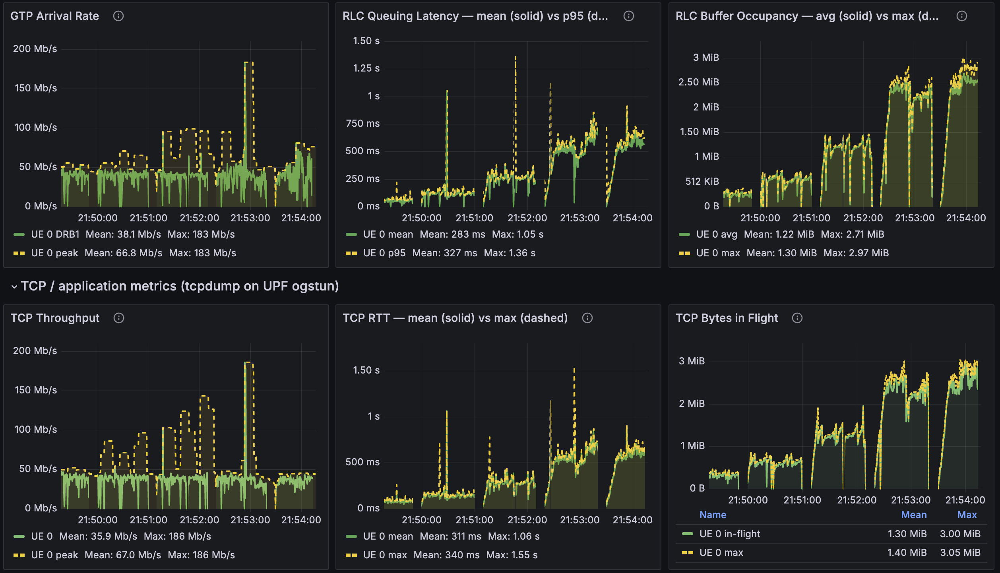

# Miscellaneous

Reference material for the [Open AI-RAN tutorial](../open-ai-ran-tutorial.md): loading codelets by
hand, the telemetry dashboards, the hooks the demos use and the repository layout.

## Telemetry with Codelets

`--telemetry` loads the telemetry for you. This section shows what it loads and how to load a
codeletset yourself.

### Codeletsets and deployments

Two levels of YAML drive every load.

**(a) The codeletset** groups codelets that share state, in `jrtc-apps/codelets/<layer>/`. It binds
each `.o` to a hook, links shared maps and names the serializers for the output. The MAC statistics
codeletset (`codelets/mac/mac_stats.yaml`) has this shape:

```yaml
codeletset_id: mac_stats

codelet_descriptor:

  # (1) the REPORTER: owns the output channels, runs on a periodic hook
  - codelet_name: mac_stats_collect
    codelet_path: ${JBPF_CODELETS}/mac/mac_stats_collect.o
    hook_name: report_stats                 # <- periodic timer hook
    priority: 1
    out_io_channel:
      - name: output_map_crc
        forward_destination: DestinationNone
        serde:
          file_path: ${JBPF_CODELETS}/mac/mac_sched_crc_stats:crc_stats_serializer.so
          protobuf:
            package_path: ${JBPF_CODELETS}/mac/mac_sched_crc_stats.pb
            msg_name: crc_stats
      # ... output_map_bsr / output_map_phr / output_map_uci

  # (2) the COLLECTORS: one per datapath hook, no output of their own;
  #     they accumulate into the reporter's maps via linked_maps
  - codelet_name: mac_sched_crc_stats
    codelet_path: ${JBPF_CODELETS}/mac/mac_sched_crc_stats.o
    hook_name: mac_sched_crc_indication     # <- fires on every CRC indication
    priority: 1
    linked_maps:
      - map_name: stats_map_crc
        linked_codelet_name: mac_stats_collect
        linked_map_name: stats_map_crc
      - map_name: crc_hash
        linked_codelet_name: mac_stats_collect
        linked_map_name: crc_hash
```

This collector and reporter split is the standard jbpf telemetry pattern. The hot-path codelets only
bump counters in a shared map, and one codelet on a periodic hook serializes and emits.

**(b) The deployment** is what you hand to `jrtc-ctl`, in `jrtc-apps/jrtc_apps/<app>/`. It names the
decoder, an optional Python xApp, the jbpf device and the codeletsets. A codelet-only deployment, with
the decoded JSON in the `jrtc-decoder` log, is enough to start. Create
`jrtc-apps/jrtc_apps/mac/deployment_mac.yaml`:

```yaml
name: mac_stats

decoder:
  - type: decodergrpc
    host: jrtc-decoder.ran.svc.cluster.local
    port: 20789

jbpf:
  device:
    - id: 1
      host: srs-gnb-du1-proxy.ran.svc.cluster.local
      port: 30450

  codelet_set:
    - device: 1
      config: ${JBPF_CODELETS}/mac/mac_stats.yaml
```

`jrtc_apps/` and `codelets/` are mounted into `jrtc-0` as `/apps` and `/codelets`, so the new file is
visible in the pod at once.

### Load and unload a codeletset

`jrtc-ctl` always connects to `127.0.0.1:30450`; a forwarder in `jrtc-0` bridges that to the gNB's jbpf
proxy. `--telemetry` starts it. If you brought the UEs up without it, start it and copy the codelet
directories into the gNB container, where the gNB's jbpf agent loads each serializer from:

```bash
kubectl cp telemetry/fwd30450.py ran/jrtc-0:/tmp/fwd30450.py -c jrtc
kubectl exec -n ran jrtc-0 -c jrtc -- bash -c 'grep -qi 76F2 /proc/net/tcp && echo "forwarder already listening" ||
  { nohup setsid python3 -u /tmp/fwd30450.py >/tmp/fwd30450.log 2>&1 </dev/null & disown; sleep 2; cat /tmp/fwd30450.log; }'

kubectl exec -n ran srs-gnb-du1-0 -c ocudujbpf -- mkdir -p /codelets
for d in upt ue_contexts mac rlc pdcp rrc ngap; do
  kubectl cp jrtc-apps/codelets/$d ran/srs-gnb-du1-0:/codelets/ -c ocudujbpf
done
```

Define this helper in every terminal that loads or unloads, then load the MAC statistics:

```bash
JRTC() { kubectl exec -n ran jrtc-0 -c jrtc -- bash -c \
  "export JRTC_APPS=/apps JBPF_CODELETS=/codelets; /jrtc/out/bin/jrtc-ctl $*"; }

JRTC 'load -c /apps/mac/deployment_mac.yaml'
```

A successful load prints `loaded app`, `successfully upserted proto package` and `successfully
associated stream ID`, and the gNB registers each codelet on its hook:

```bash
kubectl exec -n ran srs-gnb-du1-0 -c ocudujbpf -- \
  grep -aoE "Registered codelet [a-z_0-9]+ to hook [a-z_0-9]+" /tmp/gnb.stdout | tail
```

```text
Registered codelet mac_stats_collect to hook report_stats
Registered codelet mac_sched_crc_stats to hook mac_sched_crc_indication
Registered codelet mac_sched_bsr_stats to hook mac_sched_ul_bsr_indication
...
```

With traffic running, watch the decoded per-UE CRC, BSR, PHR, UCI and HARQ statistics:

```bash
kubectl logs -n ran jrtc-0 -c jrtc-decoder --tail=40 -f
```

Unload with the same file; the hooks go back to being no-ops and the gNB keeps running:

```bash
JRTC 'unload -c /apps/mac/deployment_mac.yaml'
```

Avoid loading and unloading in a tight loop: it can wedge the app loader.

| Symptom | Cause | Fix |
|---|---|---|
| `dial tcp 127.0.0.1:30450: connect: connection refused` | the forwarder is not running in `jrtc-0` | start it, as above |
| `400 Bad Request` on load | the app is already loaded | unload it, then load again |
| no `Registered codelet` lines in the gNB log | the codelet directory is missing inside the `ocudujbpf` container | copy `codelets/<dir>` again |
| `Error connecting to /tmp/jbpf/jbpf_lcm_ipc: Connection refused` | the gNB's jbpf agent died | re-run the bring-up |
| app loaded but no codelets deployed | a partial unload left state behind | delete the app by its numeric id: `kubectl exec -n ran jrtc-0 -c jrtc -- curl -s -X DELETE http://127.0.0.1:3001/app/<n>` |

### Watch it in Grafana

`--telemetry` loads two xApps into `jrtc-0`:

- **`upt_app`** (`jrtc_apps/upt`): per-packet user-plane telemetry. Per-UE downlink GTP arrival rate,
  RLC queuing latency and RLC buffer occupancy in 134 ms buckets. [Demo 3](demo3-buffer-management.md#telemetry-codelets-for-the-rlc-queue)
  shows how these codelets are written.
- **The dashboard xApp** (`jrtc_apps/dashboard`): per-layer, per-UE MAC, RLC, PDCP, RRC and NGAP
  statistics as JSON in the `jrtc-0` log, plus per-UE DL CQI, UL SNR, DL MCS, DL MAC throughput and
  each UE's identity chain, from IMSI and IP down to its C-RNTI.

The TCP row comes from `tcp_probe.py`, which runs on the host and captures on the UPF. Start it after
each bring-up, as its own command:

```bash
MAP=$(bash scripts/core_ue_info.sh --tcp-map)
setsid nohup python3 telemetry/tcp_probe.py --map "$MAP" >/tmp/tcp_probe.log 2>&1 </dev/null &
```

Open <http://localhost:30490/d/upt-userplane> (`admin` / `admin`). From a laptop, forward the port first
with `ssh -N -L 30490:localhost:30490 <user>@<testbed-host>`. The dashboard has four rows: UE identity,
Radio / MAC, RLC / user plane and TCP. Panels stay empty until traffic runs, since the codelets fire
per packet. One UE under DL iperf3 looks like this:



The RLC row is in-RAN telemetry from the codelets; the TCP row is the same run seen from outside the
RAN. In this run TCP RTT (mean 311 ms) tracks RLC queuing latency (mean 283 ms), and TCP bytes in
flight (mean 1.30 MiB) track RLC buffer occupancy (mean 1.22 MiB): two independent measurements, one
curve. The RLC queue is where the latency lives, which is the starting point of Demo 3.

## Verification cheat sheet

```bash
# codelets compile and pass the verifier
cd "$REPO_ROOT/jrtc-apps/codelets" && rm -f upt/*.o && ./make.sh -d upt && cd "$REPO_ROOT"

# codelets registered on their hooks in the gNB
kubectl exec -n ran srs-gnb-du1-0 -c ocudujbpf -- \
  grep -aoE "Registered codelet [a-z_0-9]+ to hook [a-z_0-9]+" /tmp/gnb.stdout | tail

# apps loaded in jrtc (ids are numeric)
kubectl exec -n ran jrtc-0 -c jrtc -- curl -s http://127.0.0.1:3001/app

# metrics reaching VictoriaMetrics
curl -s http://localhost:30491/api/v1/label/__name__/values
```

## Hooks used in this tutorial

| Hook | Layer | Type | Used by |
|---|---|---|---|
| `report_stats` | periodic | monitor | `mac_stats_collect`, `rlc_collect` |
| `mac_sched_crc_indication`, `_ul_bsr_`, `_ul_phr_`, `_uci_`, `_harq_dl`, `_harq_ul` | MAC | monitor | `mac_stats` collectors |
| `pdcp_dl_new_sdu` | PDCP | monitor | `gtp_arrival` (Demo 3) |
| `rlc_dl_new_sdu`, `rlc_dl_sdu_send_started`, `rlc_dl_sdu_send_completed` | RLC | monitor | `upt` codelets (Demo 3) |
| `mac_sched_slot_report` | MAC | monitor | `rt_report` (Demo 2) |
| **`mac_sched_slot_ctrl`** | MAC | **control** | `rt_ctrl` (Demo 2) |
| **`rlc_dl_ctrl`** | RLC | **control** | `bufcap`, `bufctl` (Demo 3) |
| `mac_sched_dl_ctrl` | MAC | control | `dl_sched` |
| `mac_sched_dl_mcs_ctrl` | MAC | control | `dl_mcs` |
| `pdcp_dl_sdu_segment` | PDCP | control | `l4span_mark` |

## Repository layout

| Path | What |
|---|---|
| `ocudu-jbpf/` (submodule) | jbpf-enabled OCUDU gNB source, `build.sh`, `deploy/` (gNB configs, ephemeral-container patch) |
| `duranta-oai-ue/` | the UE image, the C++ broker (`broker_cpp/`), channel and trace tables, `traces/` (SNR trace library and generator) |
| `duranta-oai-ue/duranta-ue/` (submodule) | Duranta OAI `nr-UE` source: ZMQ radio with a per-UE channel model and trace replay |
| `broker/` | the broker container image |
| `open5gs/` | Open5GS 5G core Helm chart |
| `jrtc-apps/codelets/` | codelets, one directory per layer or feature |
| `jrtc-apps/jrtc_apps/` | Python xApps and their deployment YAMLs |
| `edgeric-rt/` | EdgeRIC-RT muApps, PPO trainer and trained models (Demo 2) |
| `buffer-control-experiments/` | buffer-cap scripts, traffic and dashboards (Demo 3) |
| `telemetry/` | VictoriaMetrics and Grafana stack, dashboard JSON, forwarder, TCP probe |
| `scripts/` | bring-up, traffic, trace control and demo scripts |

## Further reading

- **jbpf**: <https://github.com/microsoft/jbpf>
- **jrt-controller**: <https://github.com/microsoft/jrtc>
- **jrtc-apps** (upstream codelets and xApps): <https://github.com/microsoft/jrtc-apps>
- **EdgeRIC** (NSDI'24): <https://www.usenix.org/conference/nsdi24/presentation/ko>
