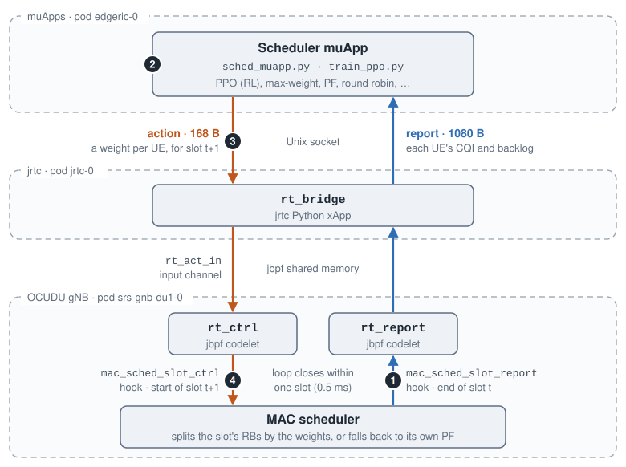
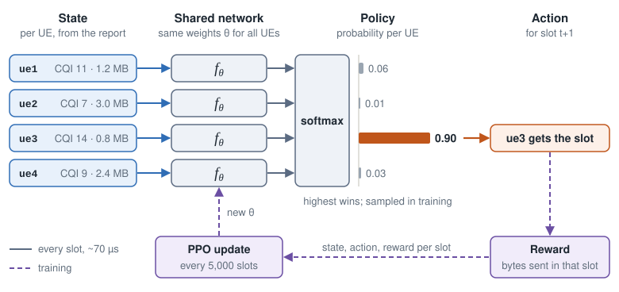
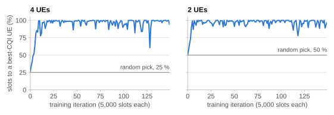
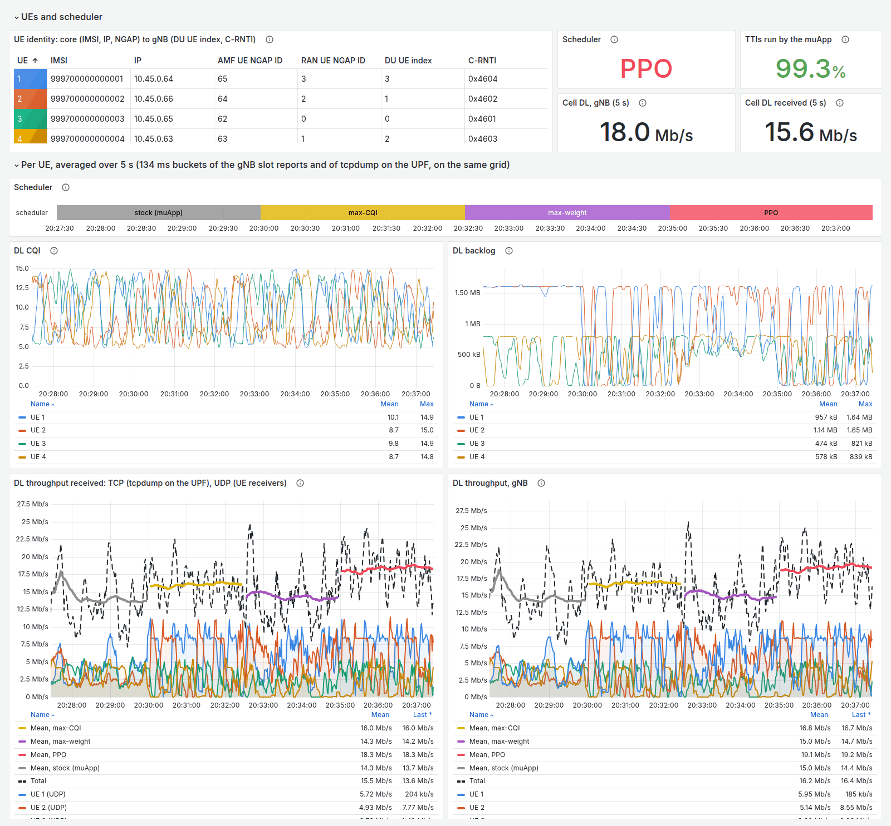
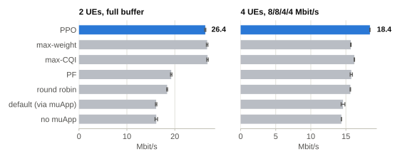

AI-driven muApp for RAN Scheduling
==================================

EdgeRIC-RT puts a muApp in the gNB's scheduling loop. Every 0.5 ms slot, the gNB reports the state
of every UE. The muApp answers with an action for the next downlink slot, and the gNB applies it in
exactly that slot. The muApp runs a PPO policy trained online against the live gNB, or a classic
scheduler such as max-weight or proportional fair.

**Code:** `edgeric-ocudu-jbpf <https://github.com/ucsdwcsng/edgeric-ocudu-jbpf/tree/open-ai-ran-tutorial>`_
(branch ``open-ai-ran-tutorial``). Full guide:
`edgeric-rt.md <https://github.com/ucsdwcsng/edgeric-ocudu-jbpf/blob/open-ai-ran-tutorial/docs/edgeric-rt.md>`_.

EdgeRIC-RT Scheduling Loop
--------------------------

         report through jbpf and the rt_bridge xApp in jrtc to the scheduler muApp. The muApp's
         action comes back through rt_bridge into the rt_ctrl codelet, which hands it to the MAC
         scheduler at the start of the next slot.

   One turn of the loop. Blue carries the report up to the muApp, and orange carries the action back
   down. The numbers match the steps below.

#. **Report.** At the end of slot *t*, the ``mac_sched_slot_report`` hook runs the ``rt_report``
   codelet. Its report travels through jbpf and ``rt_bridge`` to the muApp.
#. **Decide.** The muApp turns the newest report into a weight per UE for the next DL slot.
#. **Act.** The action travels back through ``rt_bridge`` into ``rt_act_in``, tagged with that slot.
#. **Apply.** When that slot starts, ``rt_ctrl`` hands the action to the scheduler, which splits the
   slot's RBs by the weights.

The whole loop must fit in one slot. A late action is dropped, and that slot runs the gNB's own
scheduler.

Scheduling Policies
-------------------

Baselines
^^^^^^^^^

- **Max-weight:** the slot goes to the UE with the largest CQI × backlog.
- **Max-CQI:** the slot goes to the UE with the best CQI.
- **Proportional fair (PF):** the slot goes to the UE whose CQI is highest relative to its average.
- **Round robin:** the UEs with data take turns.
- **Default:** the muApp runs but sends no action, so the gNB's own scheduler runs every slot.
- **No muApp:** the gNB's own scheduler, with no muApp running.

RL-based Policy
^^^^^^^^^^^^^^^

         the UE. A softmax over the scores gives a probability per UE, and the UE with the highest
         probability gets the next slot. Each slot's reward is the bytes sent in it, and a PPO update
         every 5,000 slots replaces the network's weights.

   The network sees each UE's CQI and backlog, plus their mean and max over all UEs. Every UE goes
   through the same weights, so one policy works for any number of UEs.

``train_ppo.py`` trains the policy online against the live gNB, and ``sched_muapp.py`` runs it.
Each report echoes the action applied in its slot, so every reward is paired with the action that
earned it.

         UE starts at the random level, 25 % and 50 %, and passes 95 % within 10 iterations.

   Training with full buffers, where the best choice is a UE with the best CQI. Both policies learn
   it within about 15 iterations, about a minute of live traffic.

Dashboard
^^^^^^^^^

         default scheduler, max-CQI, max-weight and PPO, 2.5 minutes each. On both throughput plots
         the thick mean line is highest under PPO, about 19 Mbit/s, against 14 to 17 for the others.

   A live run at 8/8/4/4 Mbit/s: the default scheduler, max-CQI, max-weight and PPO, 2.5 minutes
   each. The thick line on each throughput plot is the mean under the policy that runs. Click to
   enlarge.

Throughput
^^^^^^^^^^

         level with max-CQI and max-weight at 26.8, against 19.3 for PF, 18.4 for round robin and
         16.1 for the default scheduler and for no muApp. With 4 UEs at 8/8/4/4 Mbit/s, PPO reaches
         18.4 Mbit/s against 16.2 for max-CQI, 15.6 to 15.8 for PF, max-weight and round robin,
         14.6 for the default scheduler and 14.4 with no muApp.

   Mean DL throughput at the gNB over three 60 s runs per policy, each on the same channel replay
   (two runs for max-weight and round robin at 8/8/4/4). Error bars show one standard deviation
   across runs.

Timing
------

Report to action at the bridge, with 4 UEs and full-buffer UDP:

.. list-table::
   :header-rows: 1
   :widths: 40 30 30

   * - Path
     - p50 / p99
     - DL slots on time
   * - ``rt_bridge`` alone, no muApp
     - 51 / 90 µs
     - 99.9–100 %
   * - muApp, classic schedulers
     - 110 / 180–210 µs
     - 99.8–99.9 %
   * - muApp, PPO
     - 250 / 390–430 µs
     - 98.1–98.5 %

Run It
------

On the :doc:`cellular digital twin <tiny-twin>`, after the one-time build in the guide:

.. code-block:: bash

   # 4 UEs on CQI 4-15 channels, with the EdgeRIC-RT codelets and rt_bridge loaded
   bash scripts/setup_zmq_chan_demo.sh 4 --edgeric \
       --traces duranta-oai-ue/ue_traces_cqi_4ue.conf
   bash scripts/ue_rnti_map.sh 4                 # ue1..ue4 -> C-RNTI
   bash scripts/traffic_nue.sh start --udp 100M   # full-buffer downlink

   # run the trained PPO policy (or --scheduler maxweight, pf, rr, ...)
   bash scripts/edgeric_muapp.sh start sched --scheduler rl --model models/ppo_walk4/last.npz
   bash scripts/edgeric_muapp.sh logs sched       # Mbit/s per UE, slots on time, latency

   # or train your own (one muApp at a time)
   bash scripts/edgeric_muapp.sh stop sched
   bash scripts/edgeric_muapp.sh start train --tag my_ppo   # policy lands in runs/my_ppo/

Related Publications
--------------------

- EdgeRIC: Empowering Real-time Intelligent Optimization and Control in NextG Cellular Networks.
  `Paper@NSDI'24 <https://www.usenix.org/conference/nsdi24/presentation/ko>`_
