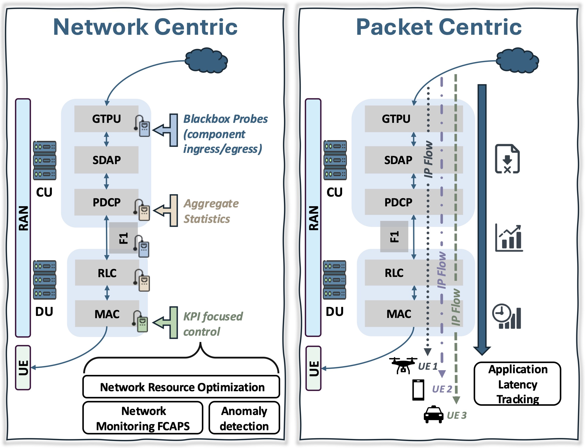

Telemetry: Packet Centric
=================================

Overview
--------

Understanding network behavior at the packet level provides unprecedented visibility into performance bottlenecks and optimization opportunities.

.. note::
   This project develops packet-centric telemetry tools that integrate with EdgeRIC for fine-grained network analysis.

Motivation
----------

Traditional telemetry approaches aggregate data, losing critical timing and ordering information. A packet-centric approach preserves:

* **Per-packet latency distributions**
* **Queue dynamics and buffer occupancy**
* **Scheduling decision impacts**
* **Cross-layer correlations**

Key Features
------------

Real-time Packet Tracing
^^^^^^^^^^^^^^^^^^^^^^^^
Capture and analyze packets as they traverse the RAN stack with minimal overhead.

Causal Analysis
^^^^^^^^^^^^^^^
Link packet-level events to scheduling decisions and network conditions.

Visualization Tools
^^^^^^^^^^^^^^^^^^^
Interactive dashboards for exploring packet traces and identifying patterns.

Integration with EdgeRIC
------------------------

The telemetry system provides:

- Input features for ML-based μApps
- Ground truth for policy evaluation
- Debugging and diagnostics capabilities

Results
-------

*Coming soon*

Related Publications
--------------------

*Coming soon*
