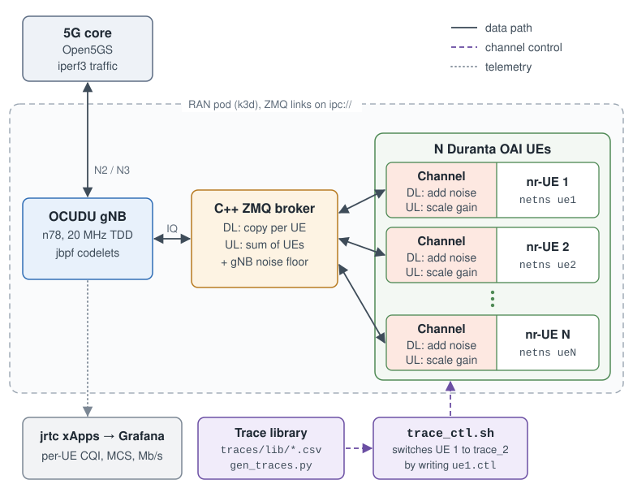
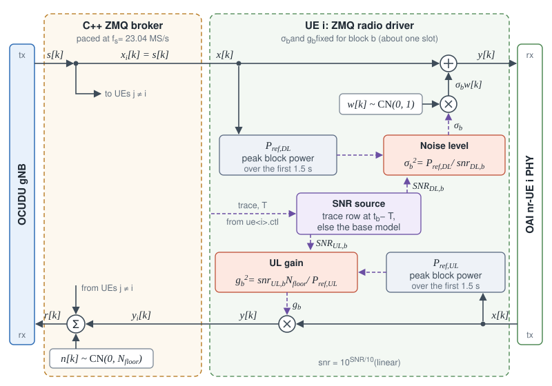
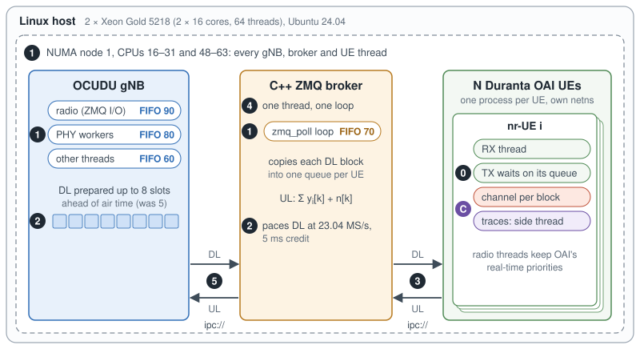
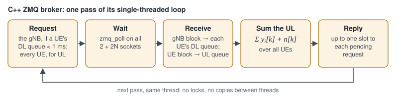
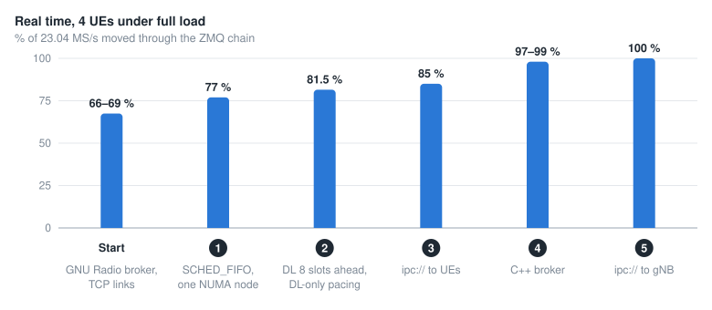
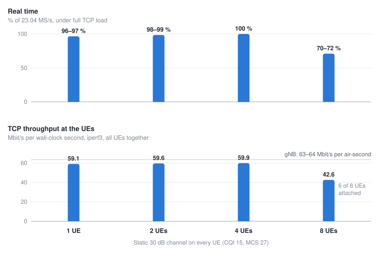
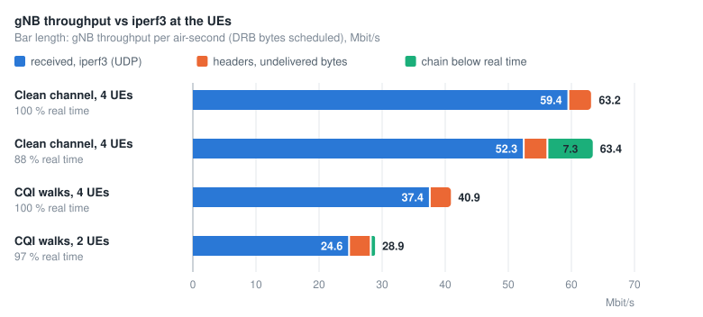

Cellular Digital Twins
======================

The cellular digital twin runs a complete 5G cell on a single CPU server, with Open5GS, an OCUDU
gNB, and OAI UEs exchanging IQ samples over ZMQ. Each UE has an independently configurable channel,
enabling repeatable mobility experiments across RIC applications.

System Design
-------------

         Duranta OAI UEs, each UE with its own channel block, plus the trace control path and
         telemetry.

Channel Computation on Each UE
^^^^^^^^^^^^^^^^^^^^^^^^^^^^^^

         adds sigma_b w[k] to its input x[k]. Uplink: UE i scales its output x[k] by g_b, and the
         broker sums all UEs and adds n[k]. sigma_b and g_b come from the SNR source and the
         reference powers.

- **Block:** block :math:`b` is one ZMQ message of at most one slot, :math:`f_s \cdot 2^{-\mu}` ms
  of samples for sample rate :math:`f_s` and numerology :math:`\mu`. In our cell (n78, 20 MHz,
  30 kHz SCS, :math:`f_s` = 23.04 MS/s) that is 11,520 samples per 0.5 ms slot.
- **SNR:** at the start of block :math:`b`, the link takes :math:`\mathrm{SNR}_{\mathrm{DL},b}` and
  :math:`\mathrm{SNR}_{\mathrm{UL},b}` from the active trace row, or from the base model when no
  trace is set.
- **Reference power:** :math:`P_\mathrm{ref}` is the mean power per sample of a fully loaded slot,
  measured once in the first 1.5 s: the gNB's signal on the DL, the UE's own samples on the UL.
- **Channel:** for each sample :math:`k` of the block, :math:`y[k] = x[k] + \sigma_b w[k]` with
  :math:`\sigma_b^2 = P_\mathrm{ref,DL} / \mathrm{snr}_{\mathrm{DL},b}` on the DL, and
  :math:`y[k] = g_b\, x[k]` with
  :math:`g_b^2 = \mathrm{snr}_{\mathrm{UL},b} N_\mathrm{floor} / P_\mathrm{ref,UL}` on the UL.

.. _tiny-twin-realtime:

Achieving Real-Time Operation
-----------------------------

Design Goals
^^^^^^^^^^^^

Run N UEs, each replaying its own channel, at 100 % of real time on one CPU server, and change any
UE's channel without stopping the cell.

         broker and the N UE processes, with their threads, priorities and ipc:// links, each
         marked with the update that made the chain run in real time.

   Real-time software architecture. Badges 1–5 match the steps in the chart below, and badge 0 is
   the UE transmit-path fix, which took a single UE from 19 % to 100 % of real time. Badge C marks
   the channel path: :math:`\sigma_b` and :math:`g_b` are set once per block, and traces load on a
   separate thread.

The C++ ZMQ broker connects the gNB to the UEs. A single thread runs one ``zmq_poll`` loop over
2 + 2N sockets (two for the gNB, two per UE). The broker follows the request/reply protocol of GNU
Radio's ZMQ blocks: the receiver sends a one-byte request, and the sender replies with a block of
complex float32 samples.

   One pass of the broker's loop.

         and 100 % after updates 1 to 5.

   Real time with four UEs under full load after each update, each step measured on its own.

System Benchmarks
^^^^^^^^^^^^^^^^^

**Compute.** One server: 2 × Intel Xeon Gold 5218 (16 cores and 32 threads each, 2.3 GHz base,
3.9 GHz turbo), 251 GiB of RAM, Ubuntu 24.04 with the stock 6.8 kernel, Docker 28 and k3d 5.8
(k3s 1.31). The gNB, the broker and every UE run on NUMA node 1, 16 cores and 32 threads.

We measure real time as samples moved per second over 23.04 MS/s: ``scripts/zmq_rt_check.sh``
reports it, and the broker logs it every 5 s. Throughput comes from iperf3 at the UEs, with one
downlink flow per UE.

         at the UEs: 59.1, 59.6, 59.9 and 42.6 Mbit/s.

   Real time and TCP throughput against the number of UEs, with a static 30 dB channel on every UE.

Up to four UEs, the chain runs at 96–100 % of real time, and four UEs sustained 11 minutes of full
TCP load at 100 % with no RLF, re-attach or crash. At eight UEs the broker's single thread saturates
(about 95 % of a core): real time falls to 70–72 % and TCP to 42.6 Mbit/s, with 6 of 8 UEs attached.
The gNB carries 63–64 Mbit/s per air-second at any UE count, so iperf3 throughput scales with the
real-time fraction.

         bytes, and the share lost below real time, for four 60 s runs with the max-weight
         scheduler.

   gNB throughput against iperf3 at the UEs, in 60 s runs with full-buffer UDP and the max-weight
   scheduler. CQI walks are the ``cqi_walk_*`` traces.

Documentation
-------------

Plug and Play Channels
^^^^^^^^^^^^^^^^^^^^^^

Each UE starts on a base channel (the built-in model, 30 dB by default) and can replay any SNR
trace on top of it. Channels switch while traffic runs, with no restart or re-attach. The
commands below are in ``scripts/``.

.. list-table::
   :header-rows: 1
   :widths: 46 54

   * - Command
     - Effect
   * - ``setup_zmq_chan_demo.sh 4 --traces T``
     - Start four UEs on the traces in table ``T``, one ``ue trace`` pair per line
   * - ``trace_ctl.sh set 1 trace_2``
     - Switch UE 1 to ``trace_2``
   * - ``trace_ctl.sh set 1,3 veh_30kmh``
     - Switch UEs 1 and 3 at the same instant
   * - ``trace_ctl.sh set 2 my_trace.csv``
     - Replay a CSV of your own
   * - ``trace_ctl.sh stop all``
     - Return every UE to its base channel
   * - ``trace_ctl.sh status``
     - Show the trace and SNR each UE plays

**Trace format.** A CSV with the header ``t_s,dl_snr_db,ul_snr_db``. Each row holds until the next,
the file loops, and a single row gives a constant channel.

**Switching.** ``trace_ctl.sh`` validates the trace, copies it into the UE container and writes the
UE's control file. Each UE reads the file every 100 ms and switches at a shared start time, 3 s
ahead by default, within one slot in both directions.

.. note::

   Keep both SNRs at or above 0 dB: below that the OAI UE misreports CQI, and a released UE does not
   reconnect. The gNB adapts the downlink once per 20 ms CSI report, so faster SNR changes show up
   as block errors.

Dataset
^^^^^^^

The trace library is in ``duranta-oai-ue/traces/lib/``. ``gen_traces.py`` regenerates it from the
recipes in ``scenarios.conf`` with fixed seeds, and ``trace_ctl.sh list`` summarizes each trace.

.. list-table::
   :header-rows: 1
   :widths: 20 38 42

   * - Family
     - Traces
     - Content
   * - Mobility
     - ``trace_1`` to ``trace_8``
     - Random walks 30–120 m from the gNB at 3–100 km/h, 300 s at 10 ms per row
   * - Mobility model
     - ``ped_3kmh``, ``veh_30kmh``, ``veh_104kmh``
     - The built-in model: back-and-forth motion between two distances
   * - Static
     - ``static_30db``, ``static_16db``, ``static_12db``
     - Constant SNR, giving CQI 15, 13 and 12
   * - Over-the-air CQI
     - ``cqi_car_*``, ``cqi_drone*``, ``cqi_robot``, ``cqi_turntable``
     - Recorded for EdgeRIC (NSDI'24): car at 10 and 20 mph, drone, ground robot, turntable; see the
       :doc:`EdgeRIC dataset <../dataset_page/edgeric-datasets>`
   * - Synthetic CQI
     - ``cqi_walk_*``, ``cqi_good``, ``cqi_bad``, ``cqi_iid_*``, ``cqi_tri``
     - Random walks, good and bad bands, i.i.d. draws, a triangle sweep

**Channel models.** The mobility traces use log-distance path loss with the 37.6 dB/decade slope of
the 3GPP urban macro-cell model (TR 36.942), log-normal shadowing (σ = 4 dB, Gudmundson correlation
over 20 m) and AWGN at the receiver. The CQI traces map each CQI to the SNR at which the OAI UE
reports it on this cell (``cqi_calib.csv``), with recorded CQI rescaled to 4–15 so the SNR stays
above 0 dB.

Related Publications
--------------------

- Tiny-Twin: A CPU-Native Full-stack Digital Twin for NextG Cellular Networks.
  `Paper@DySPAN'26 <https://arxiv.org/abs/2601.08217>`_,
  `Poster@HotMobile'24 <https://dl.acm.org/doi/abs/10.1145/3638550.3643625>`_
